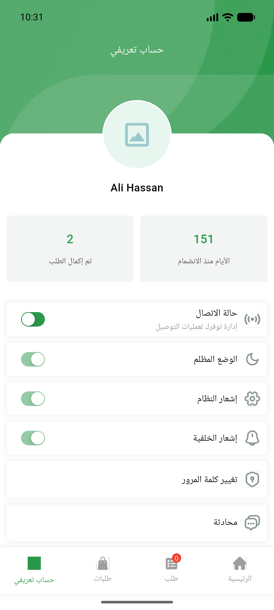

# QA Evidence — NEARS-1451

**PASS — NEARS-1451 notif-off: 3 toggle-OFF cycles, 0x update-fcm-token, 0x 403; toggle-ON updateToken 200**

**1 screenshot(s).** Click any thumbnail for full resolution.

<table>
<tr>
<td align="center" width="33%"> profile notification toggle</td>
</tr>
</table>

### Other artifacts
- [`net-log-excerpt.log`](net-log-excerpt.log)

---
*From `nears/docs/qa-evidence/NEARS-1451/` · public-repo scrub policy (no live secrets; verified clean).*
