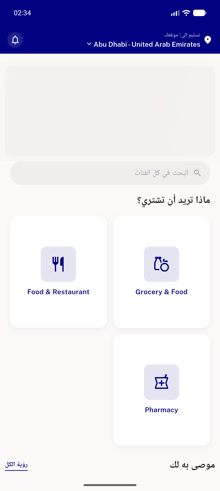
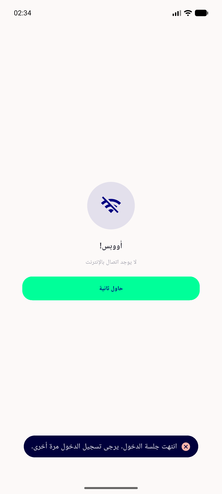

# QA Evidence — NEARS-1455

**PASS — secure-storage corrupt-token guard: no crash, PII-safe log, session-expired toast renders, re-login works**

**2 screenshot(s).** Click any thumbnail for full resolution.

<table>
<tr>
<td align="center" width="33%"> ac2 clean home after purge</td>
<td align="center" width="33%"> ac3 toast session expired ar</td>
</tr>
</table>

### Other artifacts
- [`ac1-ac3-guard-fail-log.txt`](ac1-ac3-guard-fail-log.txt)

---
*From `nears/docs/qa-evidence/NEARS-1455/` · public-repo scrub policy (no live secrets; verified clean).*
