# QA Evidence — NEARS-1473

**PASS — F7 Flow 1 home/sector-picker reskin: in-place module swap fixed, 4 states live on both contexts, RTL + 320dp@1.3 clean**

**23 screenshot(s).** Click any thumbnail for full resolution.

<table>
<tr>
<td align="center" width="33%"><a href="ac-visual-verification-composite.png">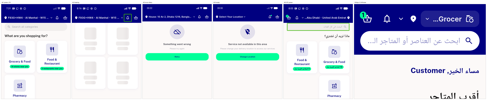</a> ac visual verification composite</td>
<td align="center" width="33%"><a href="ac1-sector-picker-ltr.png">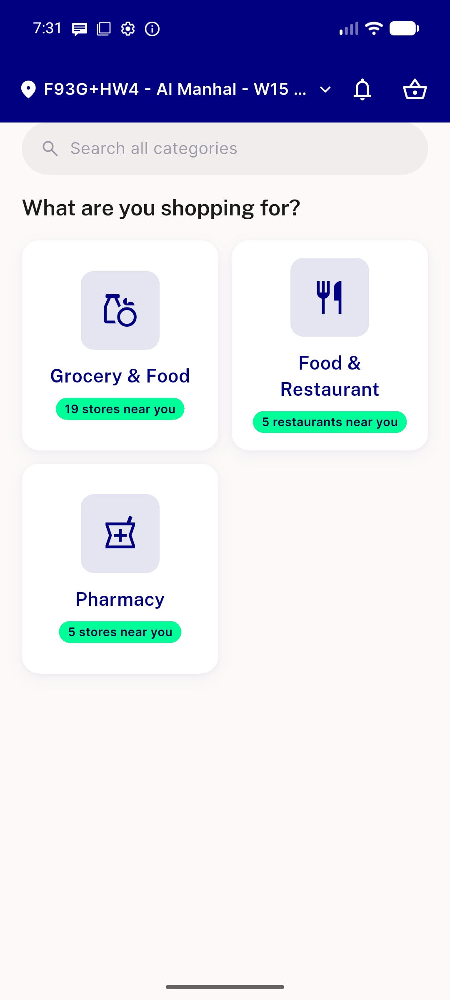</a> ac1 sector picker ltr</td>
<td align="center" width="33%"><a href="ac3-cached-tiles-survive-failure.png">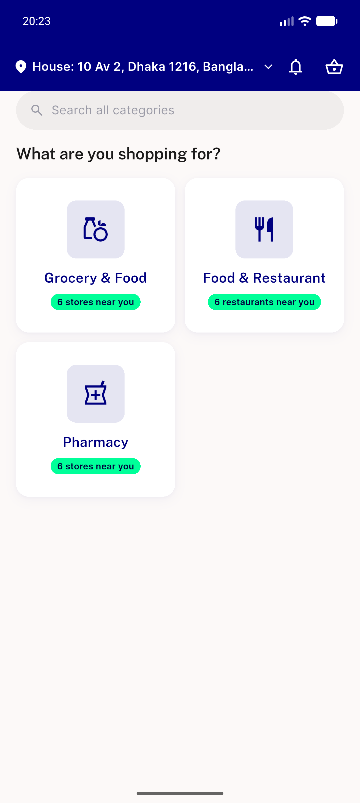</a> ac3 cached tiles survive failure</td>
</tr>
<tr>
<td align="center" width="33%"><a href="ac3-empty-state-picker.png">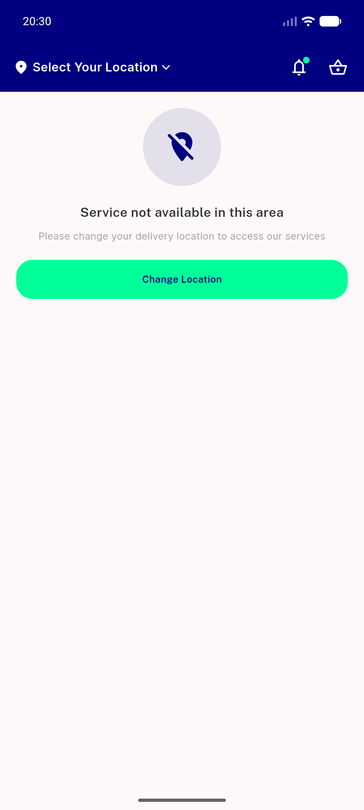</a> ac3 empty state picker</td>
<td align="center" width="33%"> ac3 error recovered picker</td>
<td align="center" width="33%"><a href="ac3-error-retry-picker.png">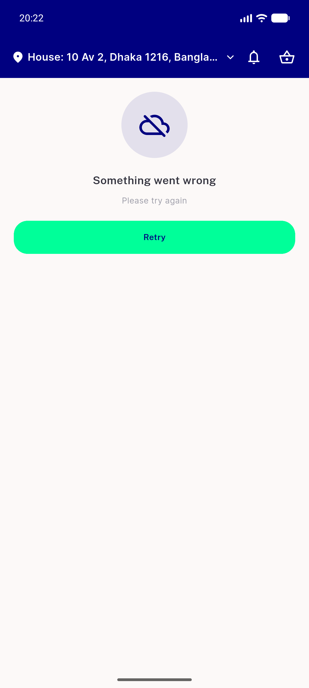</a> ac3 error retry picker</td>
</tr>
<tr>
<td align="center" width="33%"><a href="ac3-loading-shimmer-picker.png">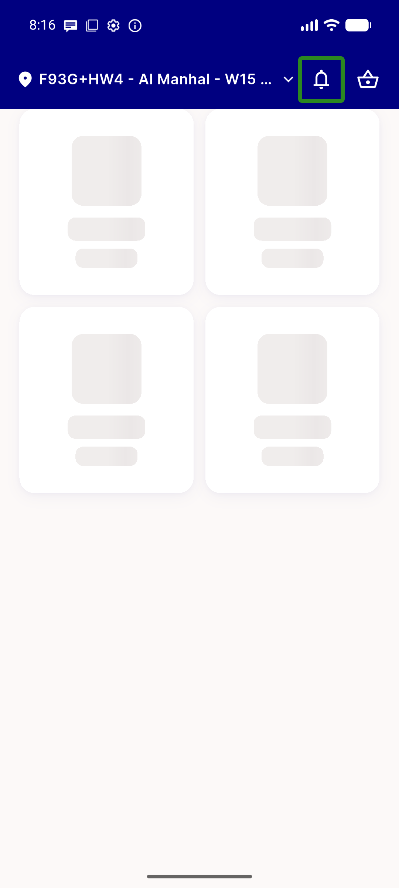</a> ac3 loading shimmer picker</td>
<td align="center" width="33%"><a href="ac3-switcher-error-modulehome.png">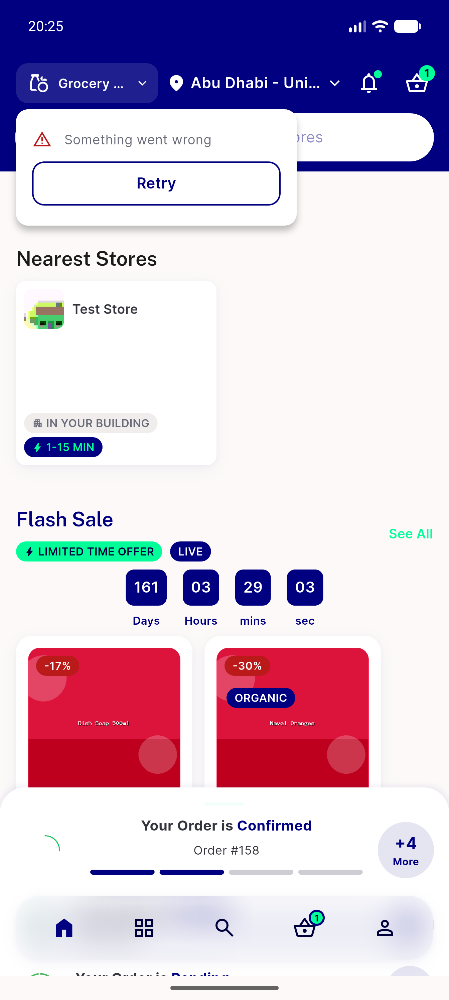</a> ac3 switcher error modulehome</td>
<td align="center" width="33%"> ac5 rtl module home header</td>
</tr>
<tr>
<td align="center" width="33%"><a href="ac5-rtl-sector-picker.png">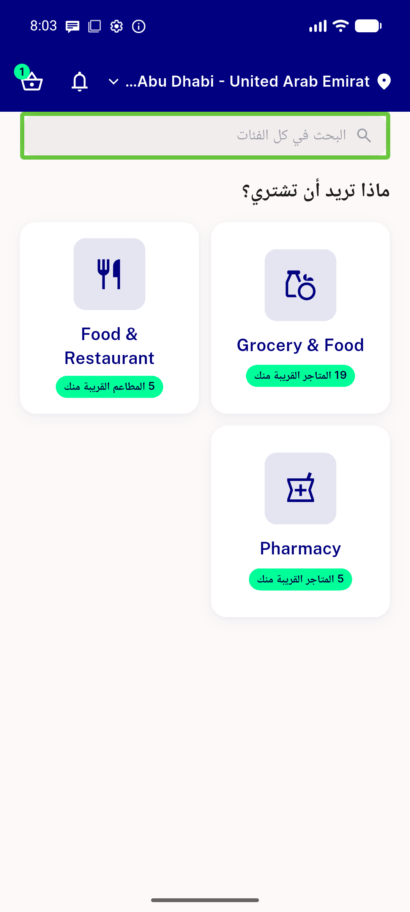</a> ac5 rtl sector picker</td>
<td align="center" width="33%"><a href="ac6-module-home-grocery.png">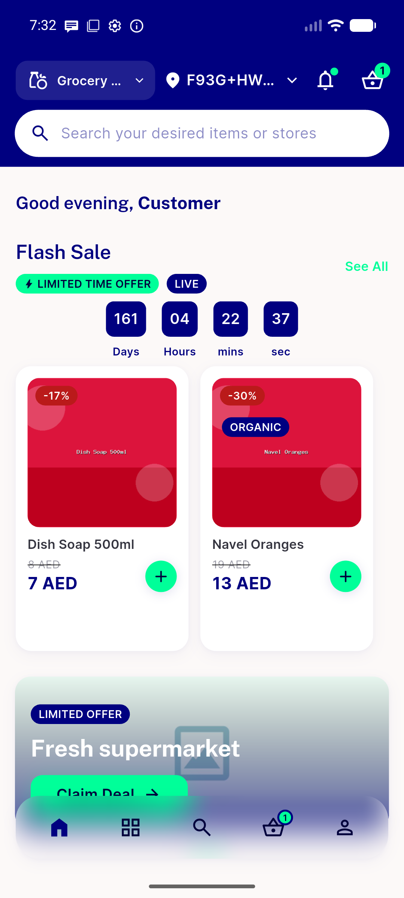</a> ac6 module home grocery</td>
<td align="center" width="33%"><a href="chipleak-A-food-toprated.png">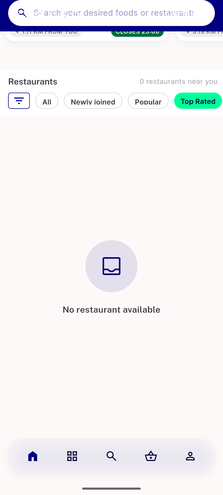</a> chipleak A food toprated</td>
</tr>
<tr>
<td align="center" width="33%"><a href="chipleak-B-grocery-all.png">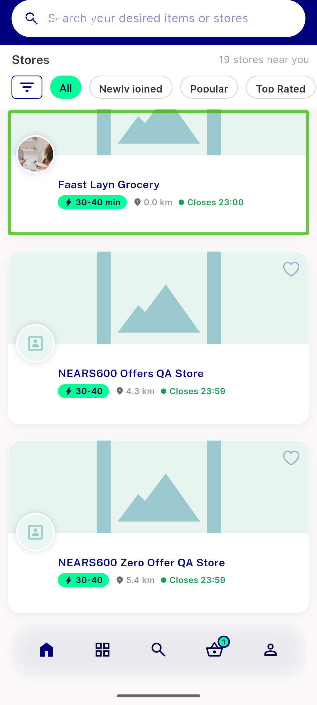</a> chipleak B grocery all</td>
<td align="center" width="33%"><a href="chipleak-gridtile-food-all.png">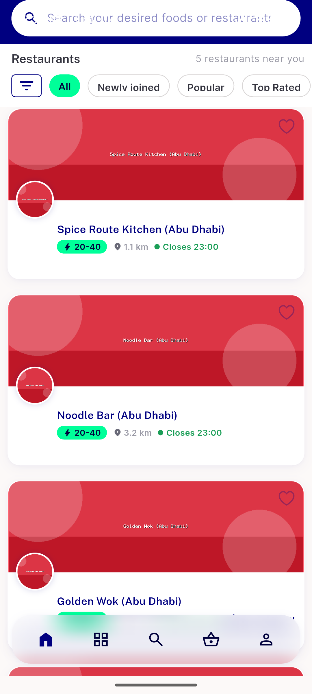</a> chipleak gridtile food all</td>
<td align="center" width="33%"><a href="critical-inplace-swap-food.png">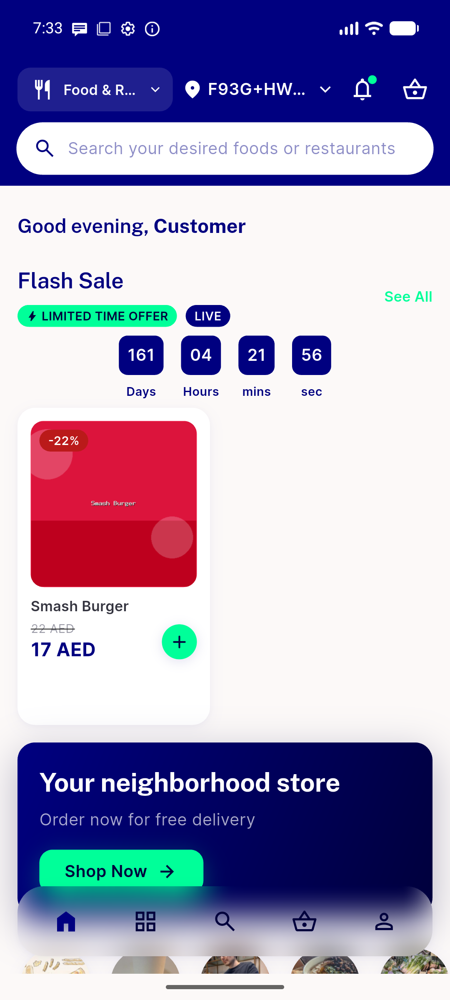</a> critical inplace swap food</td>
</tr>
<tr>
<td align="center" width="33%"><a href="critical-inplace-swap-pharmacy-5556.png">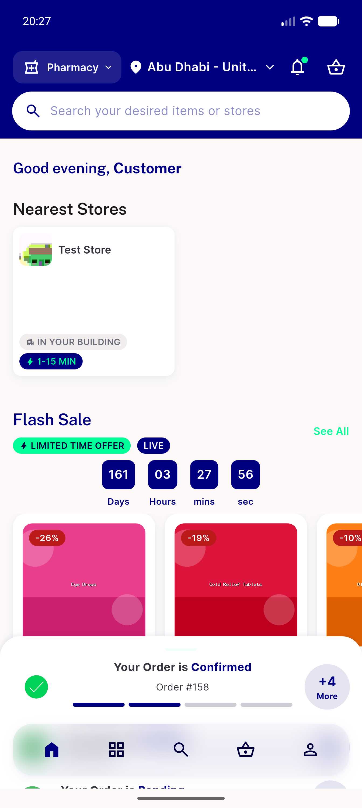</a> critical inplace swap pharmacy 5556</td>
<td align="center" width="33%"><a href="single-module-zone-header.png">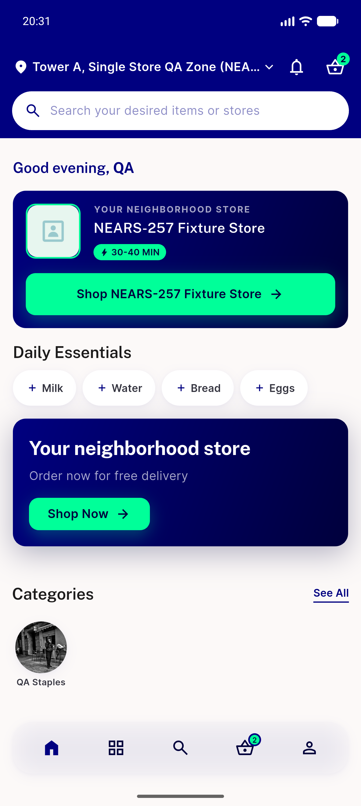</a> single module zone header</td>
<td align="center" width="33%"><a href="statusbar-picker.png">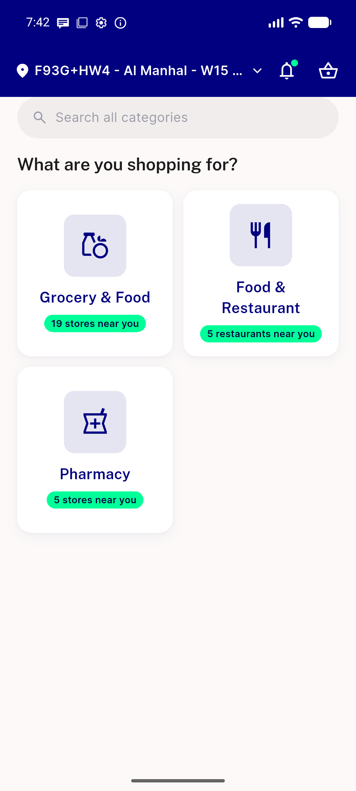</a> statusbar picker</td>
</tr>
<tr>
<td align="center" width="33%"><a href="switcher-menu-open.png">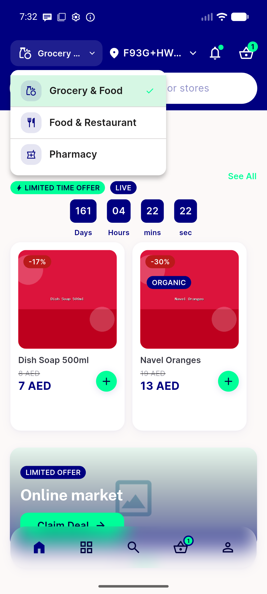</a> switcher menu open</td>
<td align="center" width="33%"> textscale 320dp max ar modulehome</td>
<td align="center" width="33%"><a href="textscale-320dp-max-ar-picker.png">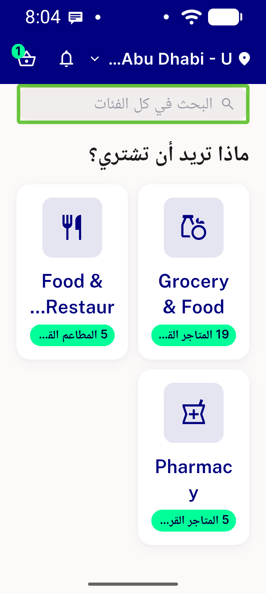</a> textscale 320dp max ar picker</td>
</tr>
<tr>
<td align="center" width="33%"><a href="textscale-320dp-max-ltr-modulehome.png">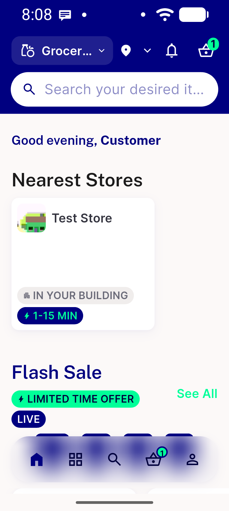</a> textscale 320dp max ltr modulehome</td>
<td align="center" width="33%"><a href="textscale-320dp-max-ltr-picker.png">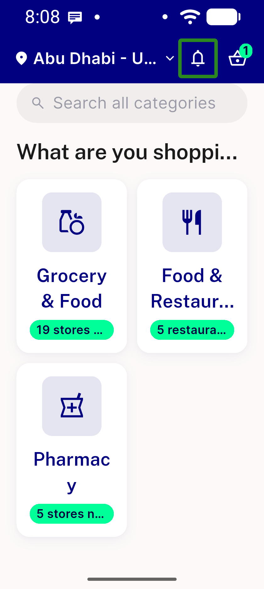</a> textscale 320dp max ltr picker</td>
</tr>
</table>

### Other artifacts
- [`ac3-module-fetch-fail.log`](ac3-module-fetch-fail.log)
- [`bug-campaign-null-check.log`](bug-campaign-null-check.log)
- [`bug-flashsale-shimmer-overflow.log`](bug-flashsale-shimmer-overflow.log)

---
*From `nears/docs/qa-evidence/NEARS-1473/` · public-repo scrub policy (no live secrets; verified clean).*
