# QA Evidence — NEARS-1474

**PARTIAL — 10/15 ACs demonstrated live on emulator-5556 (1344x2992 @480dpi + 720x1280 @320dpi override); 0 task bugs; 5 ACs not demonstrable (deep-link/data/state gates)**

**24 screenshot(s).** Click any thumbnail for full resolution.

<table>
<tr>
<td align="center" width="33%"><a href="ac1-tab-Basket.png">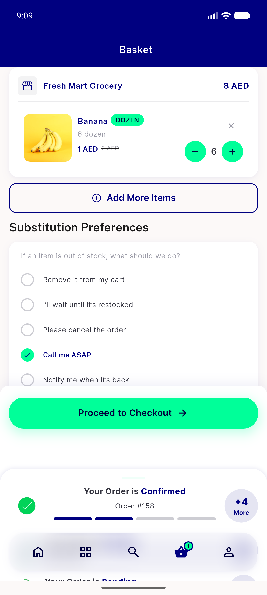</a> ac1 tab Basket</td>
<td align="center" width="33%"><a href="ac1-tab-Categories.png">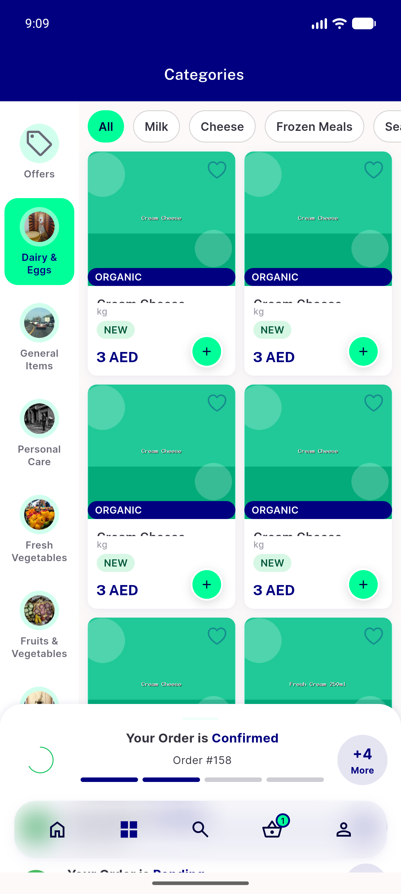</a> ac1 tab Categories</td>
<td align="center" width="33%"><a href="ac1-tab-Profile.png">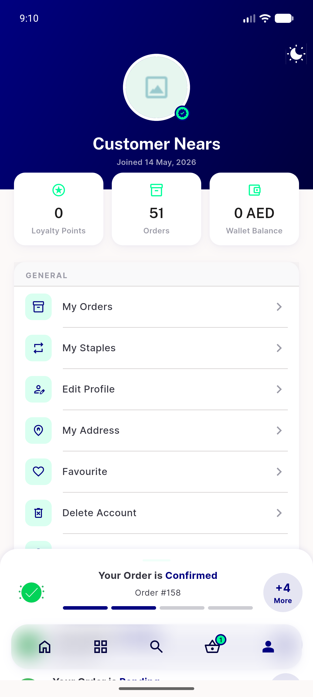</a> ac1 tab Profile</td>
</tr>
<tr>
<td align="center" width="33%"><a href="ac1-tab-Search.png">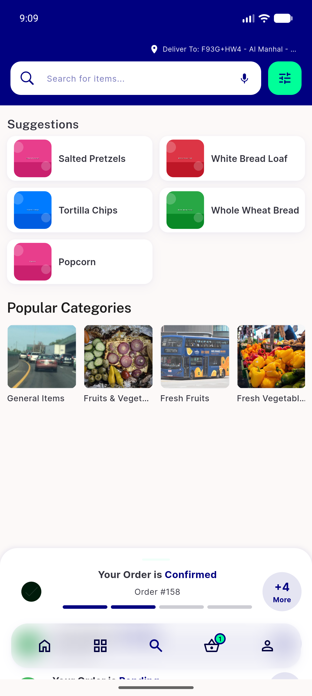</a> ac1 tab Search</td>
<td align="center" width="33%"><a href="ac1-tab1-home.png">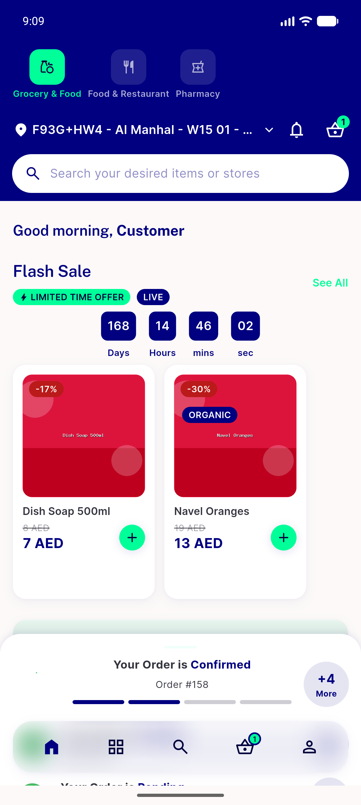</a> ac1 tab1 home</td>
<td align="center" width="33%"><a href="ac10-module-backpress-picker.png">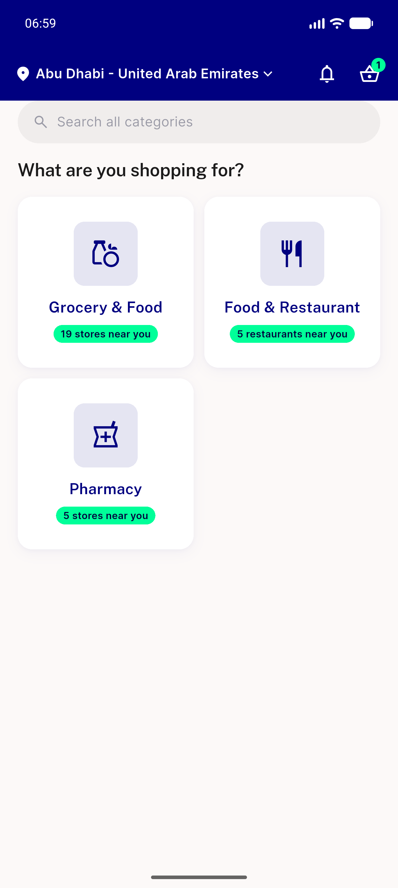</a> ac10 module backpress picker</td>
</tr>
<tr>
<td align="center" width="33%"><a href="ac11-rtl-arabic-nav-banner.png">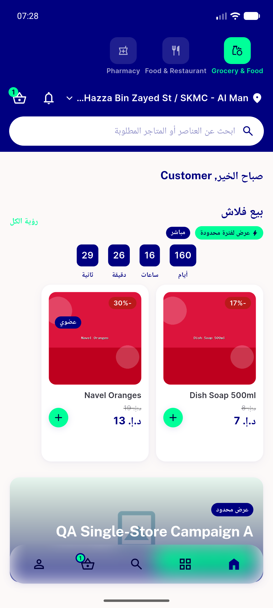</a> ac11 rtl arabic nav banner</td>
<td align="center" width="33%"><a href="ac11-rtl-banner.png">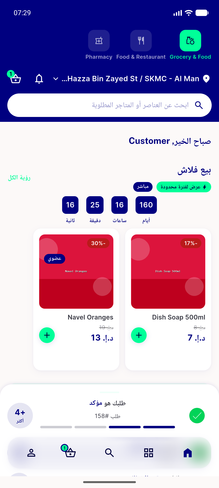</a> ac11 rtl banner</td>
<td align="center" width="33%"><a href="ac12-offline-single-toast.png">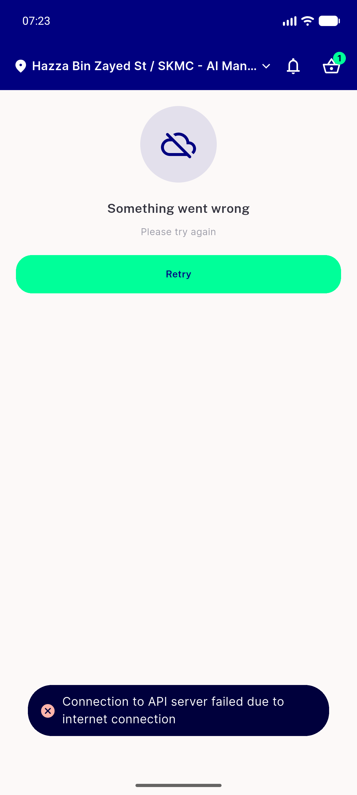</a> ac12 offline single toast</td>
</tr>
<tr>
<td align="center" width="33%"><a href="ac12-offline-t6.png">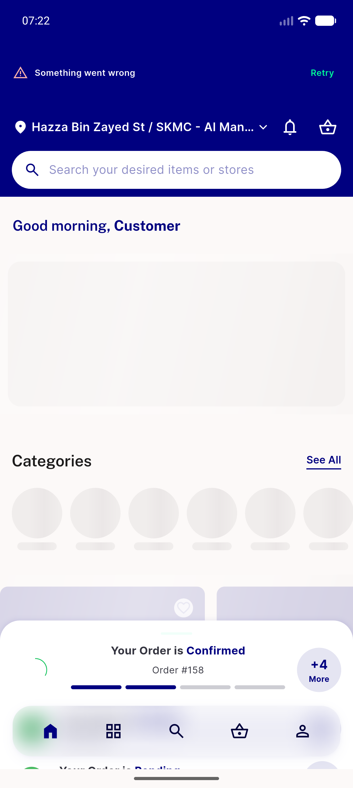</a> ac12 offline t6</td>
<td align="center" width="33%"><a href="ac2-banner-collapsed-on-return.png">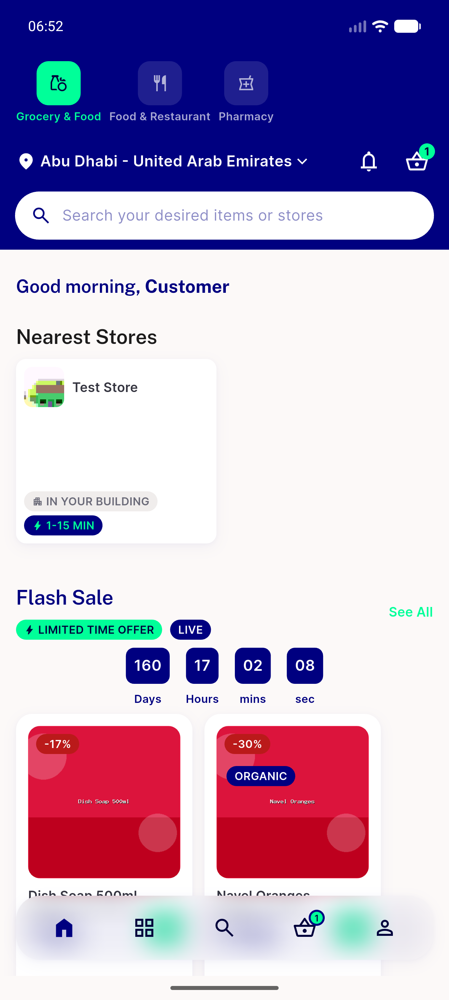</a> ac2 banner collapsed on return</td>
<td align="center" width="33%"><a href="ac2-order-tracking.png">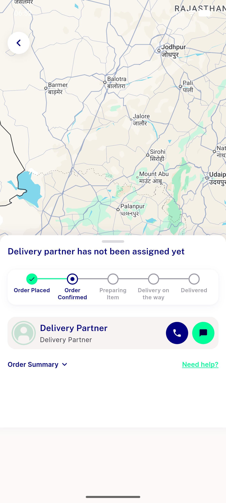</a> ac2 order tracking</td>
</tr>
<tr>
<td align="center" width="33%"><a href="ac3-banner-contracted-above-nav.png">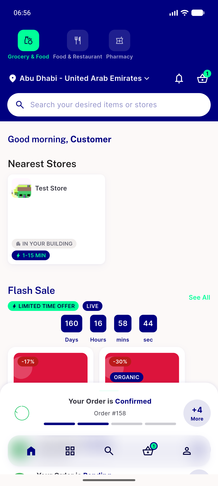</a> ac3 banner contracted above nav</td>
<td align="center" width="33%"> ac3 banner expanded</td>
<td align="center" width="33%"><a href="ac3-banner-fully-expanded-rtl.png">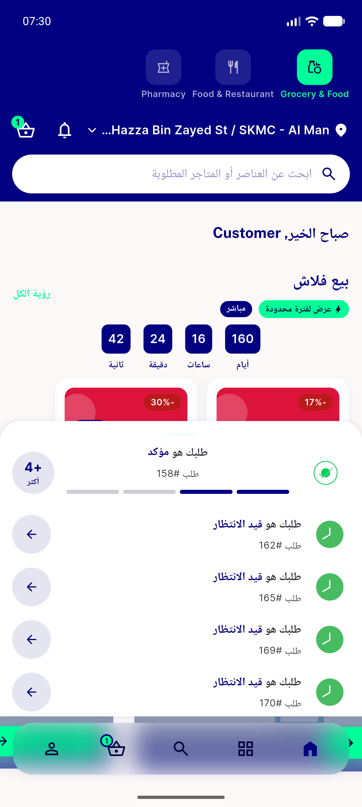</a> ac3 banner fully expanded rtl</td>
</tr>
<tr>
<td align="center" width="33%"><a href="ac3-plus-n-more-order-list.png">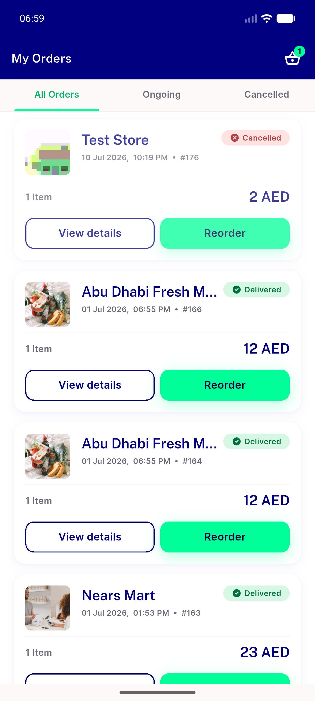</a> ac3 plus n more order list</td>
<td align="center" width="33%"><a href="ac4-cart-standalone-route.png">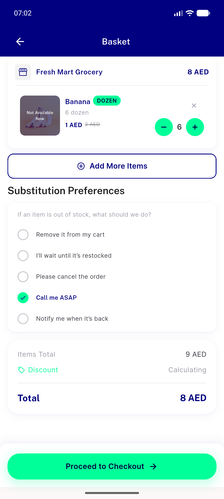</a> ac4 cart standalone route</td>
<td align="center" width="33%"><a href="ac4-search-standalone-route.png">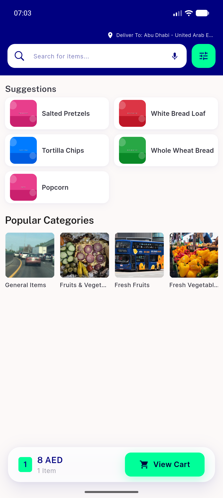</a> ac4 search standalone route</td>
</tr>
<tr>
<td align="center" width="33%"><a href="ac5-login-suggestion-sheet.png">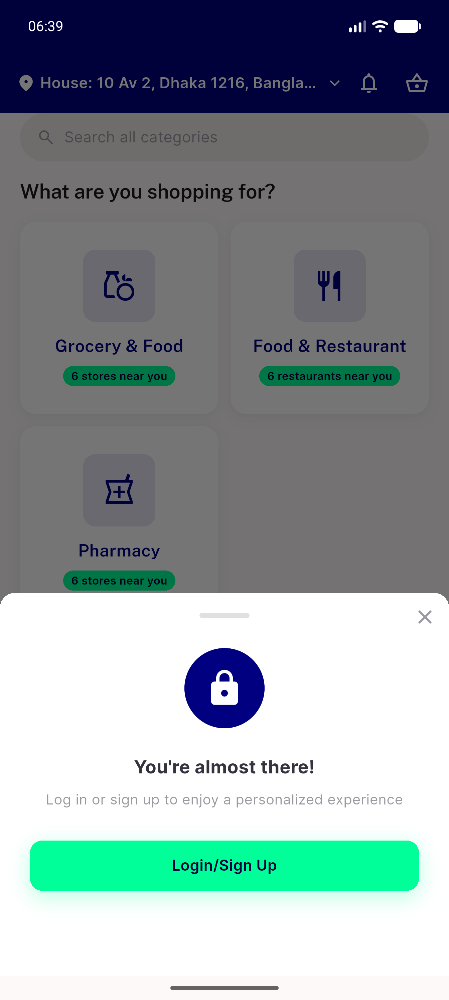</a> ac5 login suggestion sheet</td>
<td align="center" width="33%"> ac6 login sheet small 360x640</td>
<td align="center" width="33%"> ac8 loginsuggestion not refired</td>
</tr>
<tr>
<td align="center" width="33%"><a href="ac9-backpress-nsnackbar.png">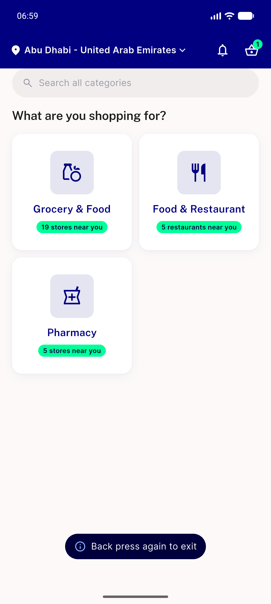</a> ac9 backpress nsnackbar</td>
<td align="center" width="33%"> ac9 toast reshow after window</td>
<td align="center" width="33%"><a href="bug-tracking-hang-anr.png">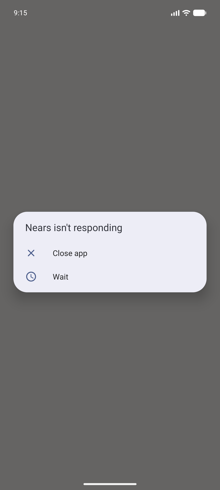</a> bug tracking hang anr</td>
</tr>
</table>

### Other artifacts
- [`bug-tracking-hang-anr.log`](bug-tracking-hang-anr.log)

---
*From `nears/docs/qa-evidence/NEARS-1474/` · public-repo scrub policy (no live secrets; verified clean).*
