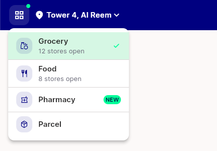
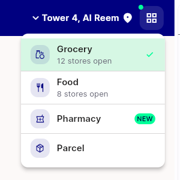
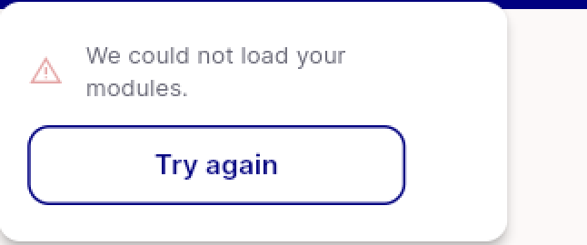
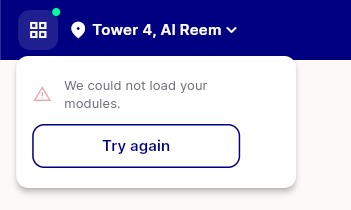

# QA Evidence — NEARS-1475

**PASS with 4 non-blocking task bugs — NModuleSwitcher live on Widgetbook release web (light mode)**

**4 screenshot(s).** Click any thumbnail for full resolution.

<table>
<tr>
<td align="center" width="33%"> ac2 overlay open ltr new badge</td>
<td align="center" width="33%"> ac4 rtl arabic overlay open</td>
<td align="center" width="33%"> bug error icon 38pct opacity</td>
</tr>
<tr>
<td align="center" width="33%"> error state overlay stacked retry</td>
</tr>
</table>

### Other artifacts
- [`bug-error-card-tap-dismisses.log`](bug-error-card-tap-dismisses.log)
- [`bug-overlay-escapes-ancestor-mediaquery.log`](bug-overlay-escapes-ancestor-mediaquery.log)
- [`bug-retry-not-exposed-to-a11y.log`](bug-retry-not-exposed-to-a11y.log)
- [`progress.md`](progress.md)

---
*From `nears/docs/qa-evidence/NEARS-1475/` · public-repo scrub policy (no live secrets; verified clean).*
