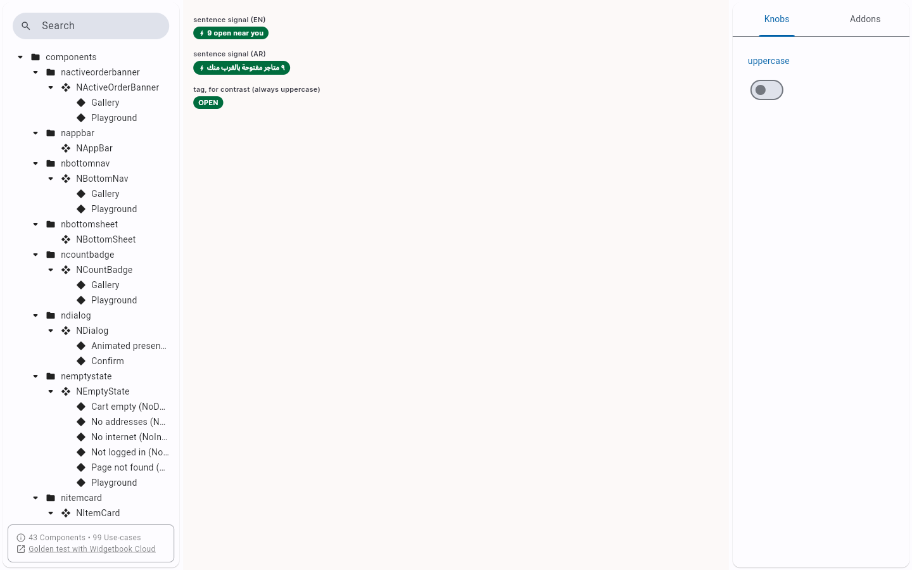
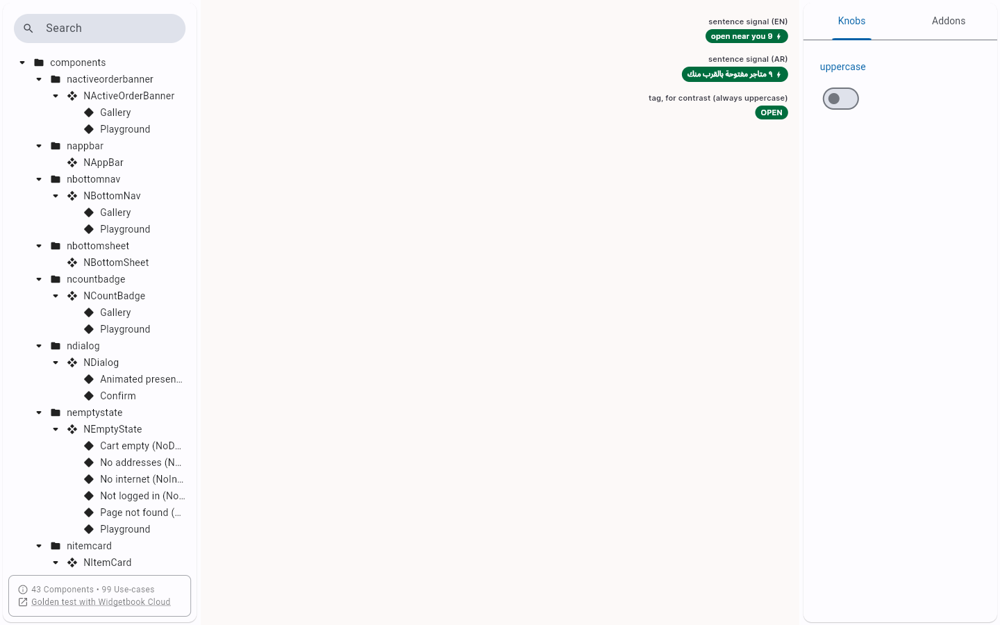
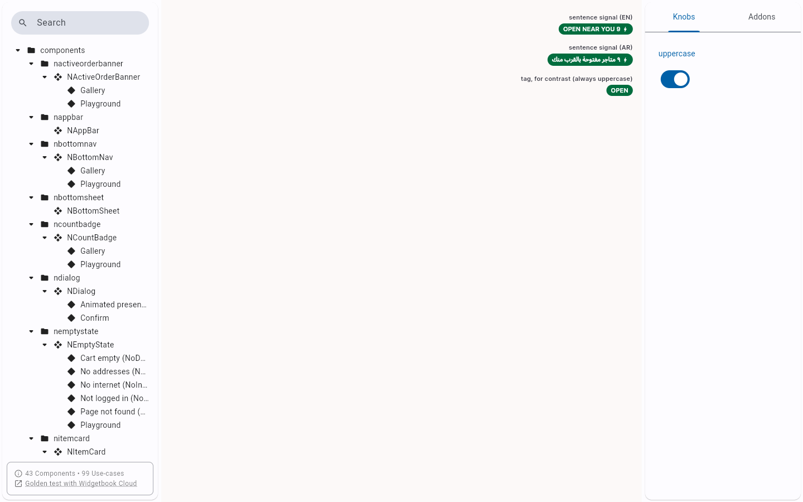
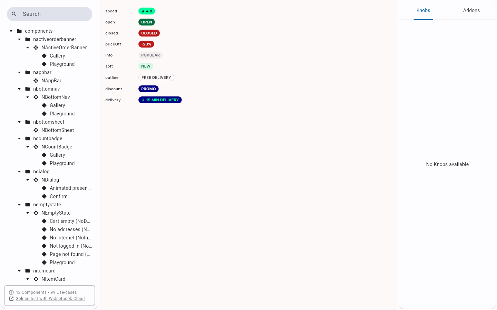
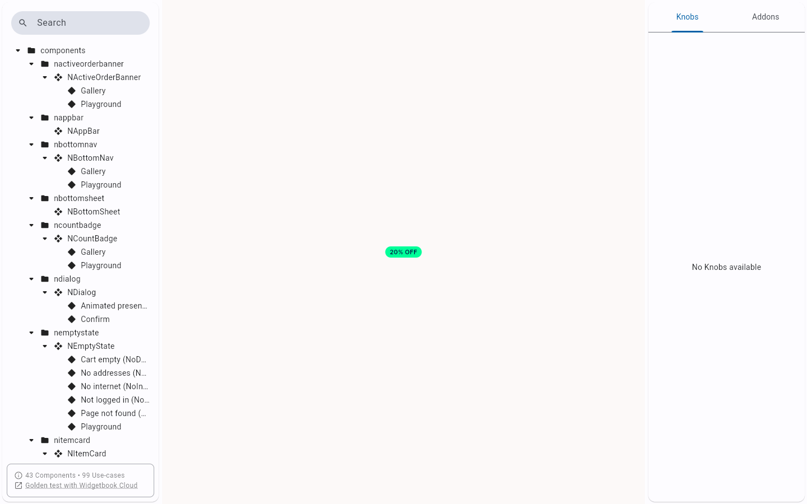
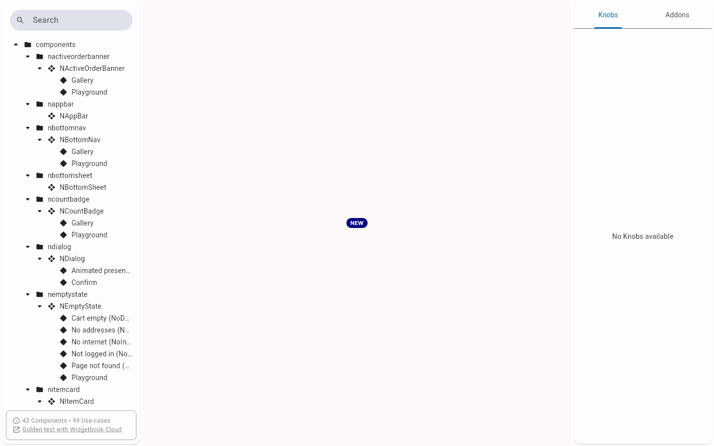
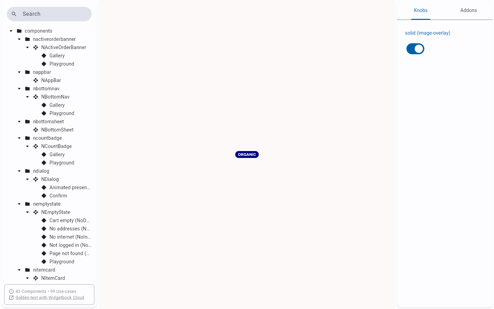
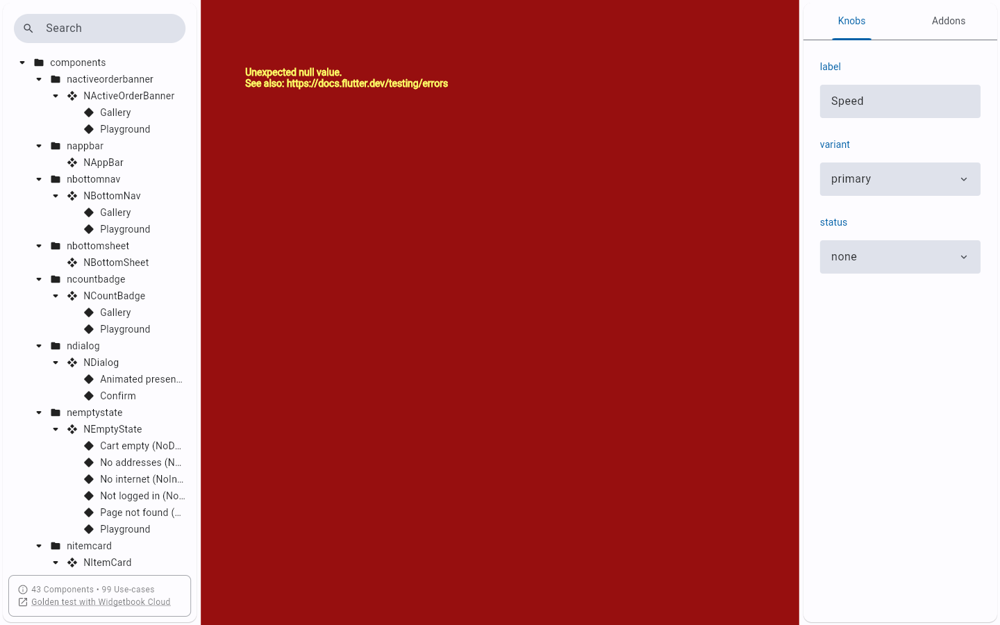
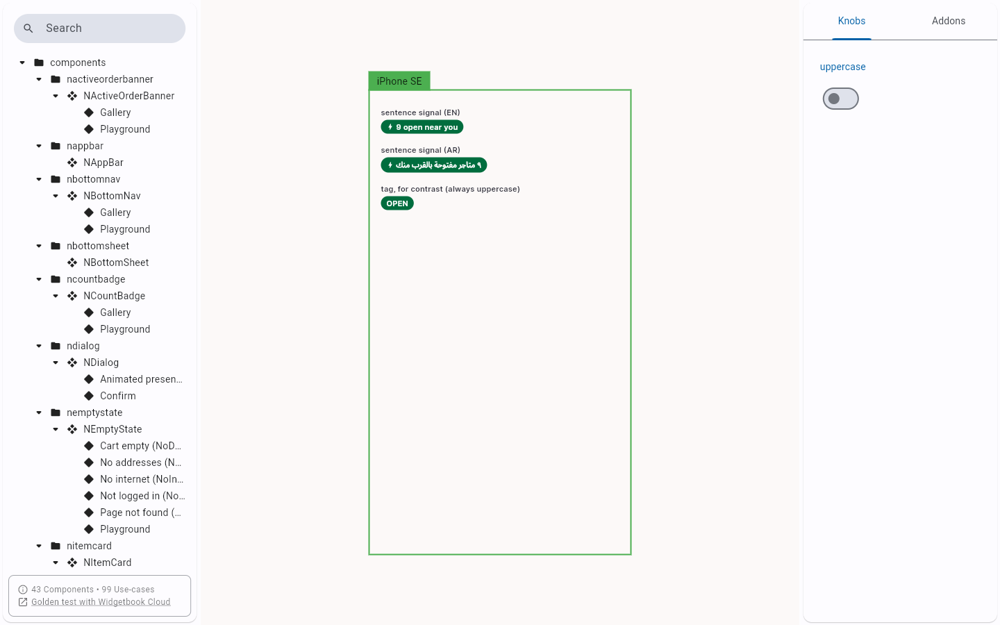
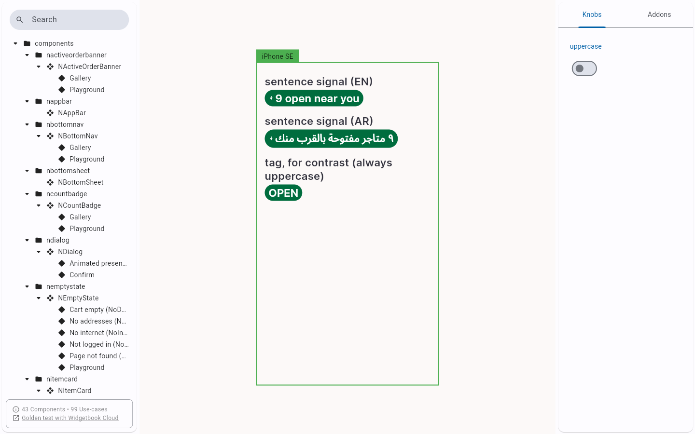

# QA Evidence — NEARS-1476

**PASS — NEARS-1476 NBadge uppercase prop: AC1/AC2/AC4/AC5 met, AC3 N/A host-side; 883/883 nears_dls tests; 5 NBadge use-cases x LTR/RTL pixel-identical to base build**

**12 screenshot(s).** Click any thumbnail for full resolution.

<table>
<tr>
<td align="center" width="33%"> ac2 live signal sentence case</td>
<td align="center" width="33%"> ac2 live signal uppercase</td>
<td align="center" width="33%"> ac4 rtl arabic locale</td>
</tr>
<tr>
<td align="center" width="33%"> ac4 rtl uppercase</td>
<td align="center" width="33%"> ac5 gallery 9 mappings</td>
<td align="center" width="33%"> ac5 tag discount</td>
</tr>
<tr>
<td align="center" width="33%"> ac5 tag new</td>
<td align="center" width="33%"> ac5 tag organic</td>
<td align="center" width="33%"> bug nbadge playground null preexisting</td>
</tr>
<tr>
<td align="center" width="33%"> extra overflow narrow iphonese</td>
<td align="center" width="33%"> extra overflow scale1.0</td>
<td align="center" width="33%"> extra overflow scale2.0</td>
</tr>
</table>

### Other artifacts
- [`bug-dls-golden-unbounded-flex-preexisting.log`](bug-dls-golden-unbounded-flex-preexisting.log)
- [`bug-nbadge-playground-null-preexisting.log`](bug-nbadge-playground-null-preexisting.log)

---
*From `nears/docs/qa-evidence/NEARS-1476/` · public-repo scrub policy (no live secrets; verified clean).*
