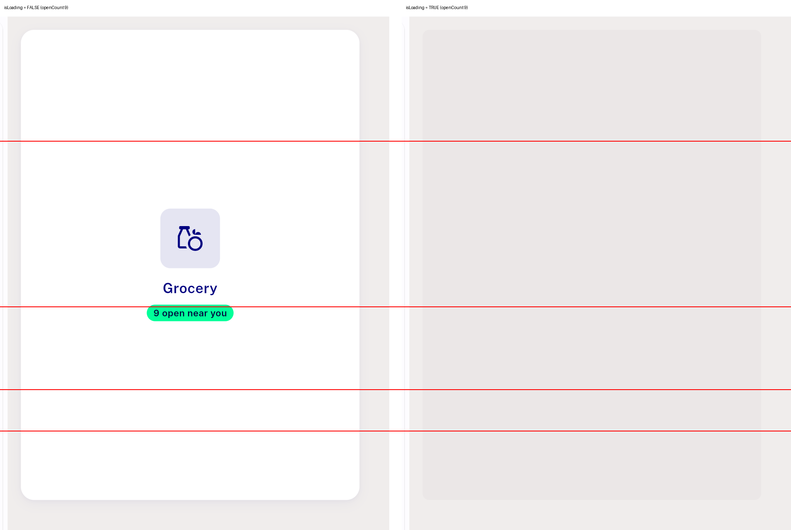
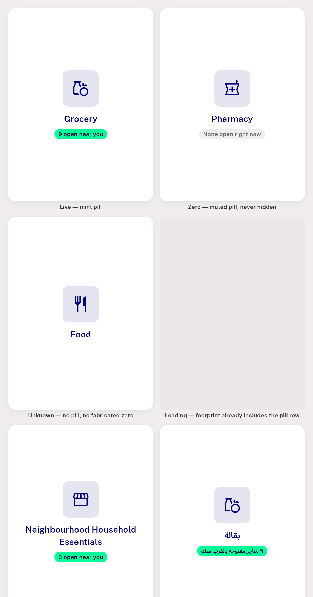
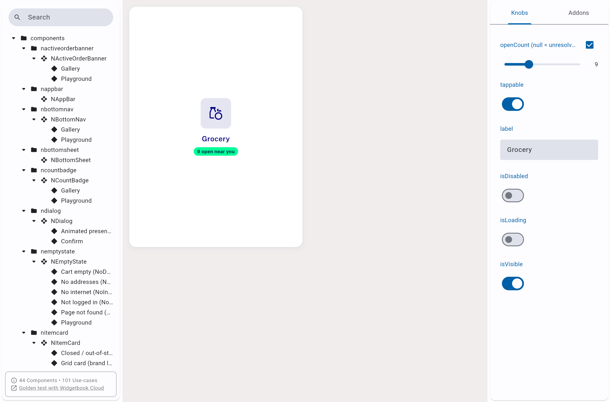

# QA Evidence — NEARS-1477

**PASS — NModuleTile package-only QA on widgetbook release build @ c0678f29; 916/916 dls tests green**

**3 screenshot(s).** Click any thumbnail for full resolution.

<table>
<tr>
<td align="center" width="33%"> ac4 loading vs loaded</td>
<td align="center" width="33%"> gallery all6</td>
<td align="center" width="33%"> playground live</td>
</tr>
</table>

---
*From `nears/docs/qa-evidence/NEARS-1477/` · public-repo scrub policy (no live secrets; verified clean).*
