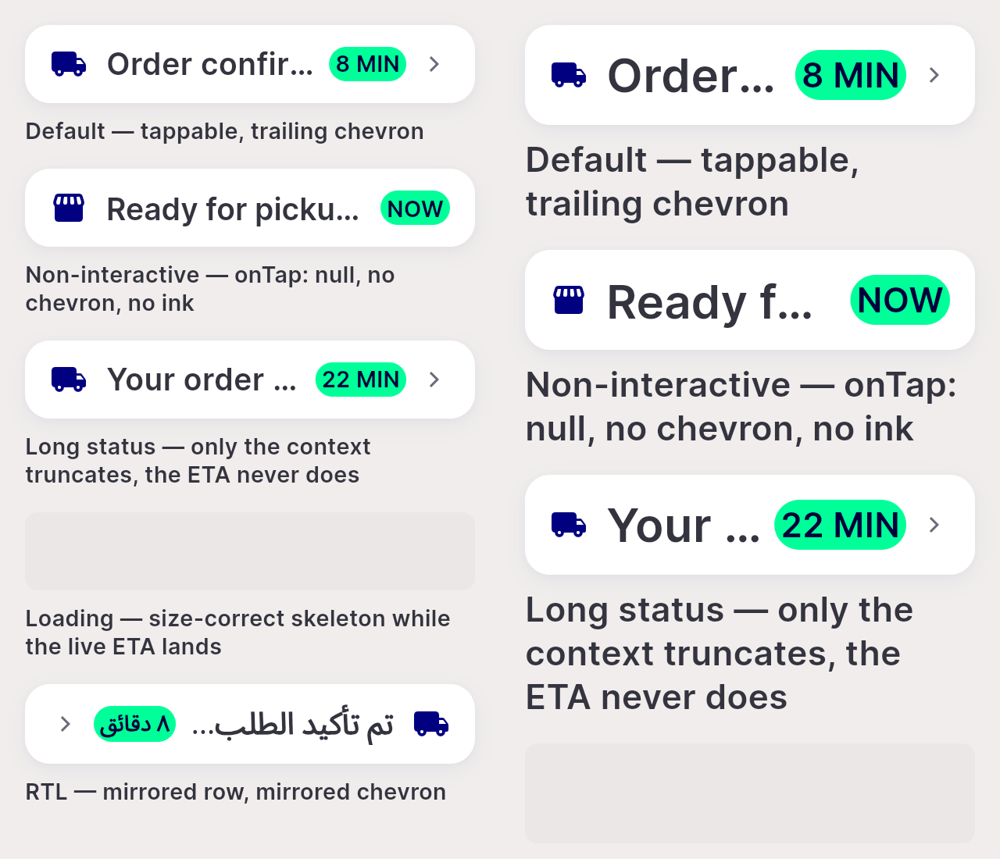
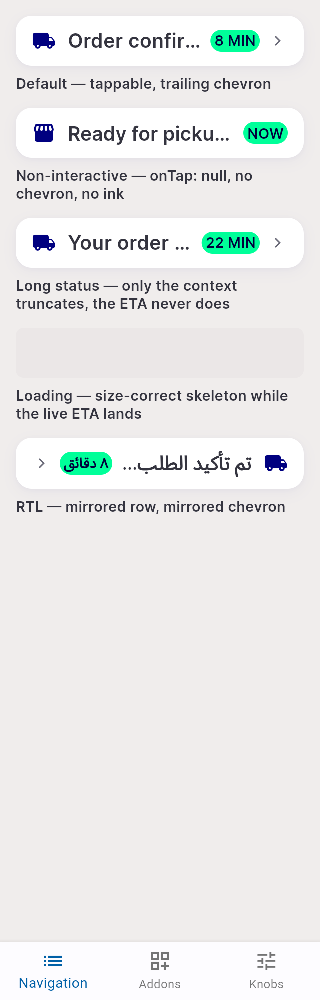
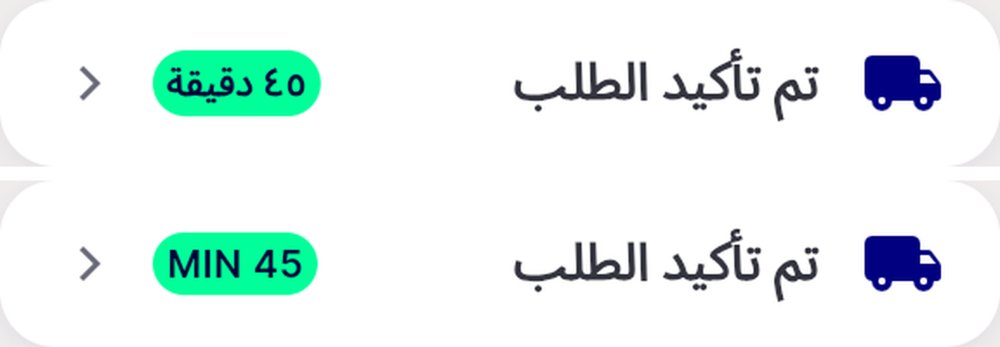

# QA Evidence — NEARS-1478

**FAIL — AC4 RTL chevron does not mirror (NIcon double-flip); 4/5 ACs pass**

**4 screenshot(s).** Click any thumbnail for full resolution.

<table>
<tr>
<td align="center" width="33%"> ac gallery 320dp 1.3x and 2.0x</td>
<td align="center" width="33%"> ac gallery 5 cases 320dp 1.3x</td>
<td align="center" width="33%"> ac4 rtl digit order 45</td>
</tr>
<tr>
<td align="center" width="33%"> bug rtl chevron not mirrored</td>
</tr>
</table>

### Other artifacts
- [`bug-duplicate-a11y-button-node.log`](bug-duplicate-a11y-button-node.log)
- [`bug-rtl-chevron-not-mirrored.log`](bug-rtl-chevron-not-mirrored.log)

---
*From `nears/docs/qa-evidence/NEARS-1478/` · public-repo scrub policy (no live secrets; verified clean).*
