# QA Evidence — NEARS-1482

**FAIL — AC3 offline-retry toast throws (no Scaffold ancestor); 4/5 glyphs verified; RTL clean**

**20 screenshot(s).** Click any thumbnail for full resolution.

<table>
<tr>
<td align="center" width="33%"> ac1 address empty</td>
<td align="center" width="33%"> ac1 allstores state</td>
<td align="center" width="33%"> ac1 cart empty standalone</td>
</tr>
<tr>
<td align="center" width="33%"><a href="ac1-cart-empty-tabmount.png">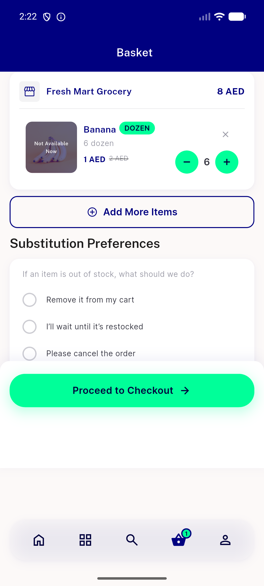</a> ac1 cart empty tabmount</td>
<td align="center" width="33%"><a href="ac1-category-state.png">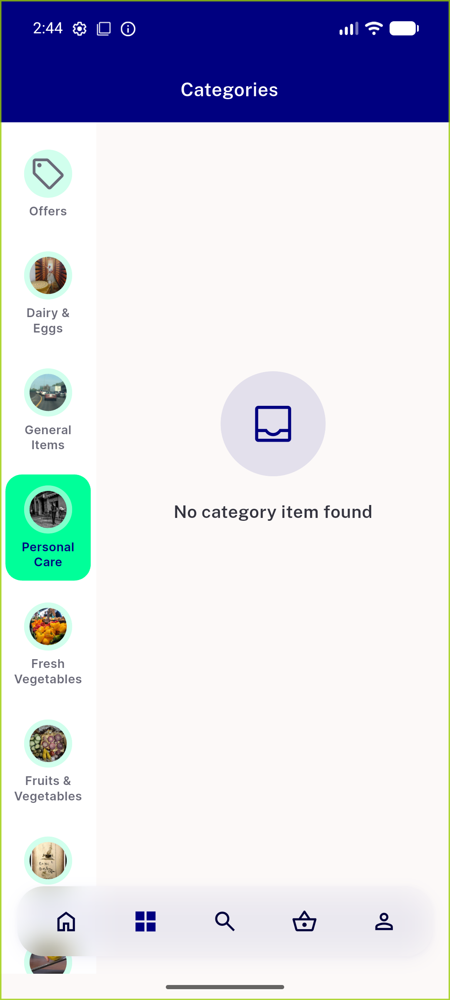</a> ac1 category state</td>
<td align="center" width="33%"><a href="ac1-notloggedin-notification.png">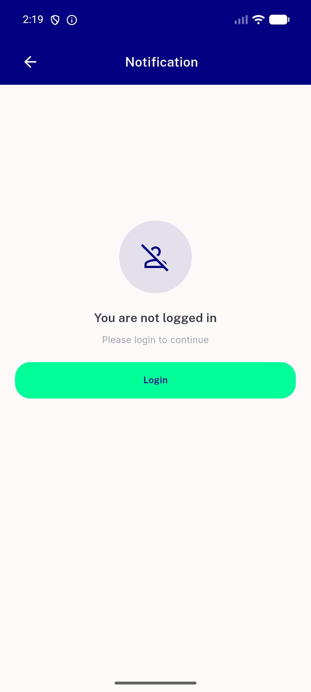</a> ac1 notloggedin notification</td>
</tr>
<tr>
<td align="center" width="33%"><a href="ac1-notloggedin-refer.png">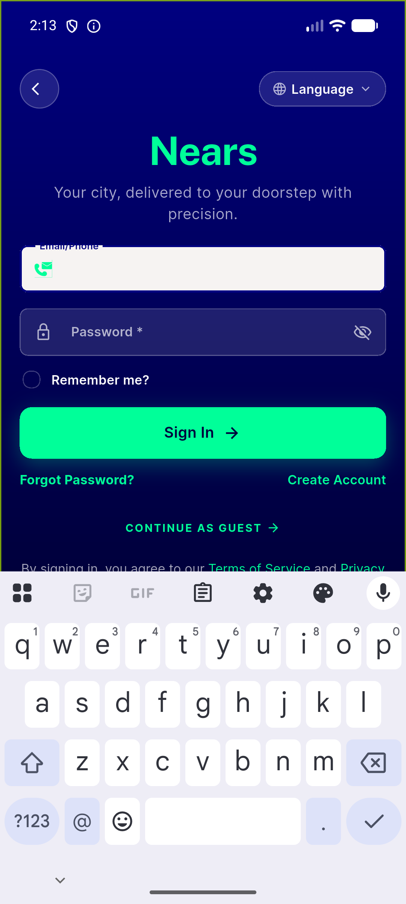</a> ac1 notloggedin refer</td>
<td align="center" width="33%"><a href="ac1-review-empty.png">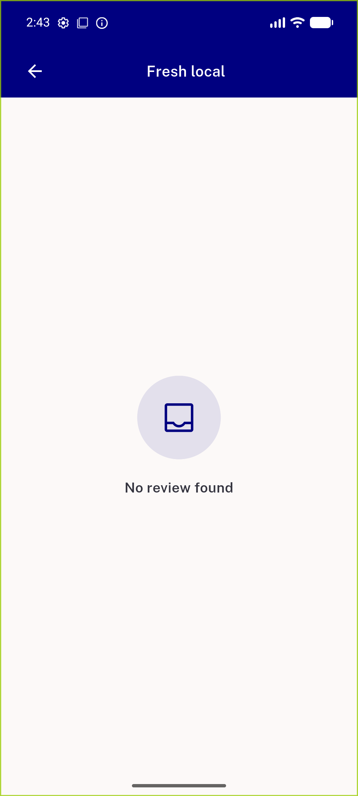</a> ac1 review empty</td>
<td align="center" width="33%"><a href="ac1-search-noitem.png">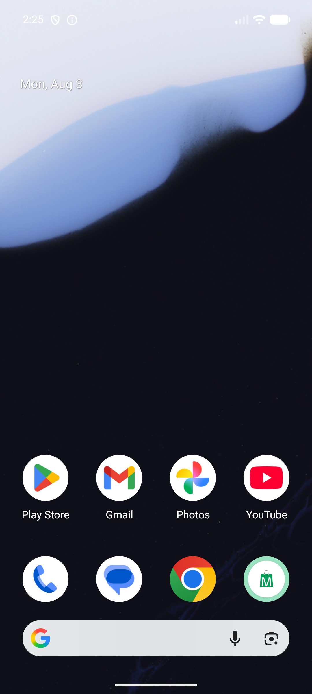</a> ac1 search noitem</td>
</tr>
<tr>
<td align="center" width="33%"><a href="ac2-cart-empty-tabmount.png">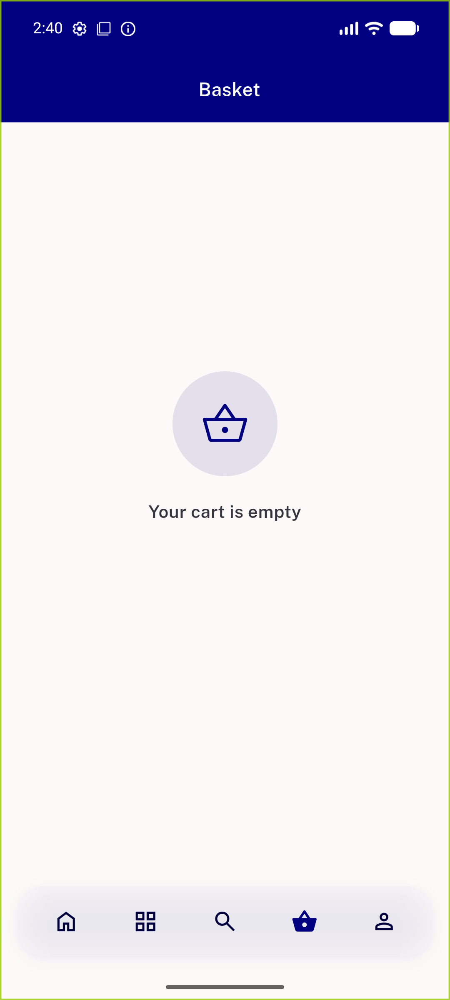</a> ac2 cart empty tabmount</td>
<td align="center" width="33%"><a href="ac2-inbox-search-empty.png">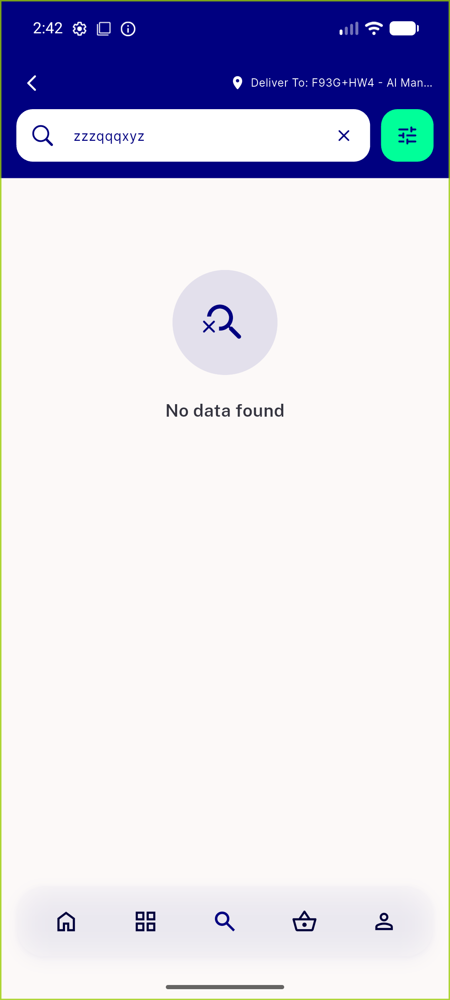</a> ac2 inbox search empty</td>
<td align="center" width="33%"><a href="ac2-wifioff-nointernet.png">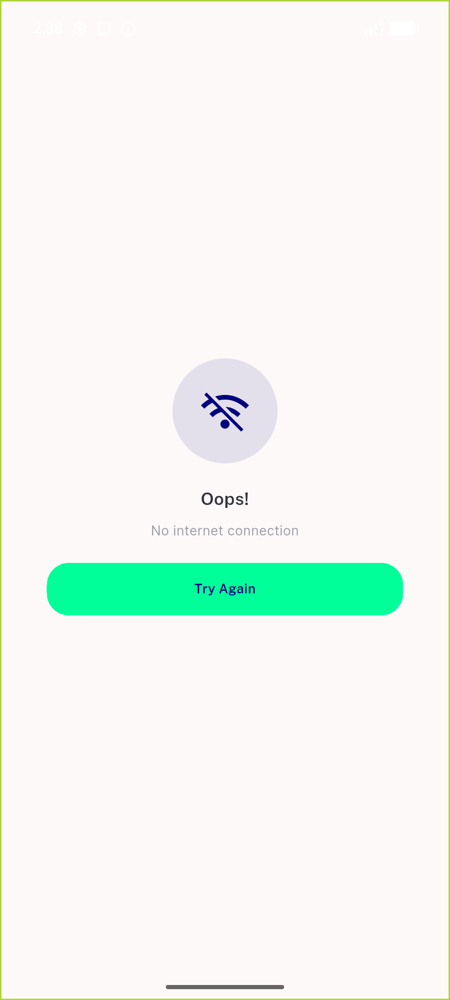</a> ac2 wifioff nointernet</td>
</tr>
<tr>
<td align="center" width="33%"><a href="ac3-retry-offline-toast.png">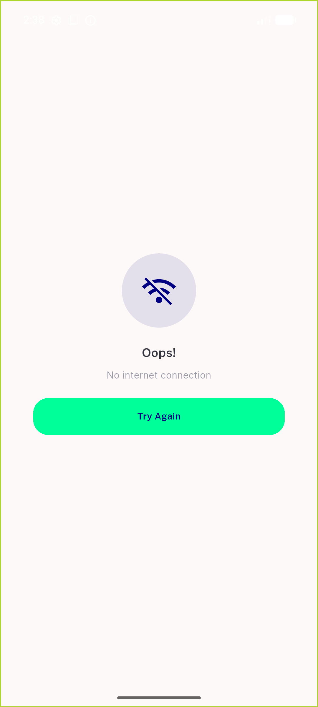</a> ac3 retry offline toast</td>
<td align="center" width="33%"> ac3 splash offline</td>
<td align="center" width="33%"><a href="ac3e-splash-nointernet.png">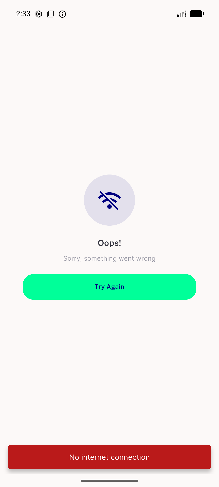</a> ac3e splash nointernet</td>
</tr>
<tr>
<td align="center" width="33%"><a href="ac4-rtl-nointernet.png">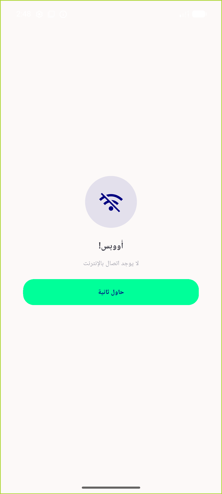</a> ac4 rtl nointernet</td>
<td align="center" width="33%"><a href="ac4-rtl-notloggedin.png">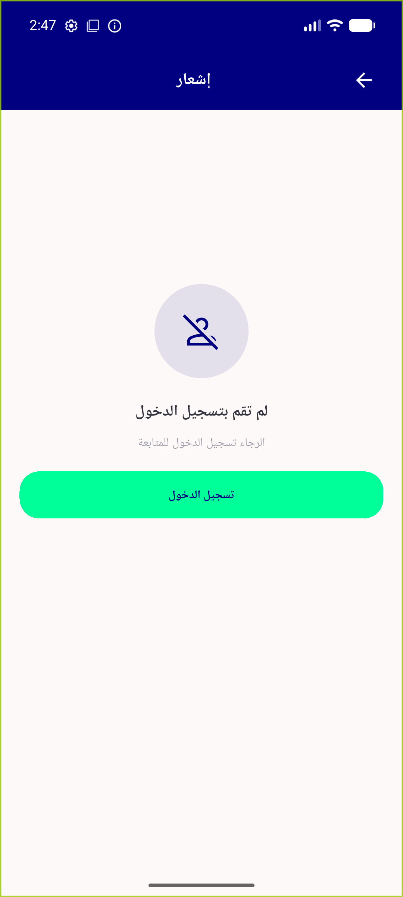</a> ac4 rtl notloggedin</td>
<td align="center" width="33%"> ac4 rtl retry offline</td>
</tr>
<tr>
<td align="center" width="33%"><a href="montage-glyphs.png">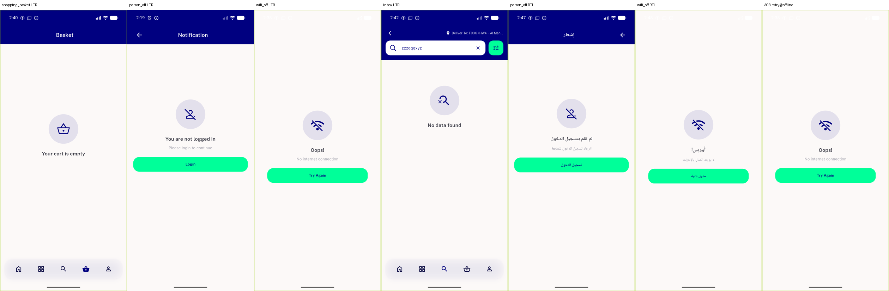</a> montage glyphs</td>
<td align="center" width="33%"><a href="montage-inbox.png">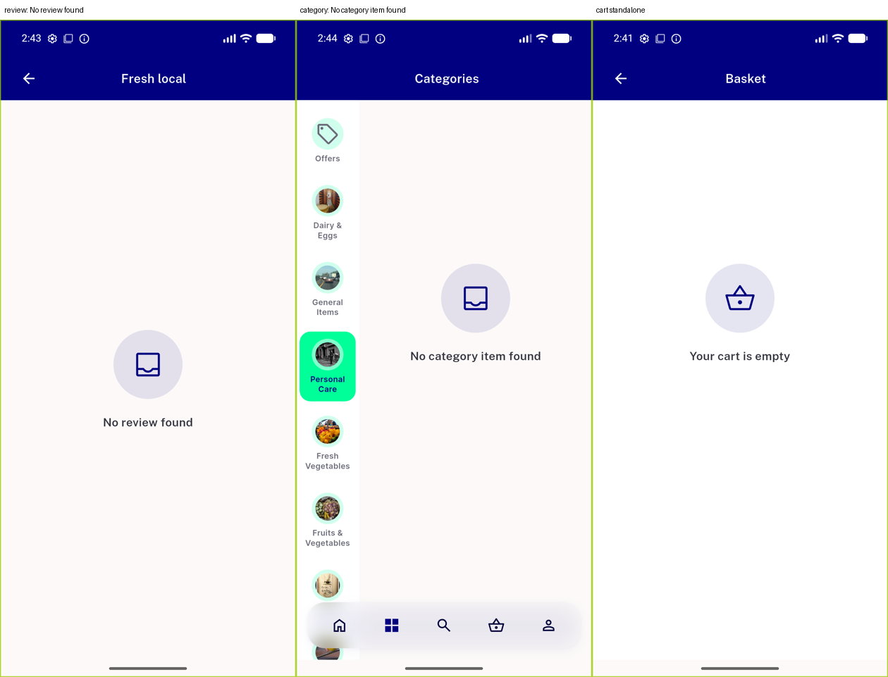</a> montage inbox</td>
</tr>
</table>

### Other artifacts
- [`bug-nointernet-retry-toast-assertion.log`](bug-nointernet-retry-toast-assertion.log)
- [`bug-startup-securestorage-decrypt.log`](bug-startup-securestorage-decrypt.log)
- [`progress.md`](progress.md)

---
*From `nears/docs/qa-evidence/NEARS-1482/` · public-repo scrub policy (no live secrets; verified clean).*
