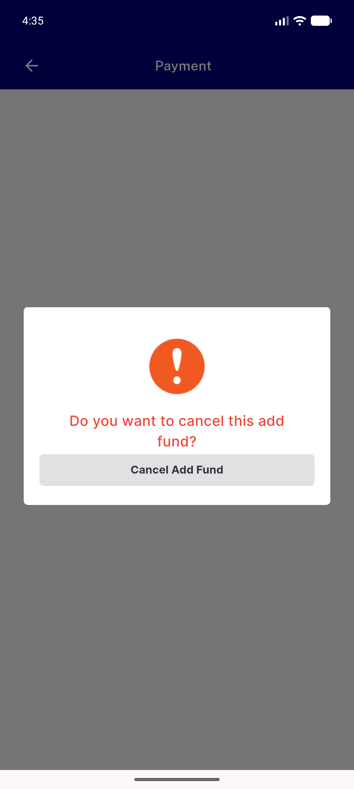
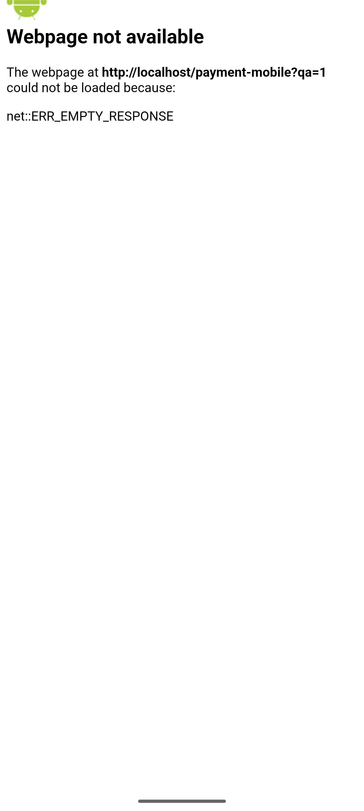

# QA Evidence — NEARS-1483

**FAIL — the fix lands on PaymentWebViewScreen, which payInWevView=false makes unreachable at runtime**

**2 screenshot(s).** Click any thumbnail for full resolution.

<table>
<tr>
<td align="center" width="33%"> bug exitapp gate diverges from live</td>
<td align="center" width="33%"> bug fix lands on unreachable widget</td>
</tr>
</table>

### Other artifacts
- [`bug-endpoint-label-hardcoded-payment-mobile.log`](bug-endpoint-label-hardcoded-payment-mobile.log)
- [`bug-exitapp-gate-diverges-from-live.log`](bug-exitapp-gate-diverges-from-live.log)
- [`bug-fix-lands-on-unreachable-widget.log`](bug-fix-lands-on-unreachable-widget.log)
- [`bug-live-surface-preexisting.log`](bug-live-surface-preexisting.log)
- [`progress.md`](progress.md)

---
*From `nears/docs/qa-evidence/NEARS-1483/` · public-repo scrub policy (no live secrets; verified clean).*
