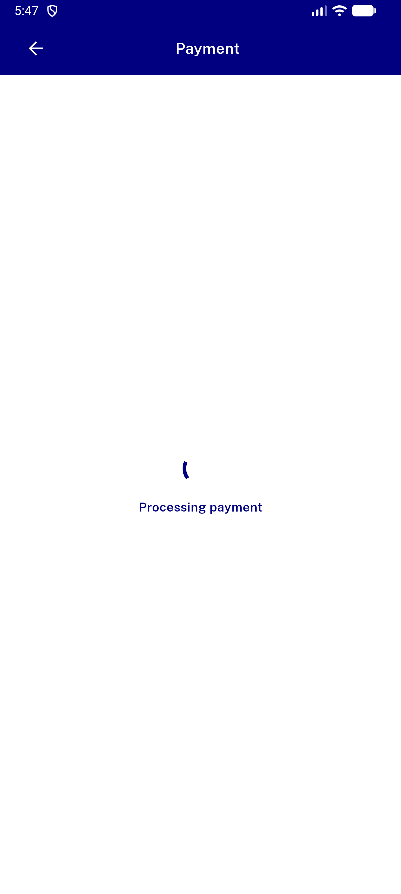
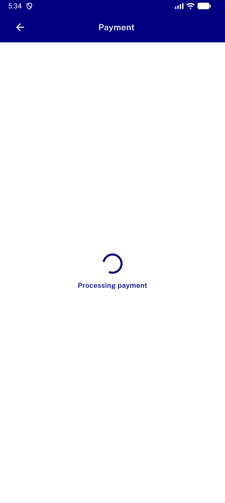

# QA Evidence — NEARS-1483

**PASS — NEARS-1483 C-prime: live-surface payment webview failure logging verified on emulator-5558**

**2 screenshot(s).** Click any thumbnail for full resolution.

<table>
<tr>
<td align="center" width="33%"> post payment screen ui</td>
<td align="center" width="33%"> pre payment screen ui</td>
</tr>
</table>

### Other artifacts
- [`ac-c1-transport-failure.log`](ac-c1-transport-failure.log)
- [`ac-c2-http-502.log`](ac-c2-http-502.log)
- [`ac-c3-subresource-control.log`](ac-c3-subresource-control.log)
- [`ac-c4-entrypoint-labels.log`](ac-c4-entrypoint-labels.log)
- [`bug-payment-back-navigator-assert.log`](bug-payment-back-navigator-assert.log)
- [`progress.md`](progress.md)
- [`regression-and-ui.log`](regression-and-ui.log)
- [`task1-isformainframe.log`](task1-isformainframe.log)

---
*From `nears/docs/qa-evidence/NEARS-1483/` · public-repo scrub policy (no live secrets; verified clean).*
