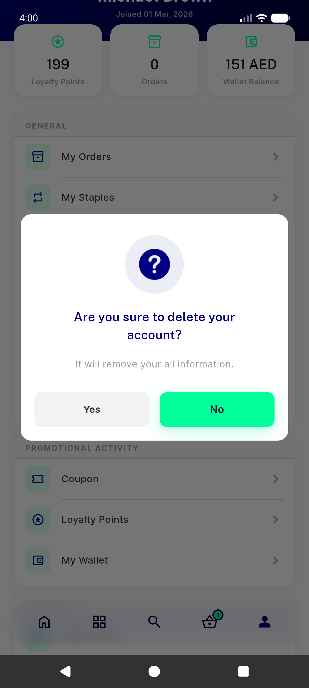
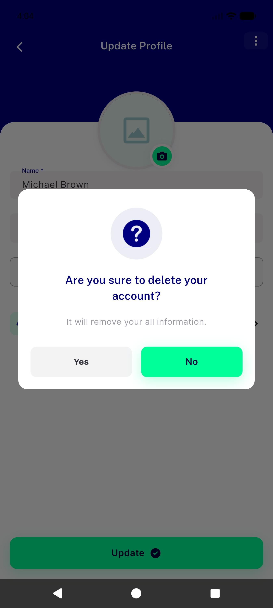
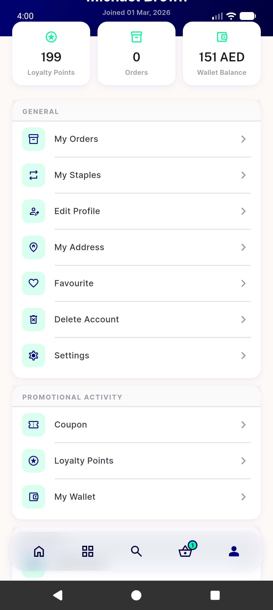
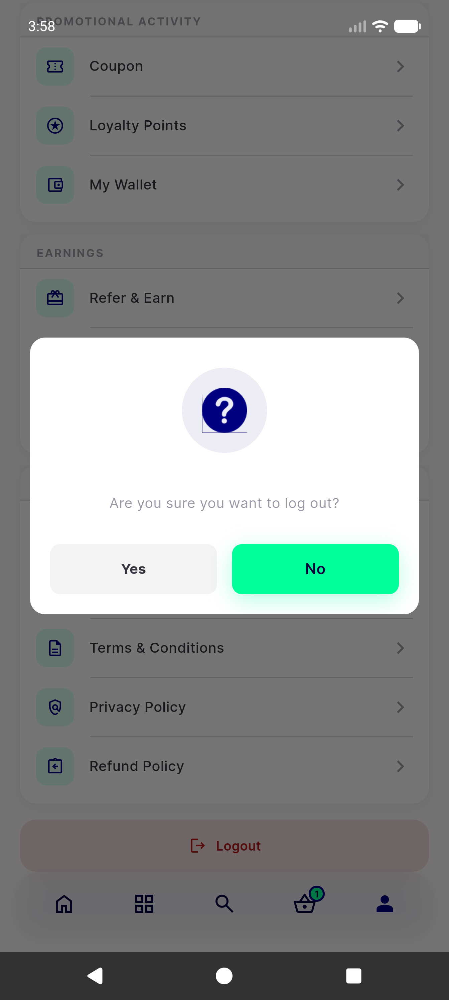
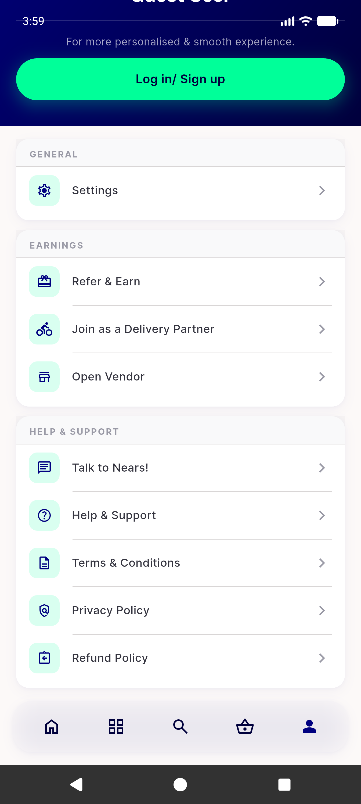
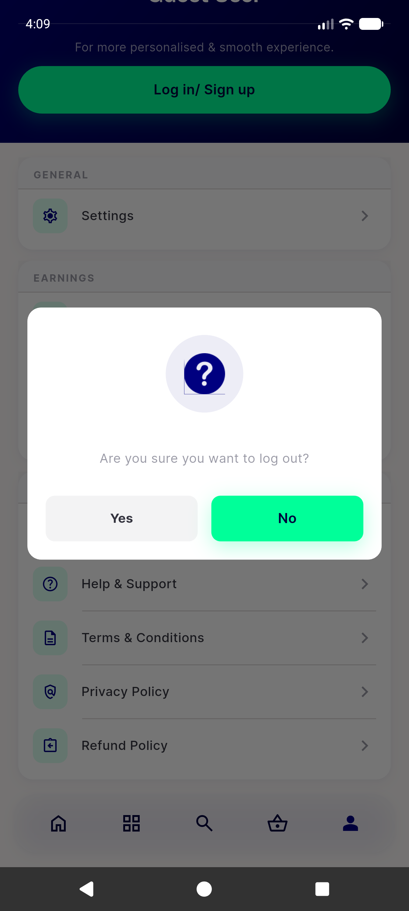
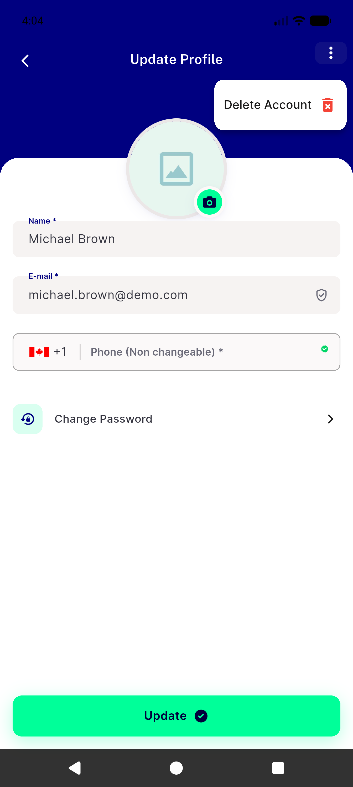

# QA Evidence — NEARS-1485

**PASS — profile_screen delete-under-logout control removed; drawer unreachability corroborated 18/18 on device**

**7 screenshot(s).** Click any thumbnail for full resolution.

<table>
<tr>
<td align="center" width="33%"> ac2 delete account dialog</td>
<td align="center" width="33%"> ac2 delete dialog from profile bg widget</td>
<td align="center" width="33%"> ac2 profile tab delete account row</td>
</tr>
<tr>
<td align="center" width="33%"> ac3 logout confirm dialog</td>
<td align="center" width="33%"> ac3 logout result</td>
<td align="center" width="33%"> ac3 logout successful snackbar</td>
</tr>
<tr>
<td align="center" width="33%"> regression profile bg widget popup</td>
</tr>
</table>

### Other artifacts
- [`progress.md`](progress.md)

---
*From `nears/docs/qa-evidence/NEARS-1485/` · public-repo scrub policy (no live secrets; verified clean).*
