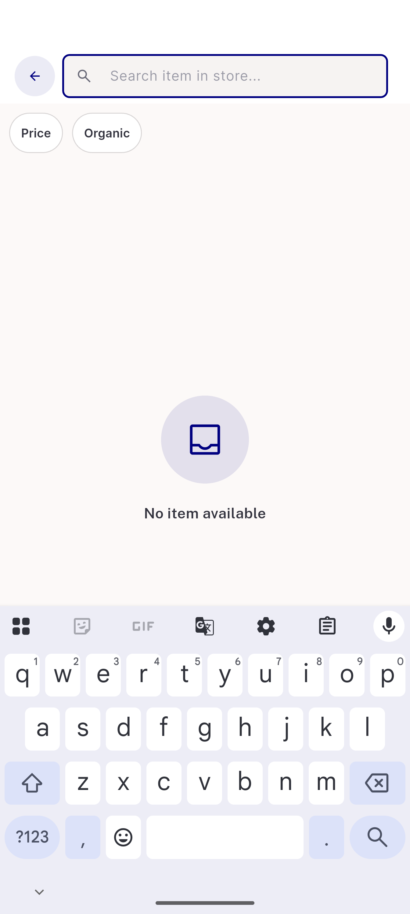
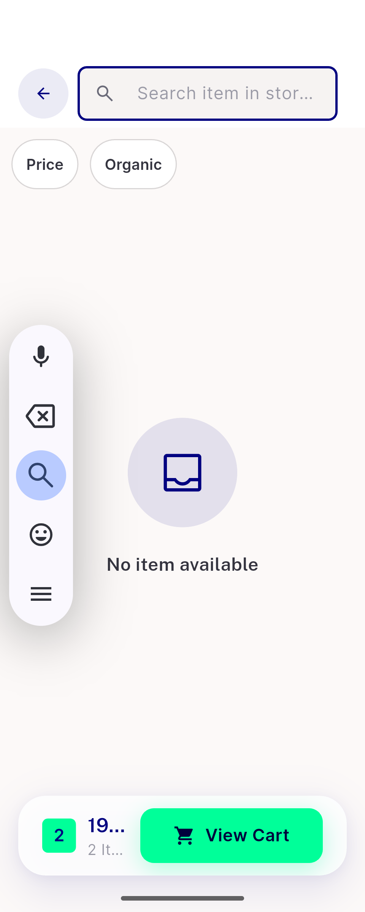
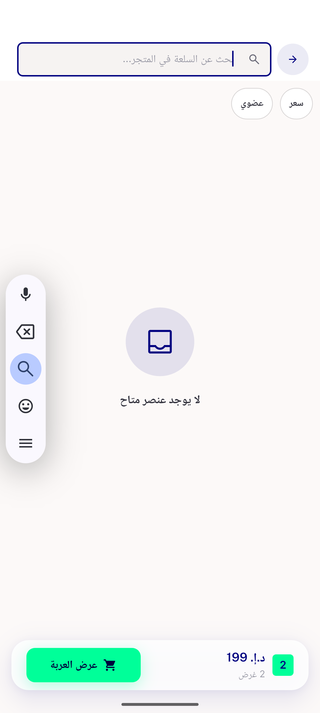

# QA Evidence — NEARS-1486

**PASS — ETA + Brand chips removed; Price/Organic verified LTR + RTL on emulator-5556**

**3 screenshot(s).** Click any thumbnail for full resolution.

<table>
<tr>
<td align="center" width="33%"> ltr two chip row</td>
<td align="center" width="33%"> ltr narrow 320dp</td>
<td align="center" width="33%"> rtl arabic two chip row</td>
</tr>
</table>

### Other artifacts
- [`bug-price-chip-does-not-filter.log`](bug-price-chip-does-not-filter.log)

---
*From `nears/docs/qa-evidence/NEARS-1486/` · public-repo scrub policy (no live secrets; verified clean).*
