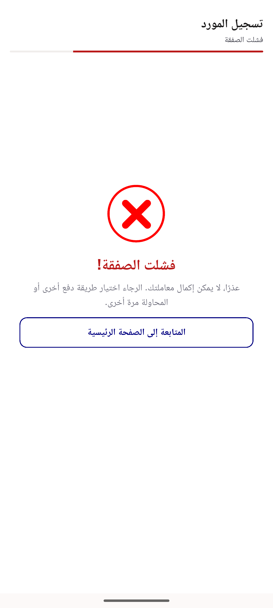
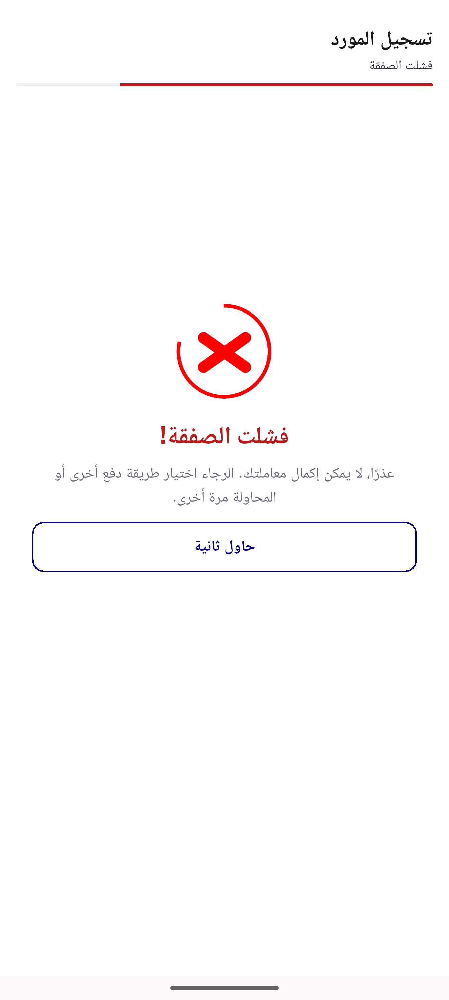
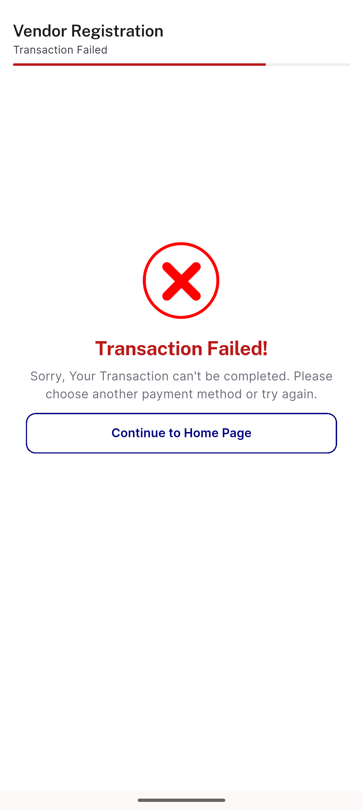
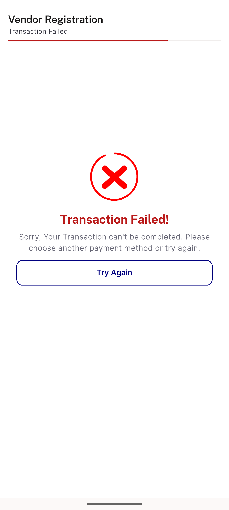

# QA Evidence — NEARS-1487

**PASS — AC1/AC2 demonstrated live on emulator-5556; retry lands on /subscription-payment?store-id=4116&package-id=1**

**4 screenshot(s).** Click any thumbnail for full resolution.

<table>
<tr>
<td align="center" width="33%"> ar failure continue home</td>
<td align="center" width="33%"> ar failure try again</td>
<td align="center" width="33%"> en failure continue home</td>
</tr>
<tr>
<td align="center" width="33%"> en failure try again</td>
</tr>
</table>

### Other artifacts
- [`progress.md`](progress.md)

---
*From `nears/docs/qa-evidence/NEARS-1487/` · public-repo scrub policy (no live secrets; verified clean).*
