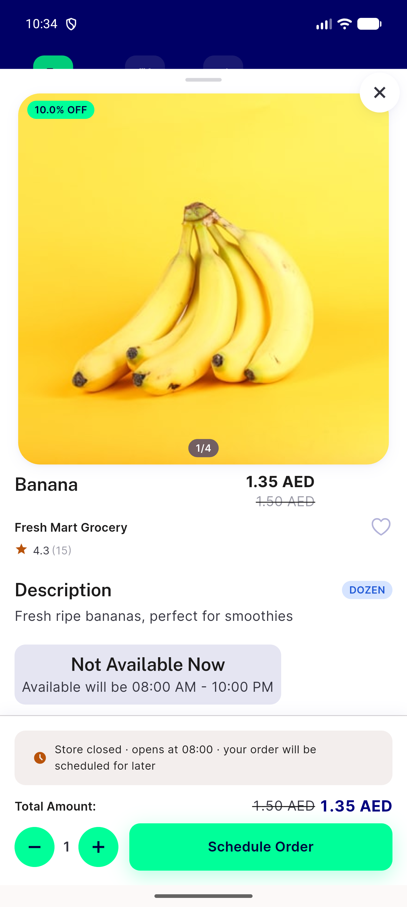
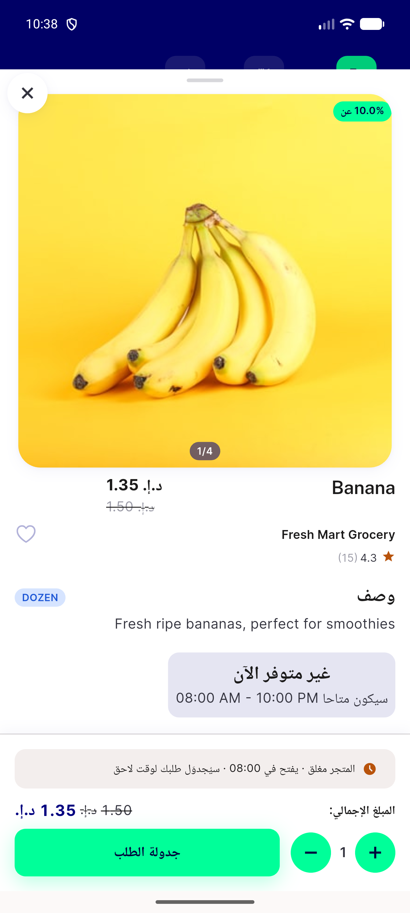
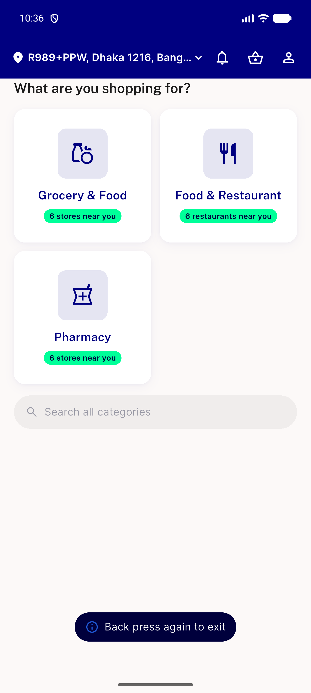
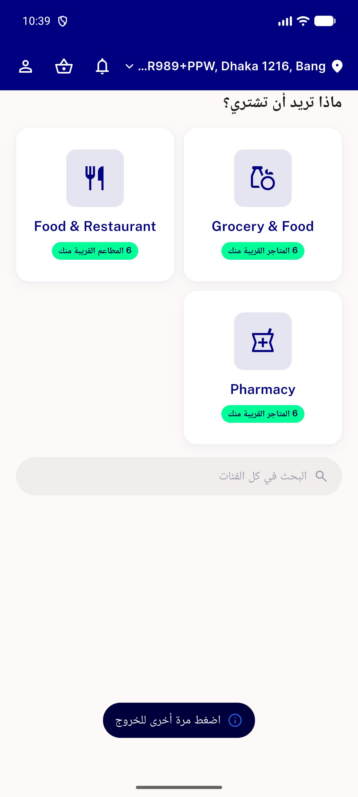
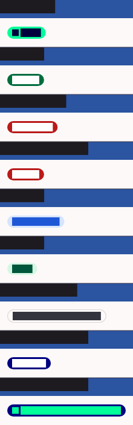

# QA Evidence — NEARS-1488

**PASS -- NEARS-1488 info token promotion; live-demoed EN+AR/RTL on emulator-5554**

**6 screenshot(s).** Click any thumbnail for full resolution.

<table>
<tr>
<td align="center" width="33%"> ac2 nbadge info live en</td>
<td align="center" width="33%"> ac2 nbadge info live rtl</td>
<td align="center" width="33%"> ac3 ntoast info live en</td>
</tr>
<tr>
<td align="center" width="33%"> ac3 ntoast info live rtl</td>
<td align="center" width="33%"> ac5 golden n badge mappings</td>
<td align="center" width="33%"> ac5 golden n toast statuses</td>
</tr>
</table>

---
*From `nears/docs/qa-evidence/NEARS-1488/` · public-repo scrub policy (no live secrets; verified clean).*
