# QA Evidence — NEARS-1491

**PASS (with 2 pre-existing regression bugs) - taxi/rental removal verified live on emulator-5554/5556, incl. a real trip_status FCM push**

**14 screenshot(s).** Click any thumbnail for full resolution.

<table>
<tr>
<td align="center" width="33%"><a href="ac1-home-arabic-rtl.png">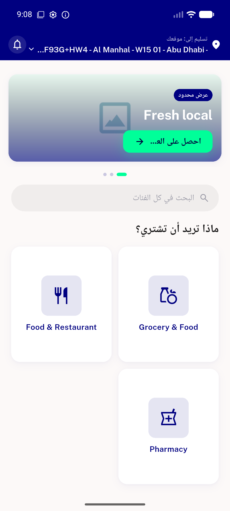</a> ac1 home arabic rtl</td>
<td align="center" width="33%"><a href="ac1-home-english-intact.png">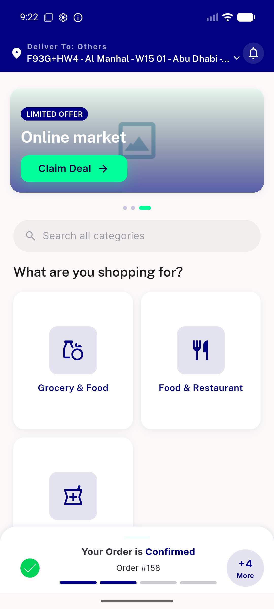</a> ac1 home english intact</td>
<td align="center" width="33%"><a href="ac1-home-greeting-search-rails-intact.png">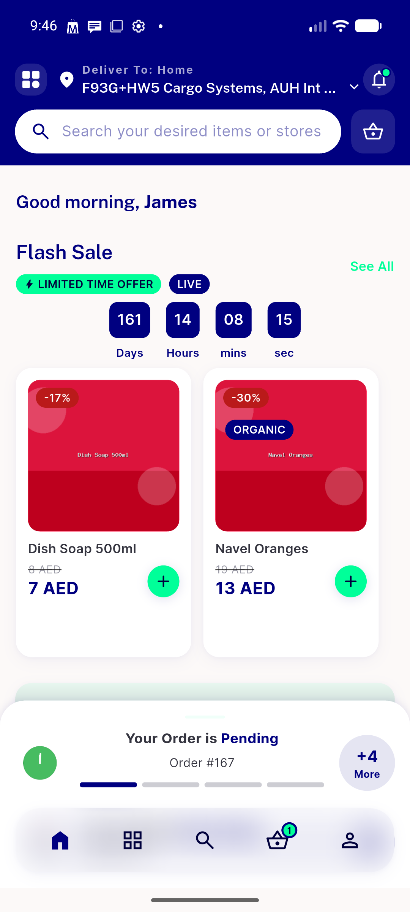</a> ac1 home greeting search rails intact</td>
</tr>
<tr>
<td align="center" width="33%"><a href="ac1-module-dashboard-arabic-yourtower.png">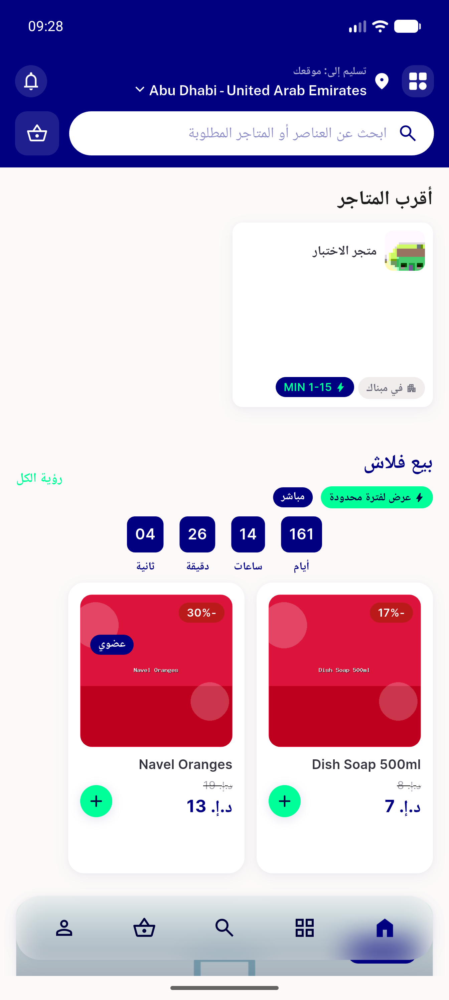</a> ac1 module dashboard arabic yourtower</td>
<td align="center" width="33%"><a href="ac2-trip-status-banner.png">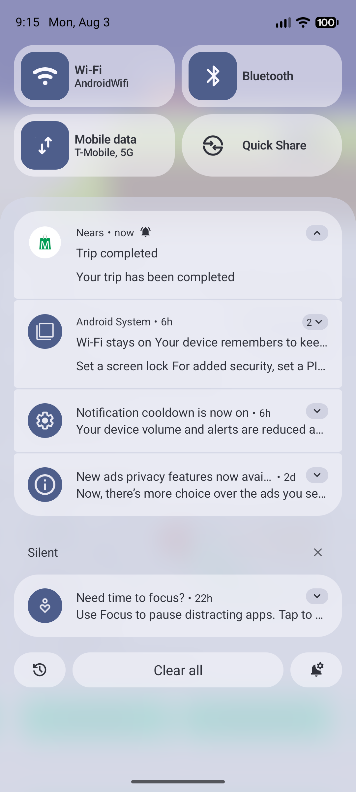</a> ac2 trip status banner</td>
<td align="center" width="33%"><a href="ac2-trip-status-opens-notification-list.png">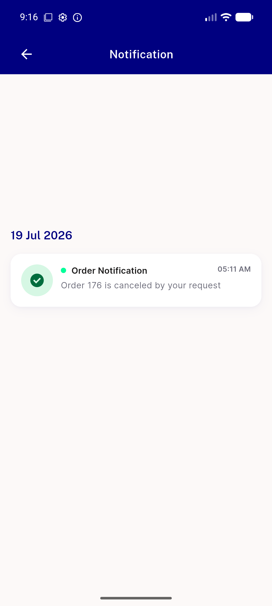</a> ac2 trip status opens notification list</td>
</tr>
<tr>
<td align="center" width="33%"><a href="ac4-block-notification-routes-signin.png">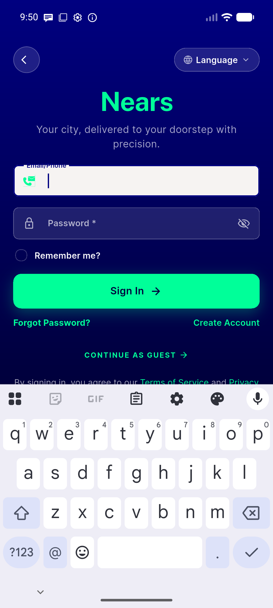</a> ac4 block notification routes signin</td>
<td align="center" width="33%"><a href="ac4-grouped-order-single-banner-nears1292.png">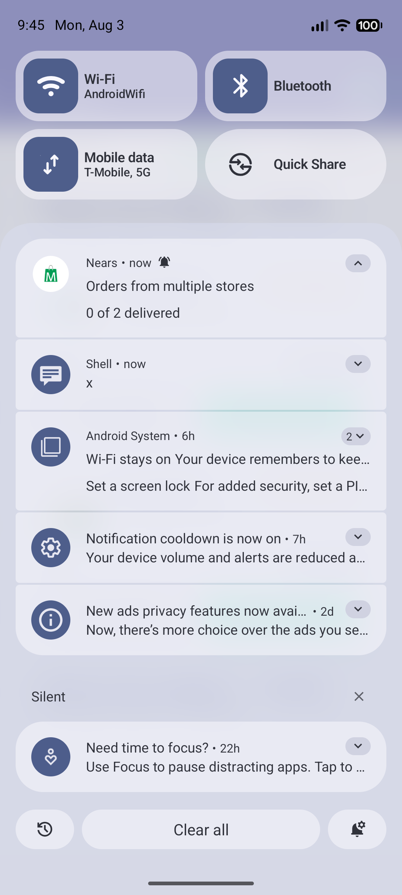</a> ac4 grouped order single banner nears1292</td>
<td align="center" width="33%"><a href="ac4-orders-empty-state.png">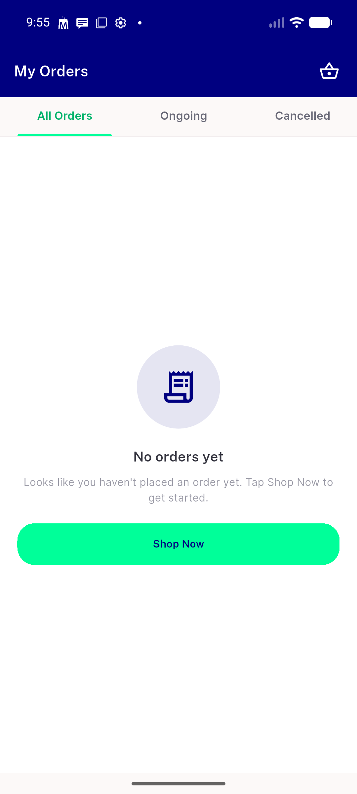</a> ac4 orders empty state</td>
</tr>
<tr>
<td align="center" width="33%"><a href="ac4-orders-tab-cancelled.png">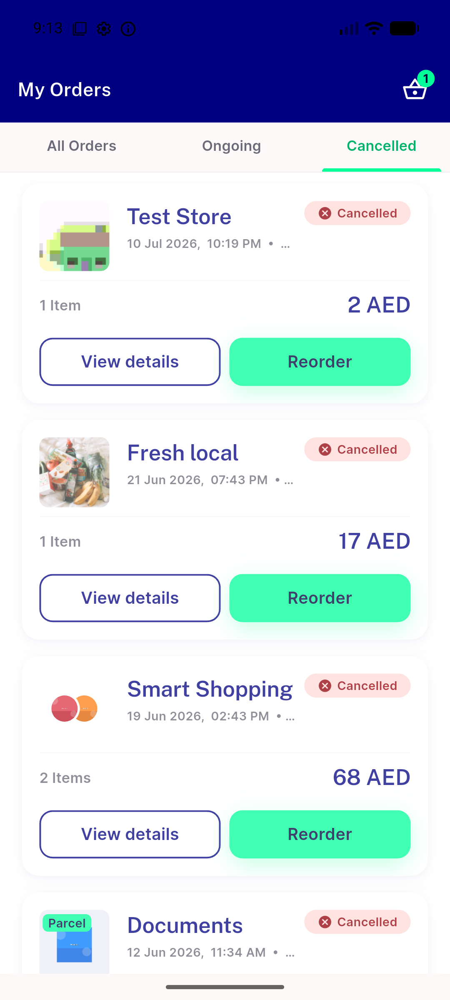</a> ac4 orders tab cancelled</td>
<td align="center" width="33%"><a href="ac4-orders-tabs-all.png">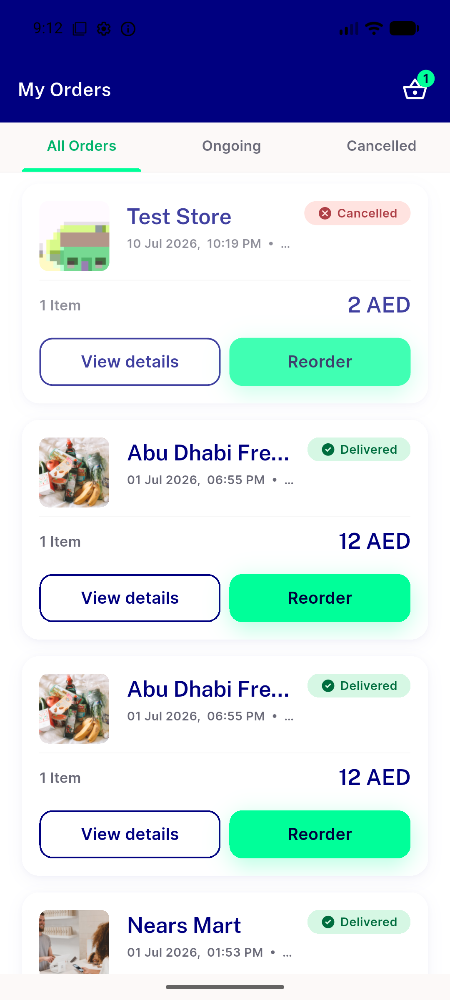</a> ac4 orders tabs all</td>
<td align="center" width="33%"><a href="bug-blank-history-tabs-grouped-user.png">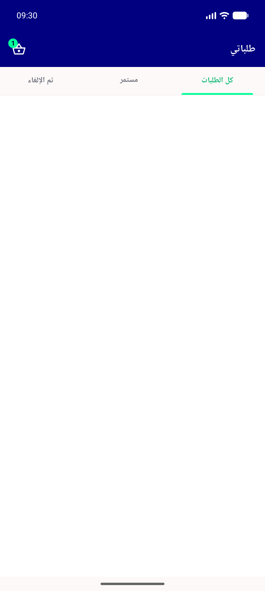</a> bug blank history tabs grouped user</td>
</tr>
<tr>
<td align="center" width="33%"> bug navigator debuglocked SAME ON BASE 791af64a</td>
<td align="center" width="33%"> bug navigator debuglocked redscreen</td>
</tr>
</table>

### Other artifacts
- [`bug-blank-history-tabs-grouped-user.log`](bug-blank-history-tabs-grouped-user.log)
- [`bug-navigator-debuglocked.log`](bug-navigator-debuglocked.log)
- [`build-freshness-proof.log`](build-freshness-proof.log)

---
*From `nears/docs/qa-evidence/NEARS-1491/` · public-repo scrub policy (no live secrets; verified clean).*
