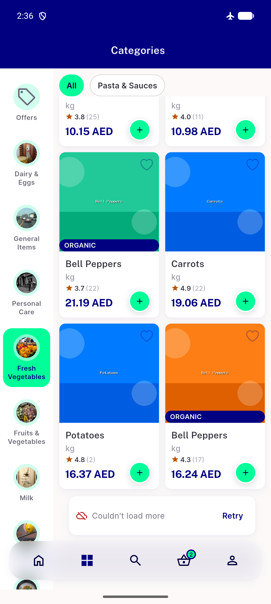
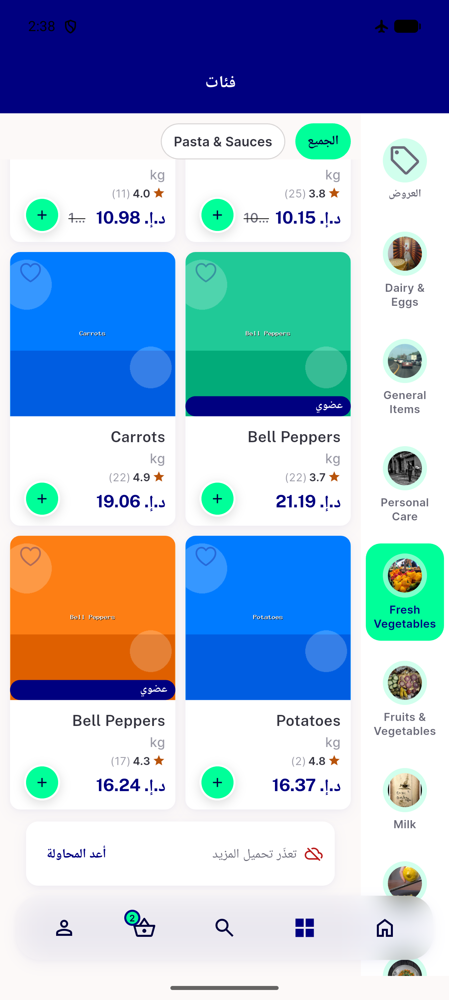
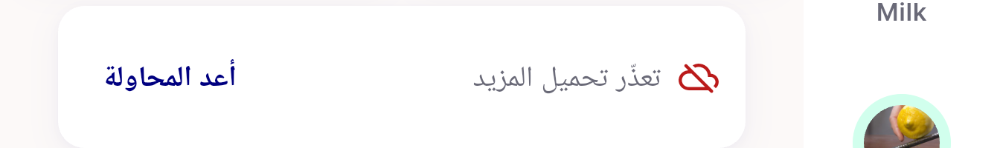
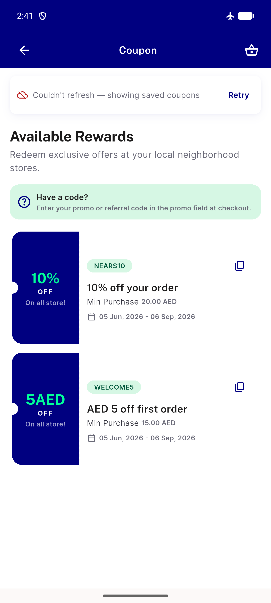
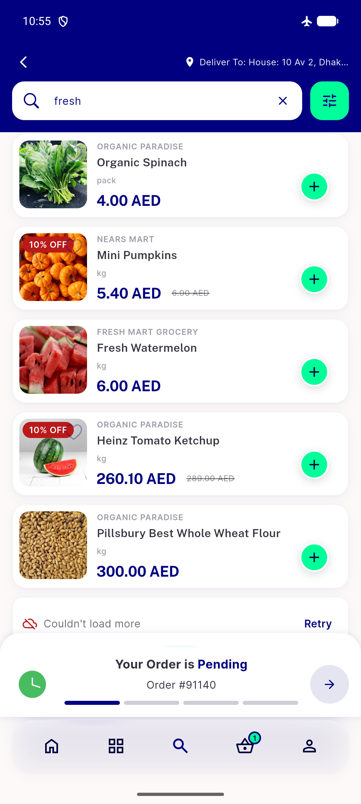
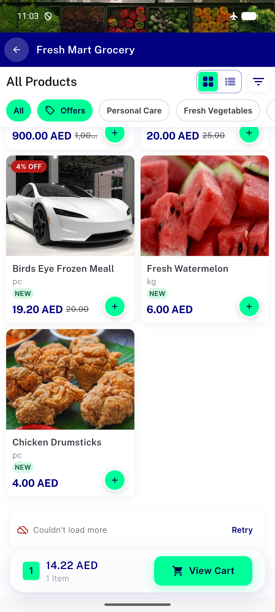
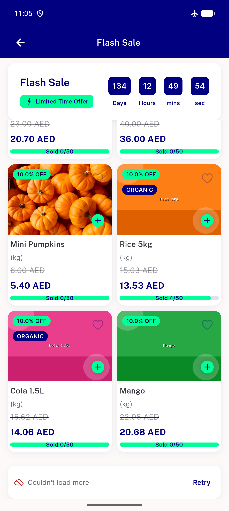
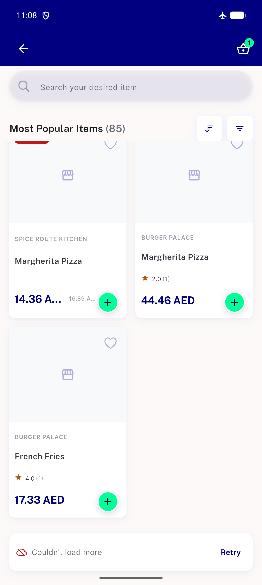

# QA Evidence — NEARS-1493

**PASS — NLoadMoreError promotion verified live on emulator-5554 (Android, light mode); 5/6 call sites demonstrated live + brands confirmed unreachable (0 seeded brands, documented data gap, widget-test verified); RTL pixel-bounds confirmed; automated backstop 131/131 green**

**8 screenshot(s).** Click any thumbnail for full resolution.

<table>
<tr>
<td align="center" width="33%"> category load more error</td>
<td align="center" width="33%"> category rtl load more error</td>
<td align="center" width="33%"> 02b rtl row crop</td>
</tr>
<tr>
<td align="center" width="33%"> coupon refresh failed</td>
<td align="center" width="33%"> search load more error</td>
<td align="center" width="33%"> store item list load more error</td>
</tr>
<tr>
<td align="center" width="33%"> flashsale load more error</td>
<td align="center" width="33%"> item view all load more error</td>
</tr>
</table>

### Other artifacts
- [`02c-rtl-a11y-dump.xml`](02c-rtl-a11y-dump.xml)

---
*From `nears/docs/qa-evidence/NEARS-1493/` · public-repo scrub policy (no live secrets; verified clean).*
