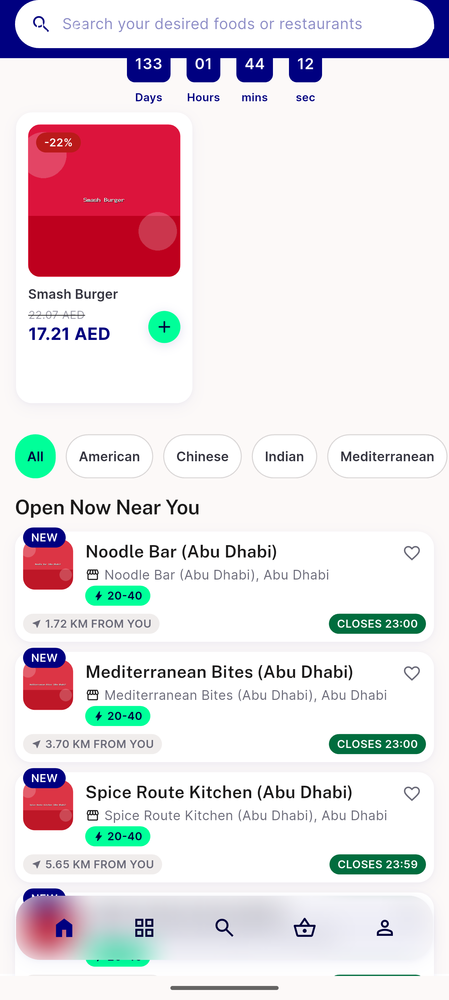
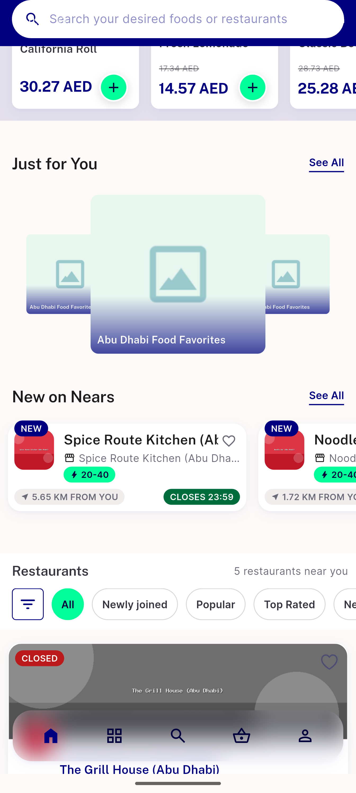
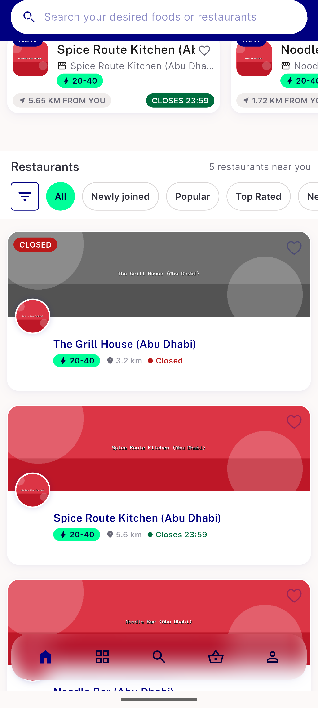
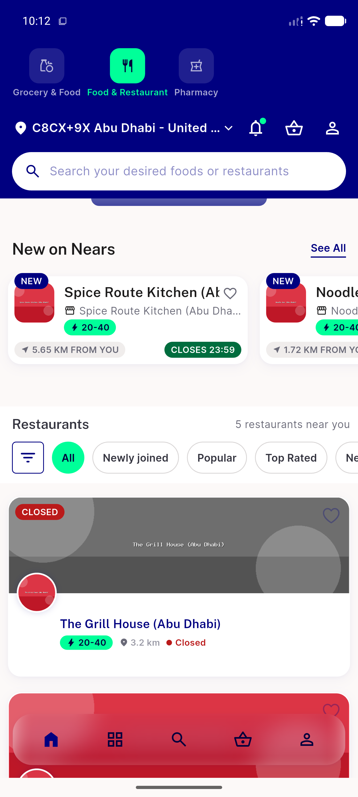
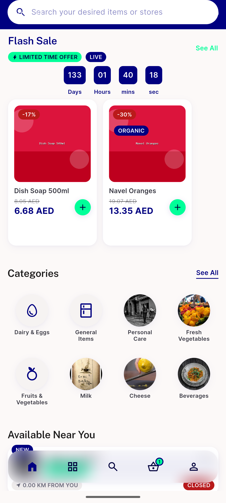
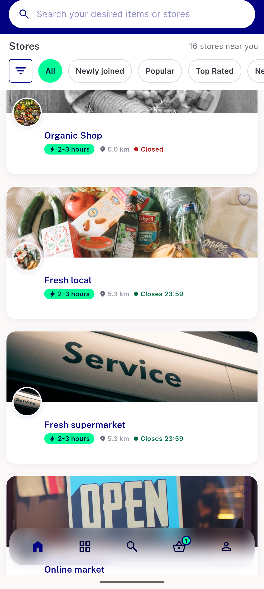
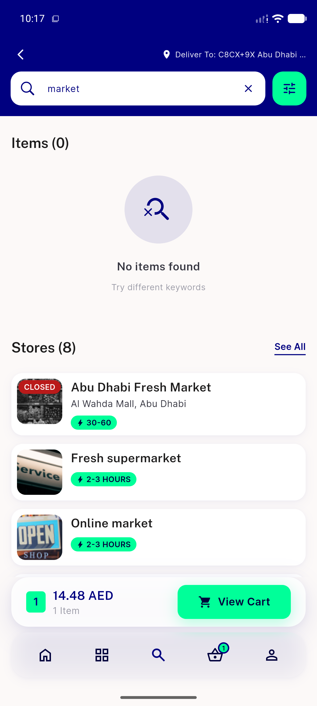
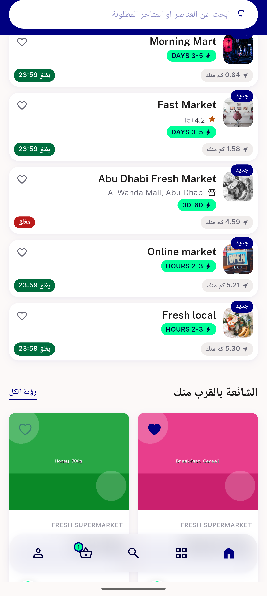

# QA Evidence — NEARS-1496

**PASS -- store-card hue matches NBadge status:success (#006D3E) live-render confirmed, closed-path unchanged, RTL clean**

**8 screenshot(s).** Click any thumbnail for full resolution.

<table>
<tr>
<td align="center" width="33%"> food home open near you</td>
<td align="center" width="33%"> newon and storelist food</td>
<td align="center" width="33%"> storelist rows food</td>
</tr>
<tr>
<td align="center" width="33%"> newon tile badge</td>
<td align="center" width="33%"> organic shop closed</td>
<td align="center" width="33%"> paginated grocery storelist</td>
</tr>
<tr>
<td align="center" width="33%"> search results storecards</td>
<td align="center" width="33%"> rtl grocery storelist</td>
</tr>
</table>

---
*From `nears/docs/qa-evidence/NEARS-1496/` · public-repo scrub policy (no live secrets; verified clean).*
