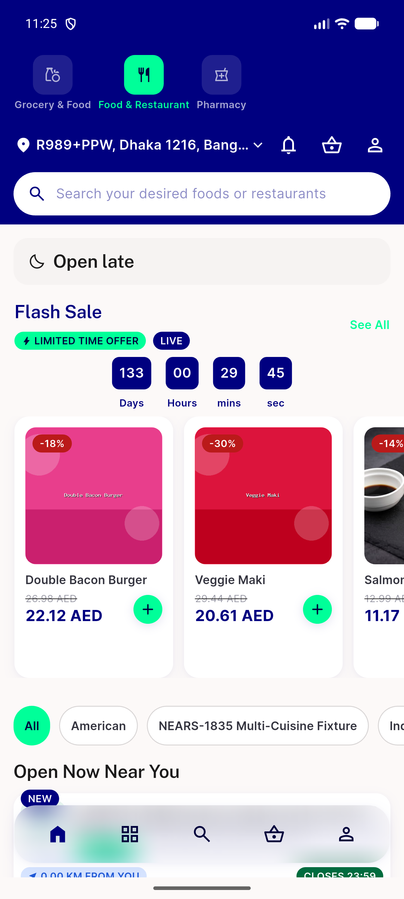
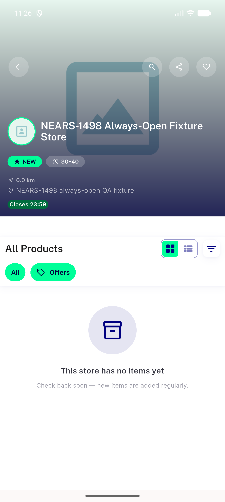

# QA Evidence — NEARS-1498

**PASS -- fixture reachable, idempotent, no raw DML, doc entry present (emulator-5554, real off-hours 2026-08-31 23:2x local)**

**3 screenshot(s).** Click any thumbnail for full resolution.

<table>
<tr>
<td align="center" width="33%"> ac2 food home rail open pill</td>
<td align="center" width="33%"> ac2 open now rail scrolled</td>
<td align="center" width="33%"> ac2 store detail open pill</td>
</tr>
</table>

---
*From `nears/docs/qa-evidence/NEARS-1498/` · public-repo scrub policy (no live secrets; verified clean).*
