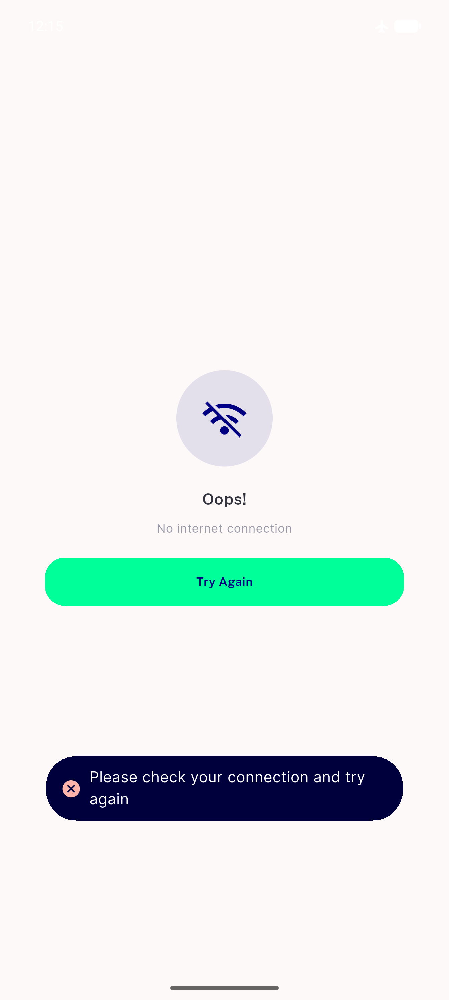
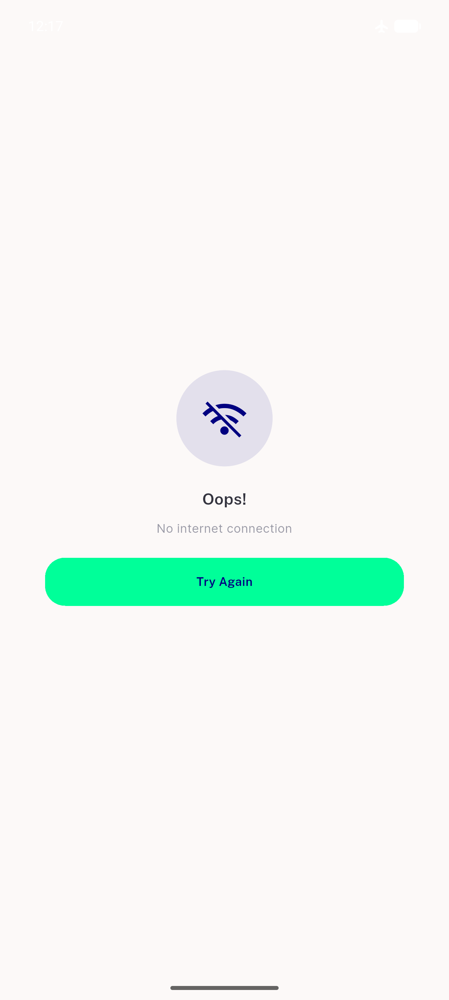
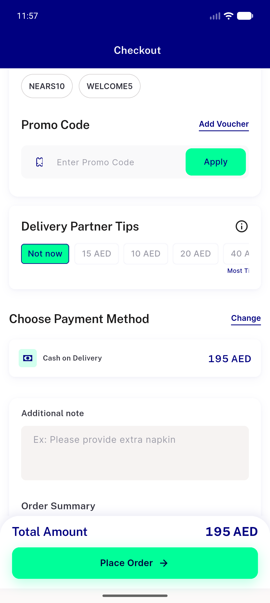
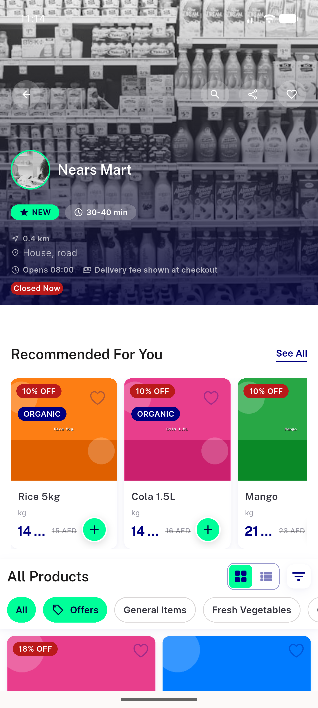

# QA Evidence — NEARS-1501

**PASS — AC1 demonstrated live via instrumented A/B on emulator-5558**

**5 screenshot(s).** Click any thumbnail for full resolution.

<table>
<tr>
<td align="center" width="33%"> ac1 buildA fix present toast visible</td>
<td align="center" width="33%"> ac1 buildB fix reverted no toast</td>
<td align="center" width="33%"> regression checkout coupon dls chrome</td>
</tr>
<tr>
<td align="center" width="33%"> regression storescreen favourite dls chrome</td>
<td align="center" width="33%"> scaffoldless nointernet toast visible</td>
</tr>
</table>

### Other artifacts
- [`ac1-buildA-warn-positive-control.log`](ac1-buildA-warn-positive-control.log)
- [`ac1-buildB-assertion-control.log`](ac1-buildB-assertion-control.log)
- [`bug-category-back-button-test-preexisting.log`](bug-category-back-button-test-preexisting.log)

---
*From `nears/docs/qa-evidence/NEARS-1501/` · public-repo scrub policy (no live secrets; verified clean).*
