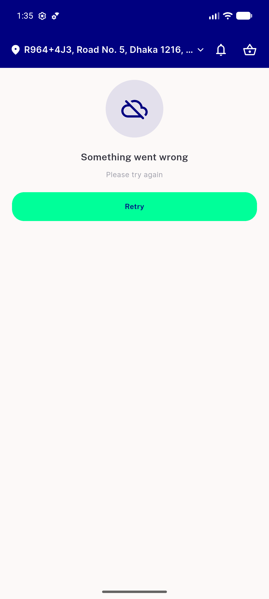

# QA Evidence — NEARS-1505

**PASS — NEARS-1505 Symbols.location_off renders live on the module-empty state; PRE/POST icon diff = 5022 px (6.05% of the 96dp disc); AC2 grep clean**

**5 screenshot(s).** Click any thumbnail for full resolution.

<table>
<tr>
<td align="center" width="33%"> ac1 empty state symbols live</td>
<td align="center" width="33%"> ac1 pre post diff</td>
<td align="center" width="33%"> regression error retry branch</td>
</tr>
<tr>
<td align="center" width="33%"> regression populated grid</td>
<td align="center" width="33%"> regression rtl arabic empty state</td>
</tr>
</table>

---
*From `nears/docs/qa-evidence/NEARS-1505/` · public-repo scrub policy (no live secrets; verified clean).*
