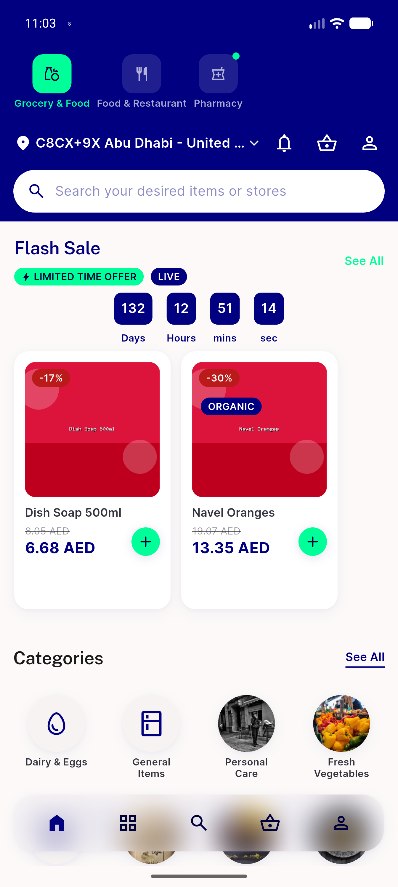
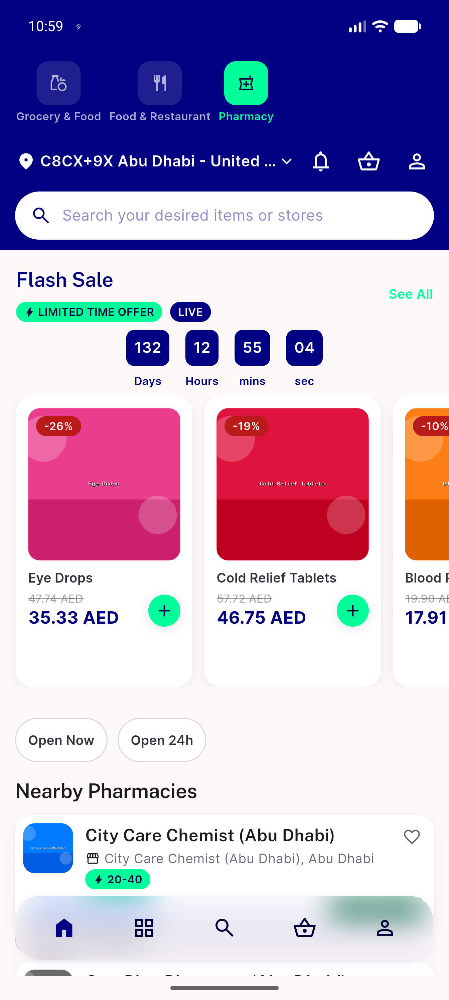
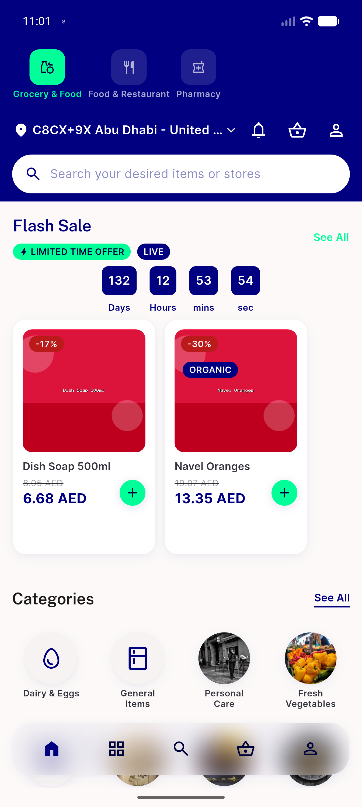

# QA Evidence — NEARS-1508

**PASS — module switcher New badge persistence: AC2-4 + cold-install baseline demonstrated live on emulator-5556, pixel-level evidence, 130/130 automated tests green**

**6 screenshot(s).** Click any thumbnail for full resolution.

<table>
<tr>
<td align="center" width="33%"> ac2 pharmacy new dot</td>
<td align="center" width="33%"> ac3 edge active unseen after tap</td>
<td align="center" width="33%"> ac3 edge active unseen before tap</td>
</tr>
<tr>
<td align="center" width="33%"> ac3 pharmacy dot cleared</td>
<td align="center" width="33%"> ac4 after restart</td>
<td align="center" width="33%"> control grocery active not new</td>
</tr>
</table>

---
*From `nears/docs/qa-evidence/NEARS-1508/` · public-repo scrub policy (no live secrets; verified clean).*
