# QA Evidence — NEARS-1517

**AC4 delta: chat send glyph verified both locales; gallery + store-card chevron proven unreachable**

**18 screenshot(s).** Click any thumbnail for full resolution.

<table>
<tr>
<td align="center" width="33%"><a href="en-01-home-banner.png">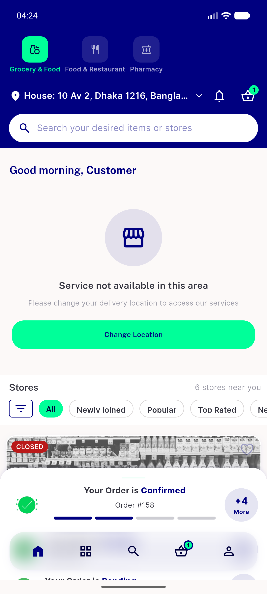</a> en 01 home banner</td>
<td align="center" width="33%"><a href="en-02-menu.png">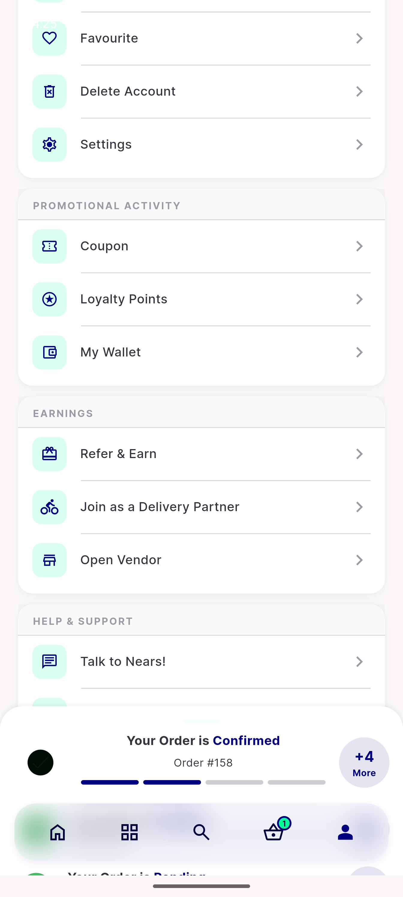</a> en 02 menu</td>
<td align="center" width="33%"><a href="ltr-01-home-active-order-banner.png">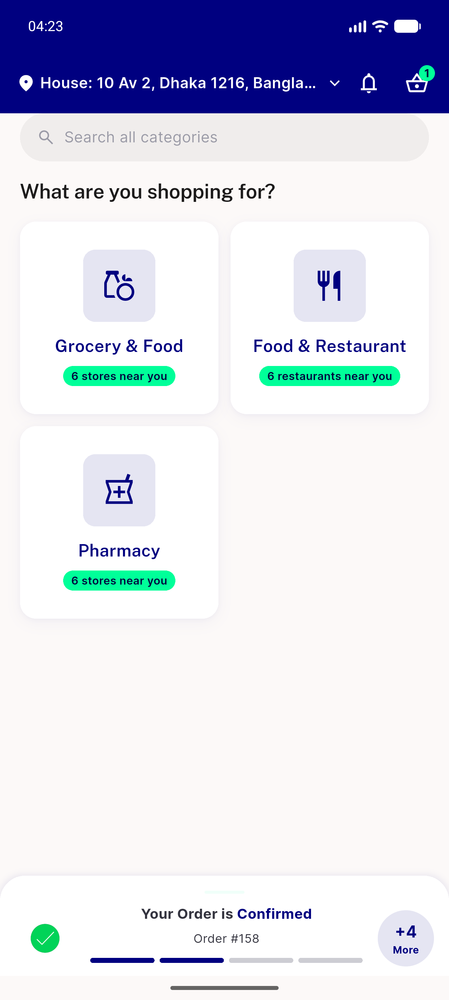</a> ltr 01 home active order banner</td>
</tr>
<tr>
<td align="center" width="33%"><a href="ltr-02-store-list.png">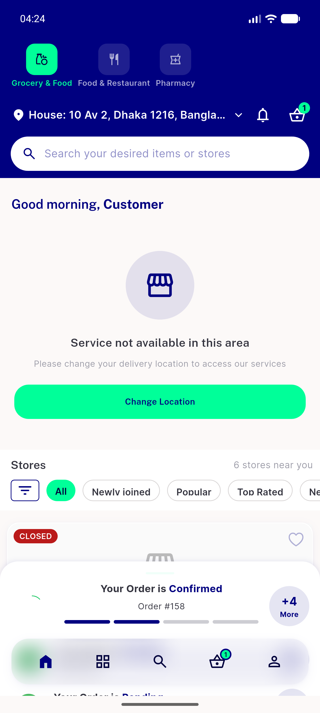</a> ltr 02 store list</td>
<td align="center" width="33%"><a href="ltr-03-profile-chevron-rows.png">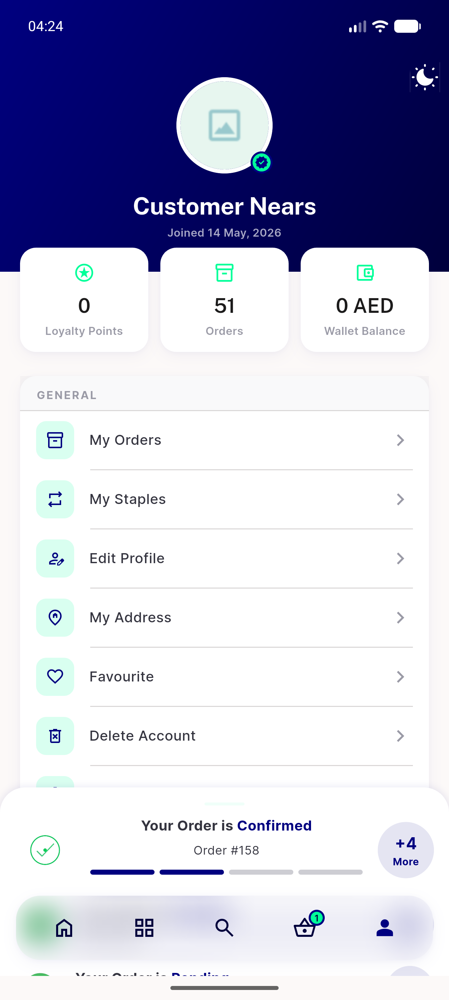</a> ltr 03 profile chevron rows</td>
<td align="center" width="33%"><a href="ltr-04-cart-nbutton-arrow.png">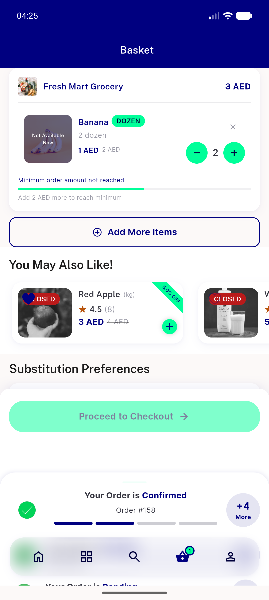</a> ltr 04 cart nbutton arrow</td>
</tr>
<tr>
<td align="center" width="33%"><a href="ltr-05-settings-appbar-back.png">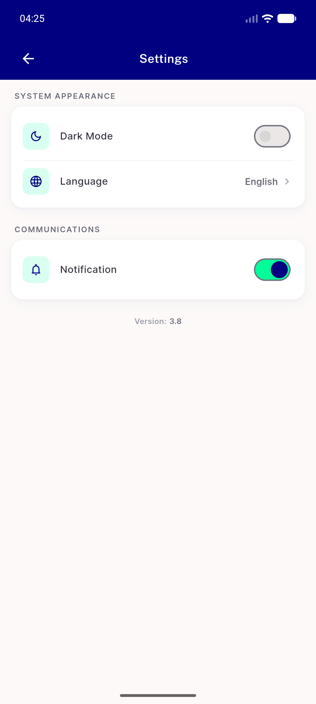</a> ltr 05 settings appbar back</td>
<td align="center" width="33%"><a href="ltr-06-language-screen.png">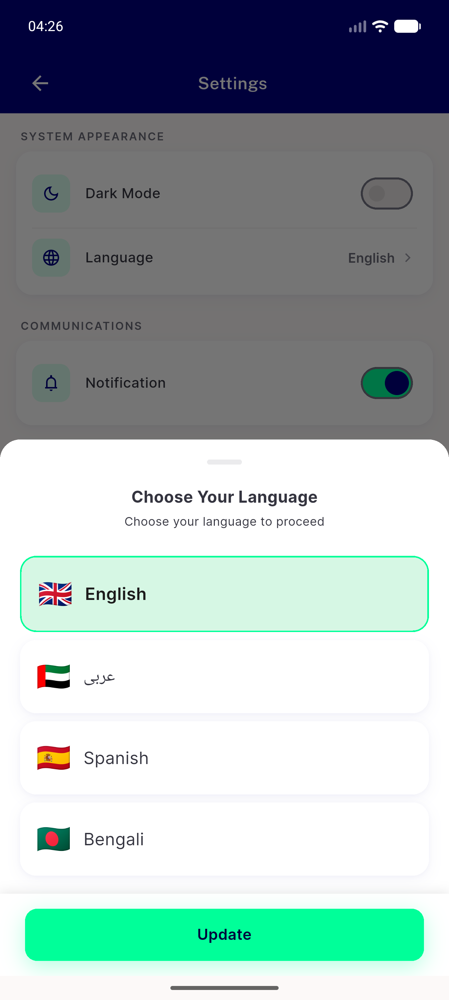</a> ltr 06 language screen</td>
<td align="center" width="33%"><a href="ltr-07-store-detail.png">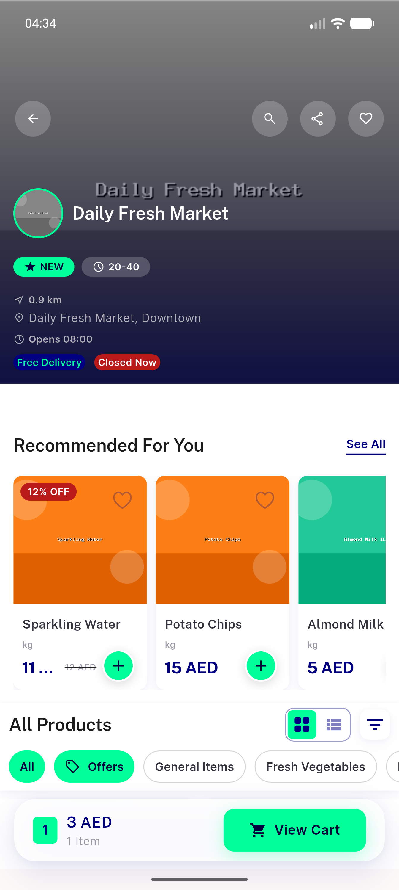</a> ltr 07 store detail</td>
</tr>
<tr>
<td align="center" width="33%"><a href="ltr-08-chat-send-glyph.png">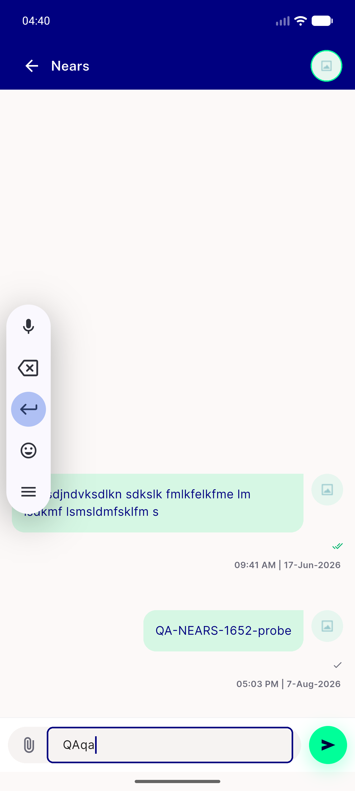</a> ltr 08 chat send glyph</td>
<td align="center" width="33%"><a href="rtl-01-language-screen-arabic.png">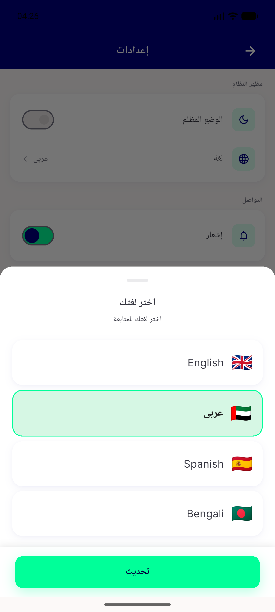</a> rtl 01 language screen arabic</td>
<td align="center" width="33%"><a href="rtl-02-settings-appbar-chevron.png">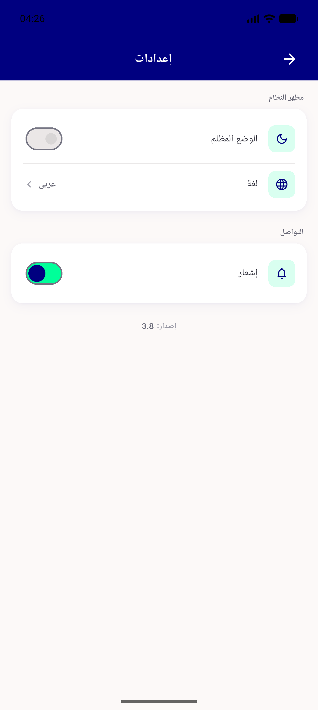</a> rtl 02 settings appbar chevron</td>
</tr>
<tr>
<td align="center" width="33%"><a href="rtl-03-profile-chevron-rows.png">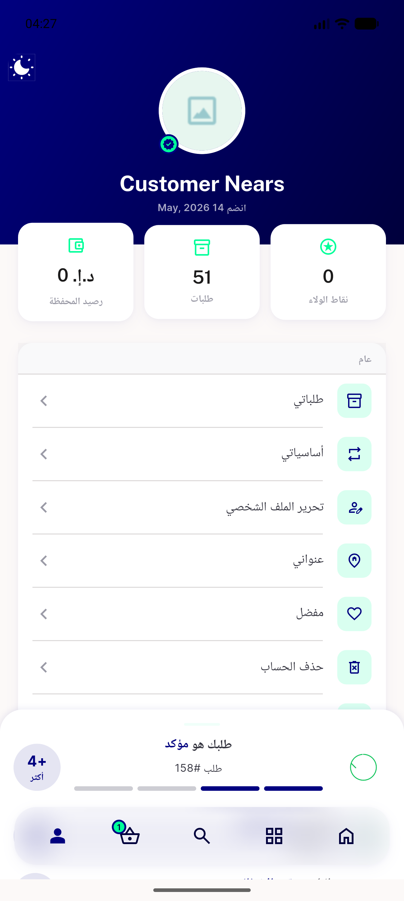</a> rtl 03 profile chevron rows</td>
<td align="center" width="33%"><a href="rtl-04-cart-nbutton-arrow.png">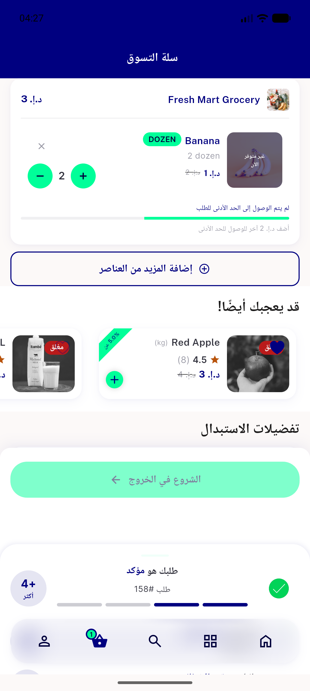</a> rtl 04 cart nbutton arrow</td>
<td align="center" width="33%"><a href="rtl-05-search-storecard.png">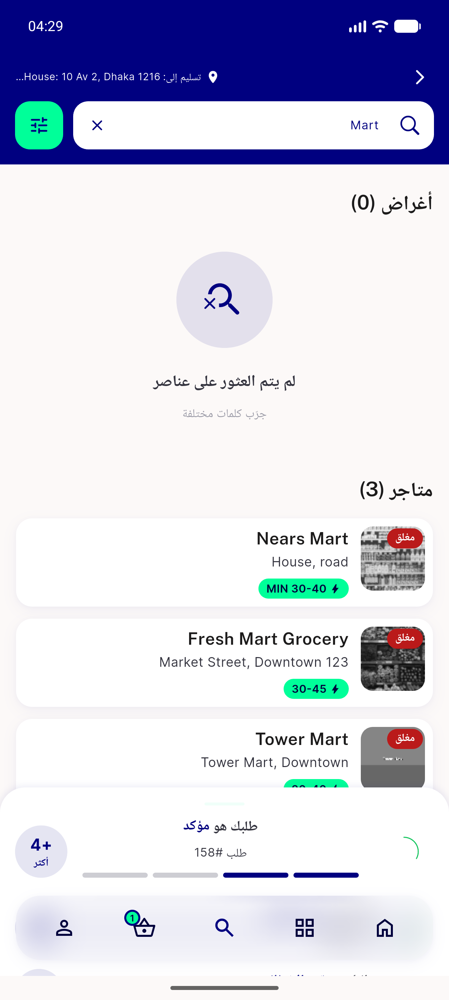</a> rtl 05 search storecard</td>
</tr>
<tr>
<td align="center" width="33%"><a href="rtl-06-module-home-scrolled.png">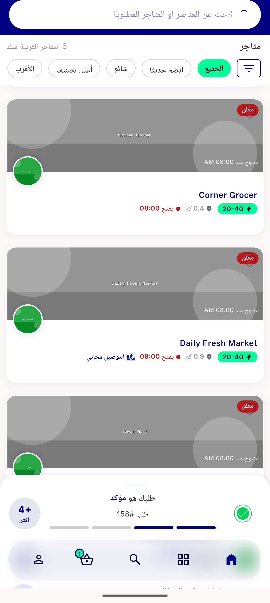</a> rtl 06 module home scrolled</td>
<td align="center" width="33%"><a href="rtl-07-store-detail.png">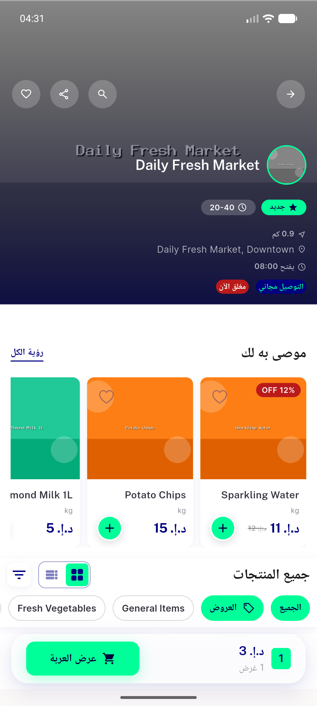</a> rtl 07 store detail</td>
<td align="center" width="33%"><a href="rtl-08-chat-send-glyph.png">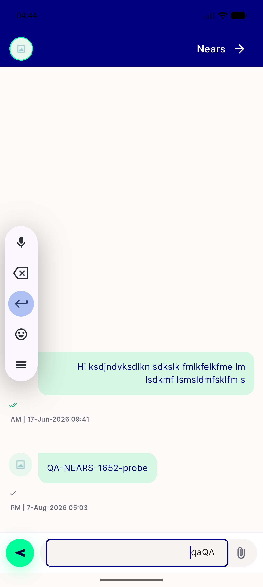</a> rtl 08 chat send glyph</td>
</tr>
</table>

---
*From `nears/docs/qa-evidence/NEARS-1517/` · public-repo scrub policy (no live secrets; verified clean).*
