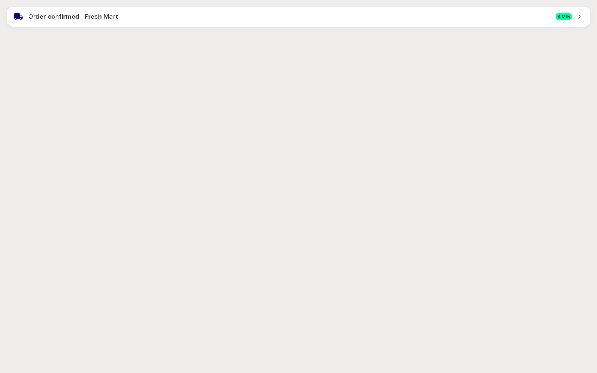

# QA Evidence — NEARS-1519

**PASS — a11y dup-button-node fix verified live via widgetbook Flutter-web semantics DOM (flt-tappable proxy) + widget-test evidence; 0 new regressions, 2 pre-existing test failures confirmed unrelated**

**1 screenshot(s).** Click any thumbnail for full resolution.

<table>
<tr>
<td align="center" width="33%"> ac2 active order banner semantics</td>
</tr>
</table>

---
*From `nears/docs/qa-evidence/NEARS-1519/` · public-repo scrub policy (no live secrets; verified clean).*
