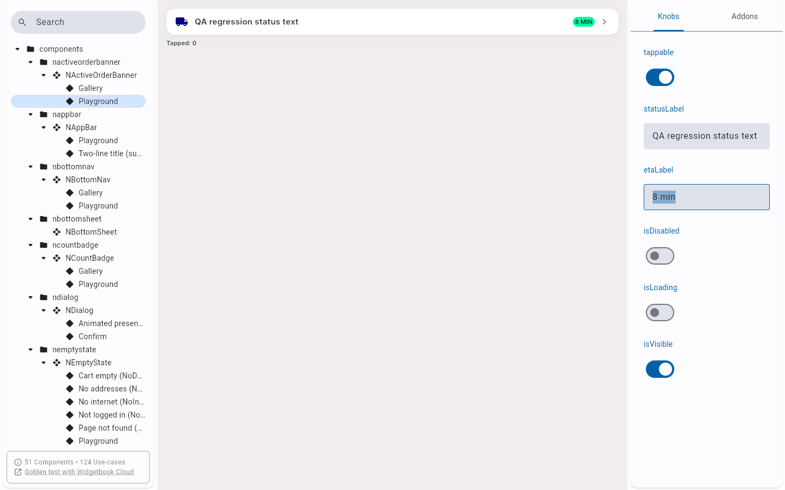

# QA Evidence — NEARS-1522

**fix-cycle 2: FAIL — AC3 still broken (ScaffoldMessenger crash, not the state-shape bug), AC1/AC2 reused-PASS**

**6 screenshot(s).** Click any thumbnail for full resolution.

<table>
<tr>
<td align="center" width="33%"> REGR isloading on</td>
<td align="center" width="33%"> REGR isvisible off</td>
<td align="center" width="33%"> REGR statuslabel etalabel</td>
</tr>
<tr>
<td align="center" width="33%"> REGR tappable off</td>
<td align="center" width="33%"> ac3 c2 knob toggle preserves count not increment</td>
<td align="center" width="33%"> bug ac3 playground tap counter still stuck at 1 cycle2</td>
</tr>
</table>

### Other artifacts
- [`bug-ac3-scaffoldmessenger-crash-cycle2.log`](bug-ac3-scaffoldmessenger-crash-cycle2.log)

---
*From `nears/docs/qa-evidence/NEARS-1522/` · public-repo scrub policy (no live secrets; verified clean).*
