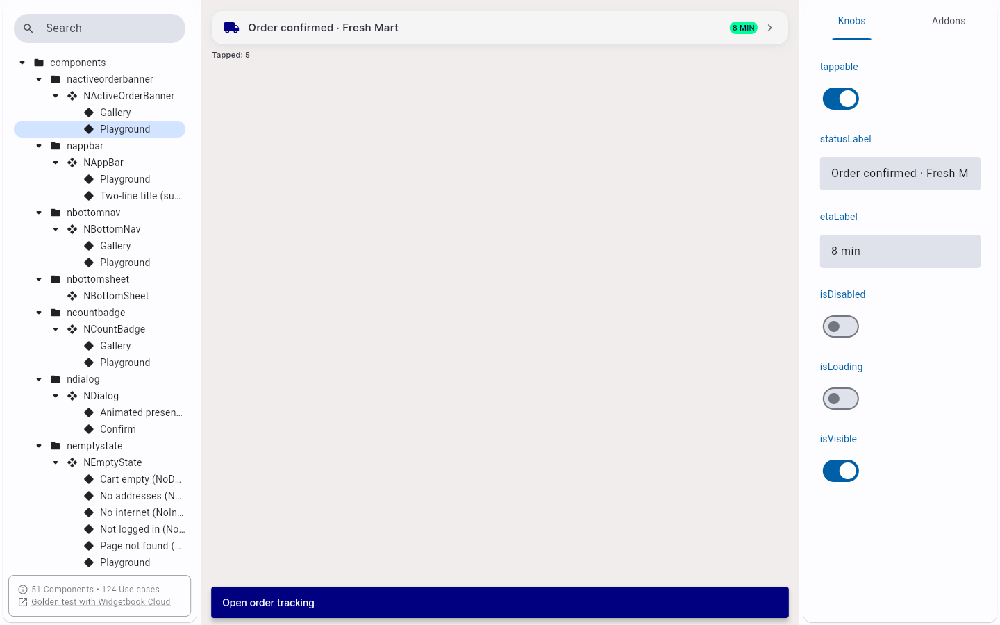

# QA Evidence — NEARS-1522

**fix-in-run cycle 4: tap-counter survives knob toggle -- PASS**

**5 screenshot(s).** Click any thumbnail for full resolution.

<table>
<tr>
<td align="center" width="33%"> ac2 gallery rtl digit order</td>
<td align="center" width="33%"> ac3 playground baseline tapped 0</td>
<td align="center" width="33%"> bug ac3 playground tap counter stuck at 1</td>
</tr>
<tr>
<td align="center" width="33%"> fixinrun baseline 5taps unchanged</td>
<td align="center" width="33%"> fixinrun tapcounter survives interleaved knob toggles</td>
</tr>
</table>

### Other artifacts
- [`ac1-mutation-check.log`](ac1-mutation-check.log)
- [`ac2-falsifiability-mutation.log`](ac2-falsifiability-mutation.log)
- [`fixinrun-verification.log`](fixinrun-verification.log)
- [`full-suite-failures-preexisting.log`](full-suite-failures-preexisting.log)

---
*From `nears/docs/qa-evidence/NEARS-1522/` · public-repo scrub policy (no live secrets; verified clean).*
