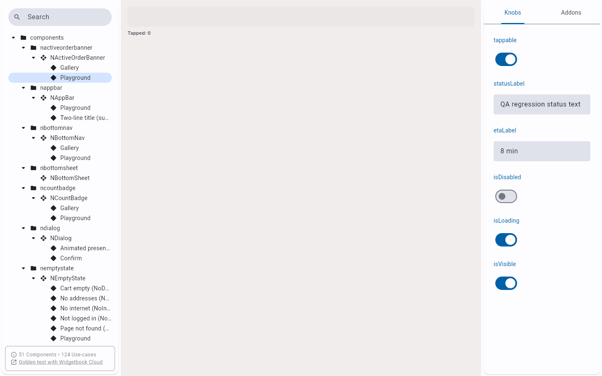
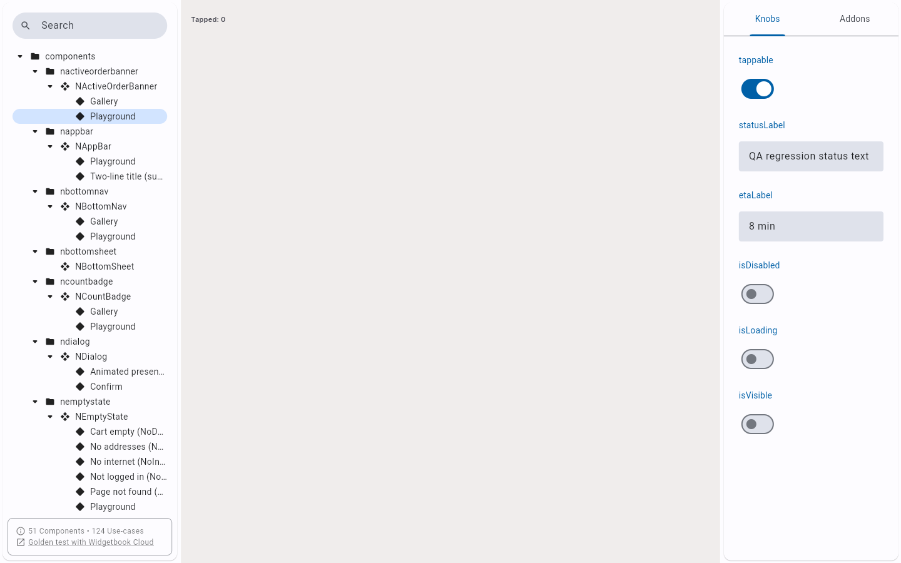
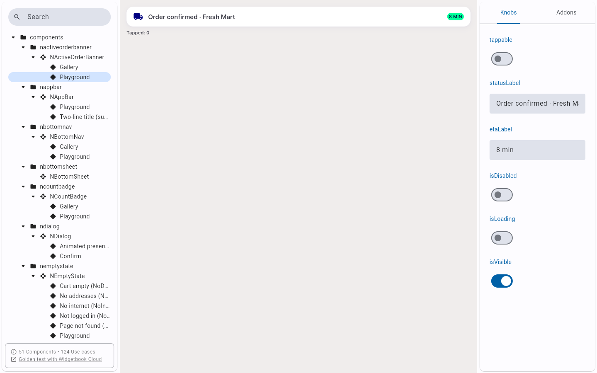
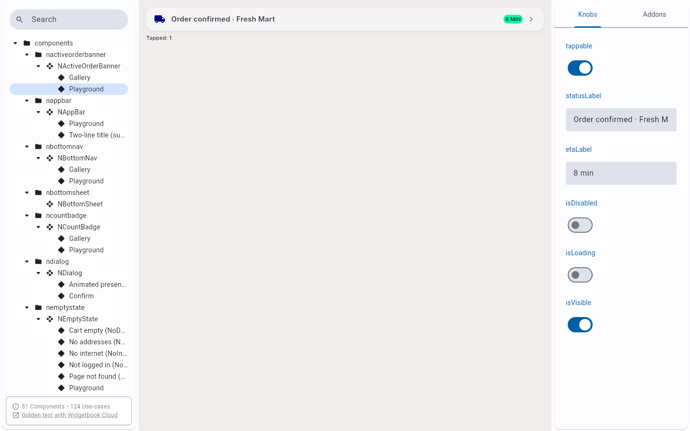
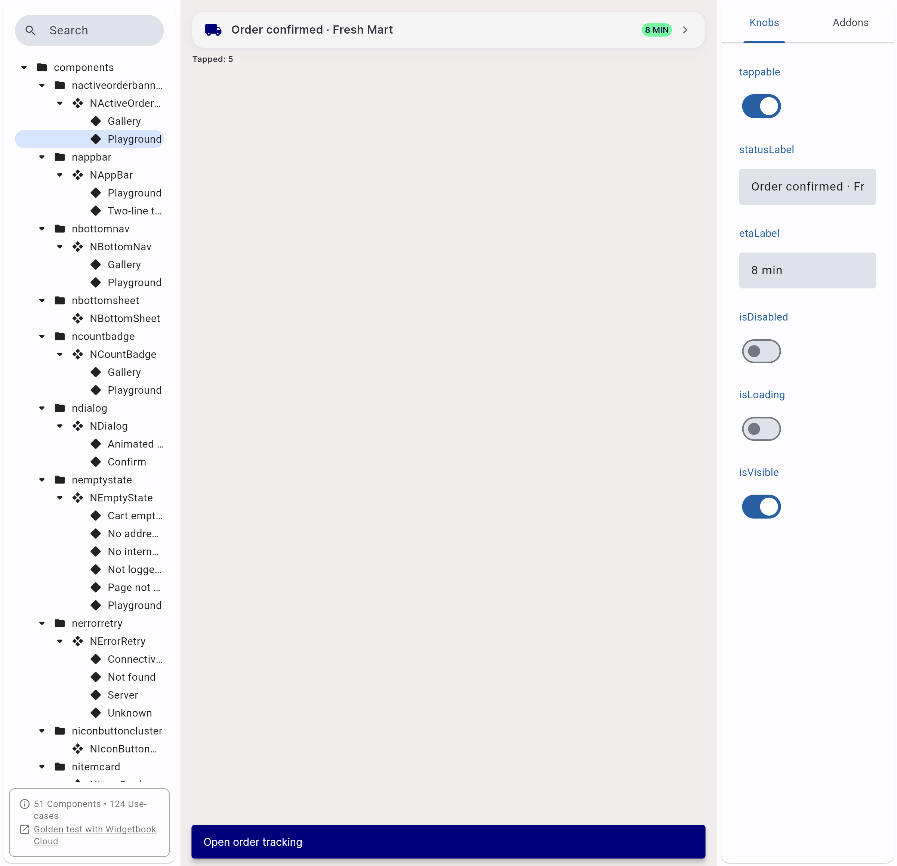
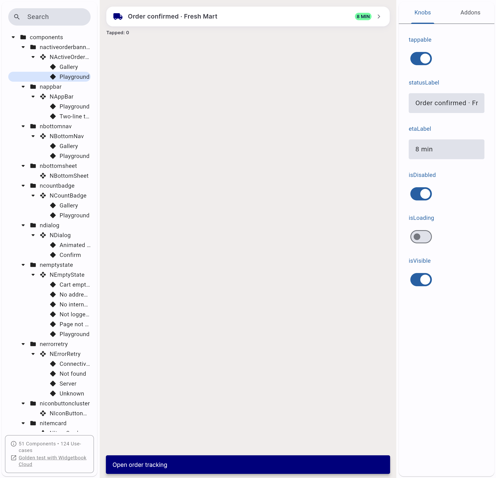
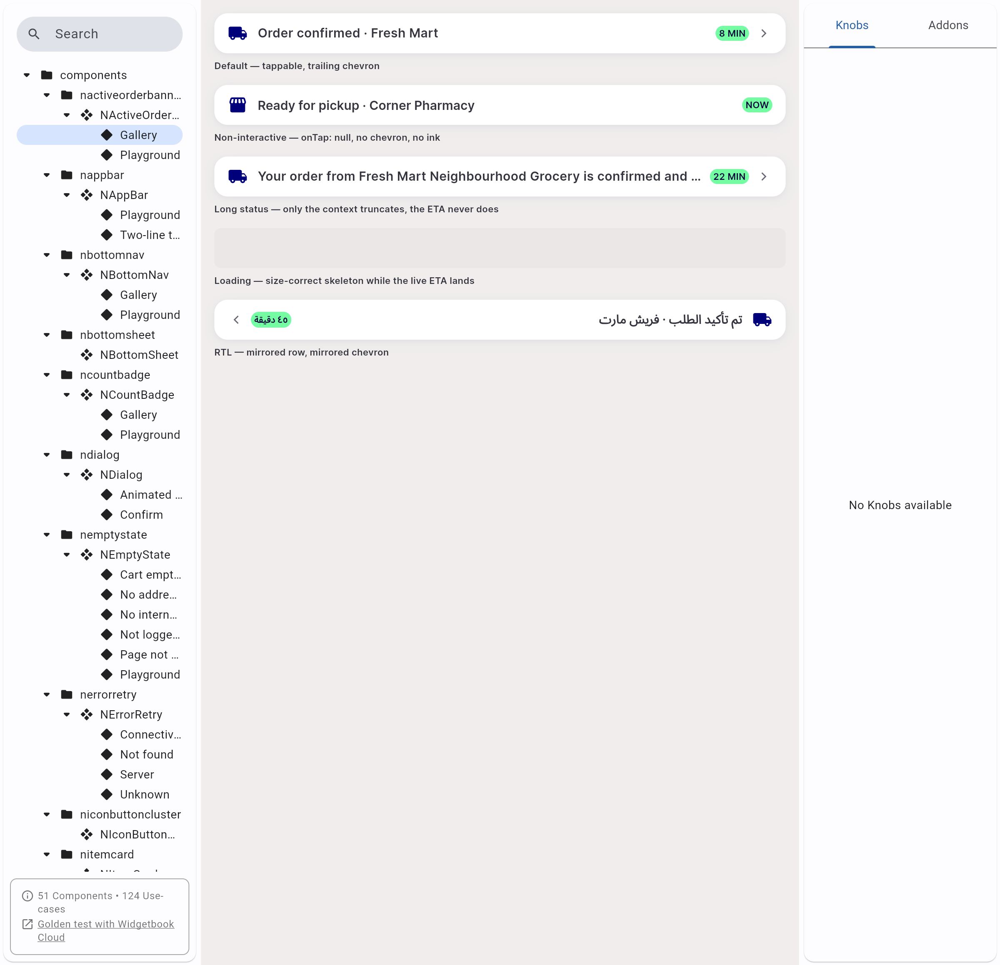

# QA Evidence — NEARS-1522

**cycle3 delta re-QA: AC3 live-verified via Playwright-over-CDP against widgetbook Chrome (57793) - 5 consecutive taps increment counter cleanly, SnackBar shows, zero errors; AC1/AC2 reused/reconfirmed**

**8 screenshot(s).** Click any thumbnail for full resolution.

<table>
<tr>
<td align="center" width="33%"> REGR isloading on</td>
<td align="center" width="33%"> REGR isvisible off</td>
<td align="center" width="33%"> REGR tappable off</td>
</tr>
<tr>
<td align="center" width="33%"> ac3 c2 knob toggle preserves count not increment</td>
<td align="center" width="33%"> ac3 cycle3 5taps counter5 snackbar</td>
<td align="center" width="33%"> bug ac3 playground tap counter still stuck at 1 cycle2</td>
</tr>
<tr>
<td align="center" width="33%"> bug playground counter resets on knob toggle</td>
<td align="center" width="33%"> gallery cycle3 regression check</td>
</tr>
</table>

### Other artifacts
- [`bug-ac3-scaffoldmessenger-crash-cycle2.log`](bug-ac3-scaffoldmessenger-crash-cycle2.log)
- [`bug-playground-counter-resets-on-knob-toggle.log`](bug-playground-counter-resets-on-knob-toggle.log)

---
*From `nears/docs/qa-evidence/NEARS-1522/` · public-repo scrub policy (no live secrets; verified clean).*
