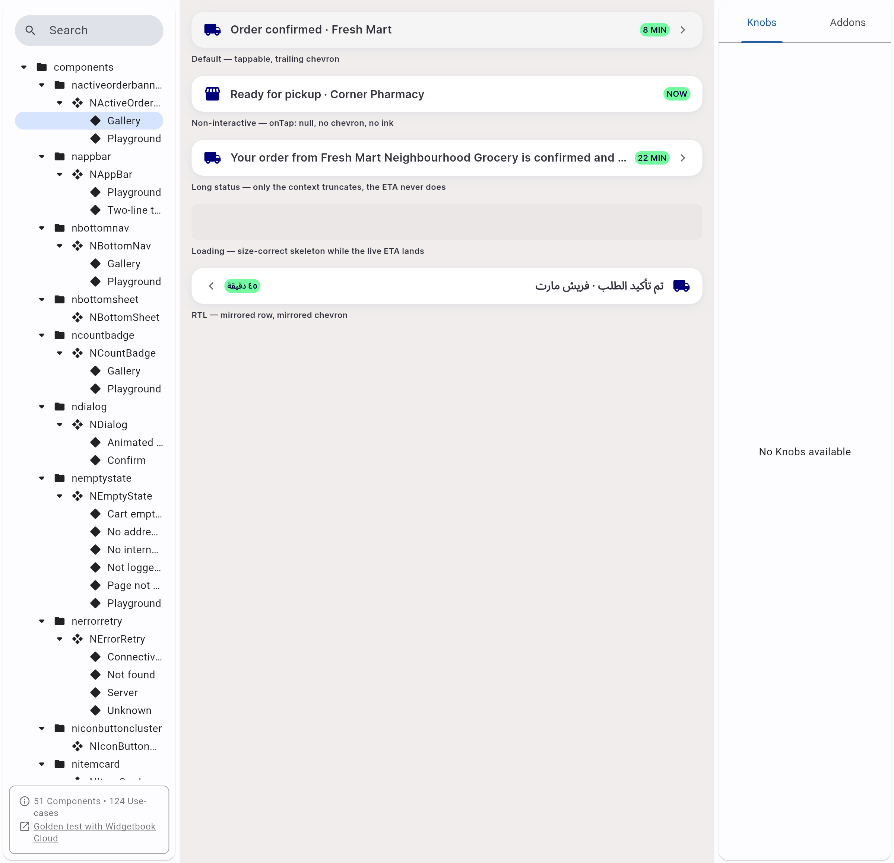
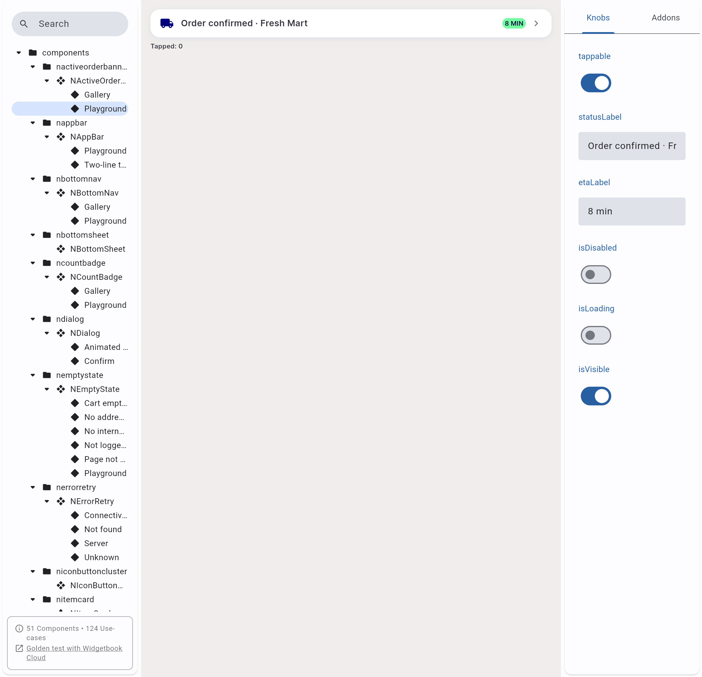
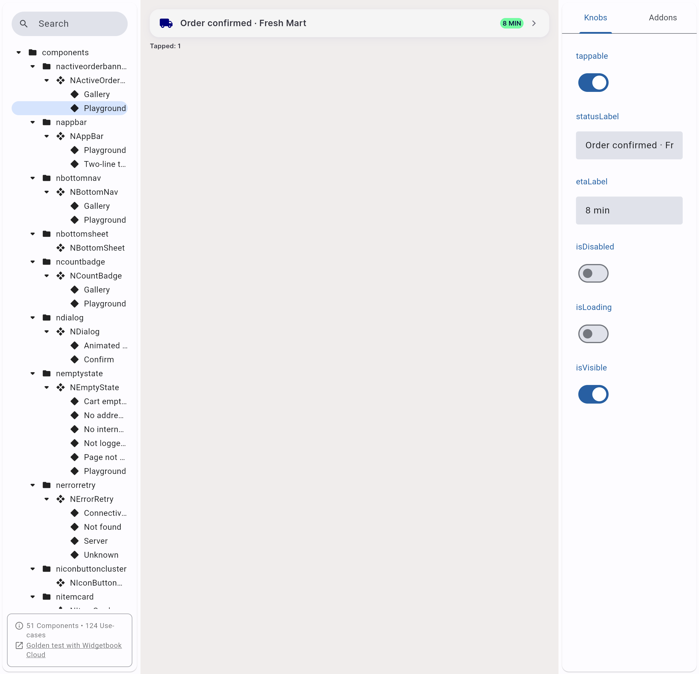

# QA Evidence — NEARS-1522

**FAIL — AC1/AC2 verified live+mutation-checked, AC3 broken (in-canvas tap counter stuck at 1 after first tap)**

**3 screenshot(s).** Click any thumbnail for full resolution.

<table>
<tr>
<td align="center" width="33%"> ac2 gallery rtl digit order</td>
<td align="center" width="33%"> ac3 playground baseline tapped 0</td>
<td align="center" width="33%"> bug ac3 playground tap counter stuck at 1</td>
</tr>
</table>

### Other artifacts
- [`ac1-mutation-check.log`](ac1-mutation-check.log)
- [`ac2-falsifiability-mutation.log`](ac2-falsifiability-mutation.log)
- [`full-suite-failures-preexisting.log`](full-suite-failures-preexisting.log)

---
*From `nears/docs/qa-evidence/NEARS-1522/` · public-repo scrub policy (no live secrets; verified clean).*
