# QA Evidence — NEARS-1526

**PASS - Wallet PopScope didPop guard: P1/P2 demonstrated in RELEASE and debug on emulator-5558; 74/74 wallet tests, 3852/3852 full suite**

**13 screenshot(s).** Click any thumbnail for full resolution.

<table>
<tr>
<td align="center" width="33%"><a href="control-appbar-back-goes-home.png">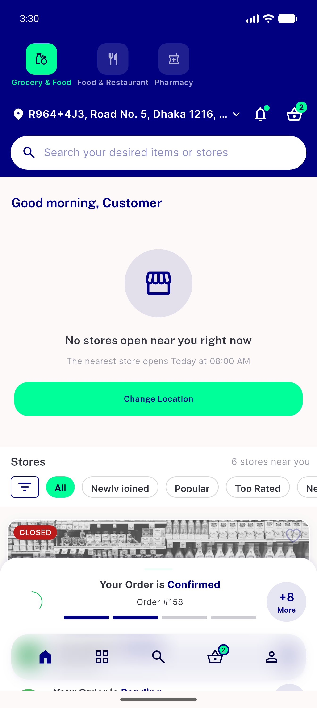</a> control appbar back goes home</td>
<td align="center" width="33%"><a href="p1-01-notification-shade.png">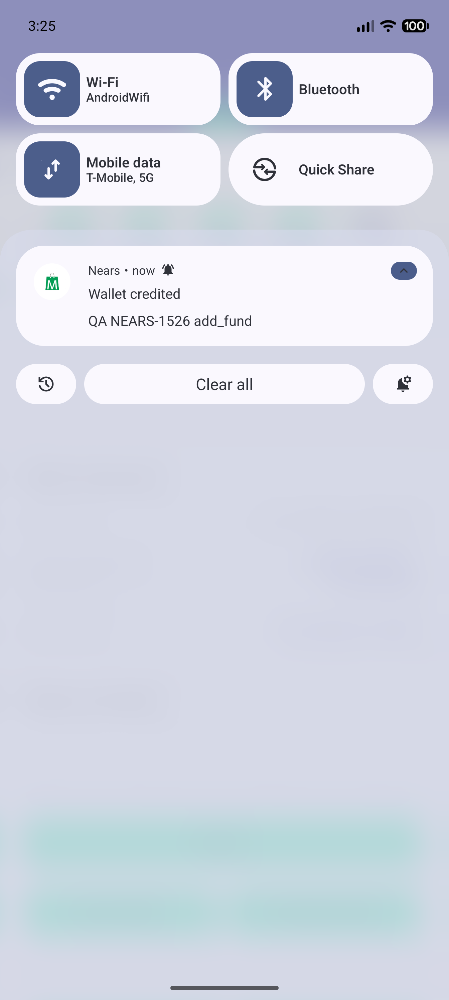</a> p1 01 notification shade</td>
<td align="center" width="33%"> p1 02 wallet from notification</td>
</tr>
<tr>
<td align="center" width="33%"><a href="p1-03-after-back-lands-on-order-details.png">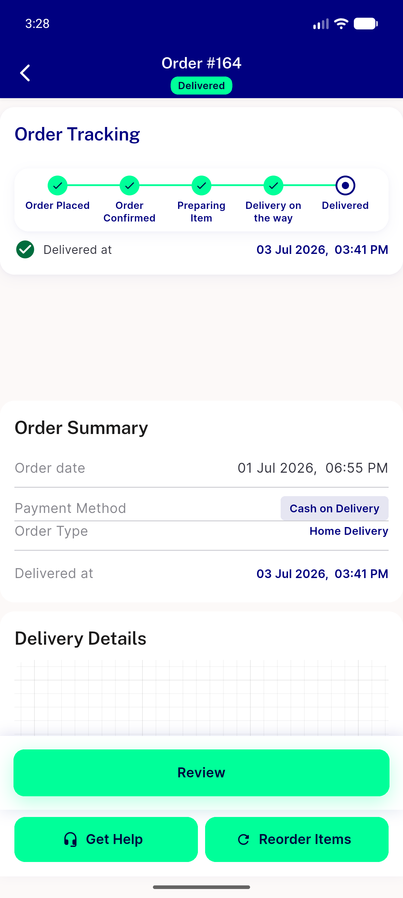</a> p1 03 after back lands on order details</td>
<td align="center" width="33%"><a href="p2-01-second-back-lands-on-my-orders.png">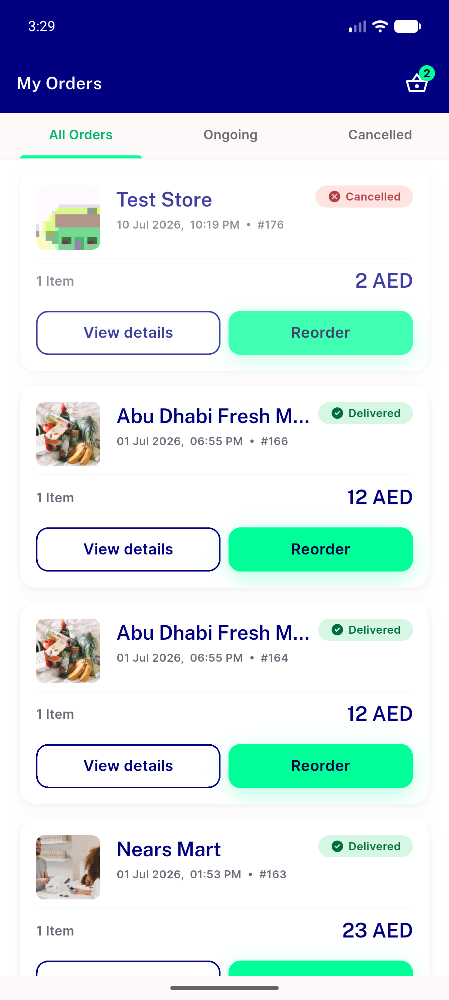</a> p2 01 second back lands on my orders</td>
<td align="center" width="33%"> p3 debug 01 wallet from notification</td>
</tr>
<tr>
<td align="center" width="33%"><a href="p3-debug-02-after-back-order-details.png">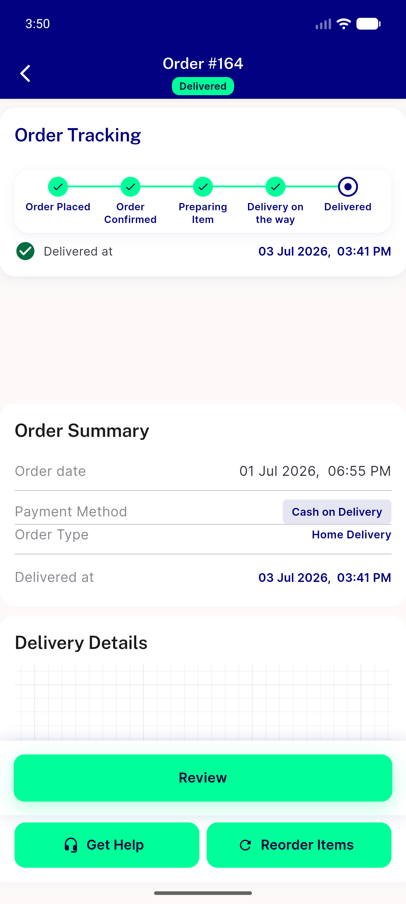</a> p3 debug 02 after back order details</td>
<td align="center" width="33%"><a href="reg1-01-wallet-normal-entry.png">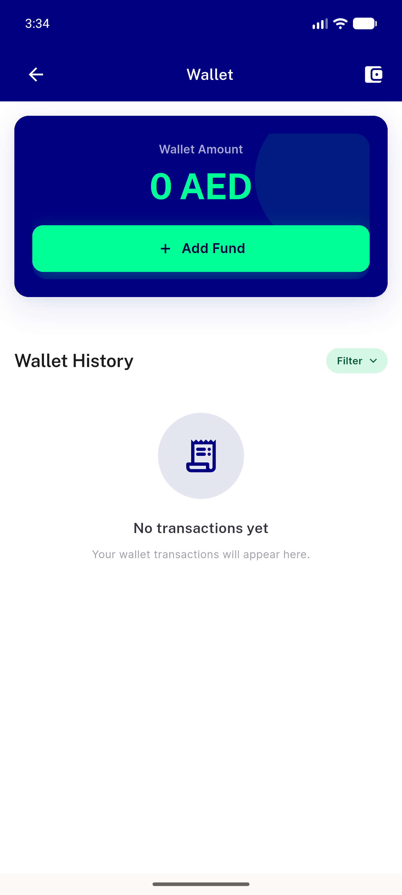</a> reg1 01 wallet normal entry</td>
<td align="center" width="33%"><a href="reg1-02-normal-back-returns-to-profile.png">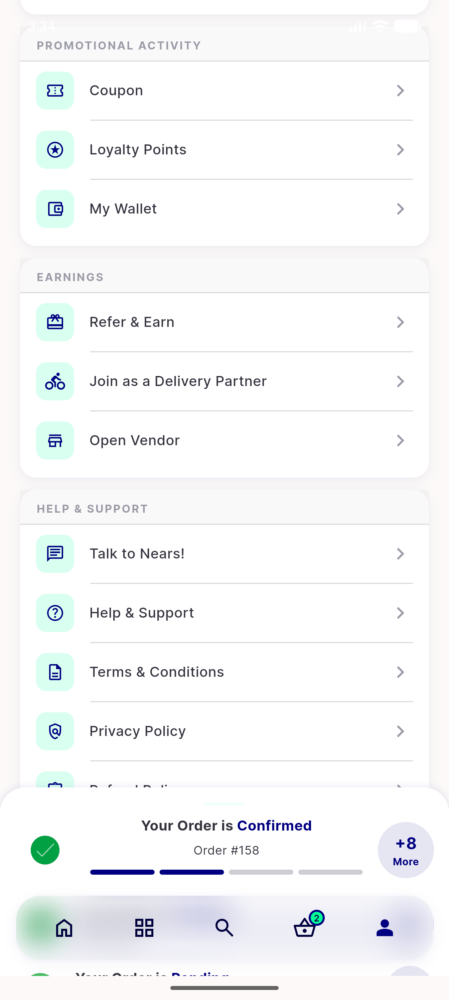</a> reg1 02 normal back returns to profile</td>
</tr>
<tr>
<td align="center" width="33%"><a href="reg2-01-add-fund-sheet.png">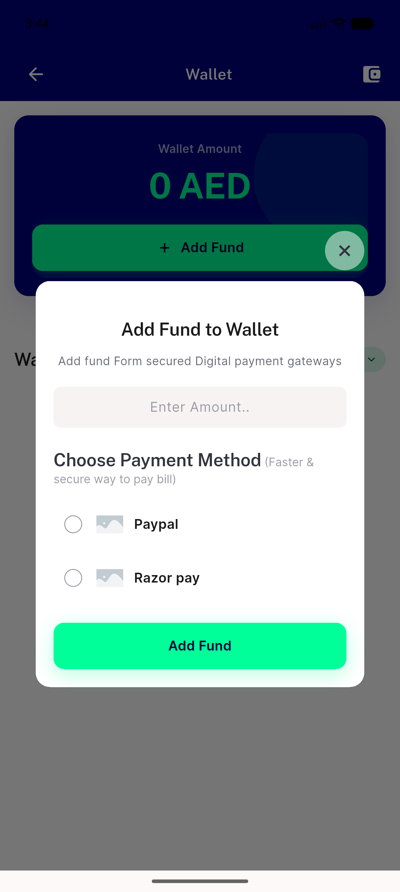</a> reg2 01 add fund sheet</td>
<td align="center" width="33%"><a href="reg3-01-wallet-rtl-arabic.png">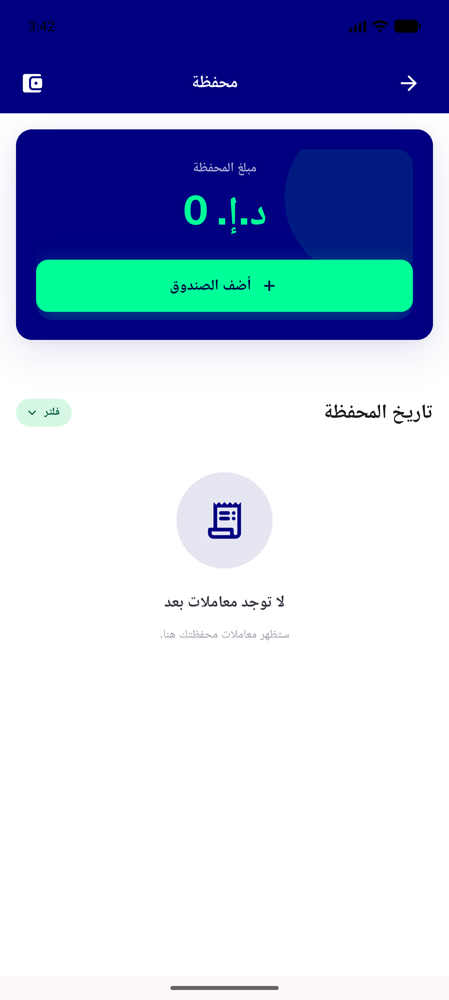</a> reg3 01 wallet rtl arabic</td>
<td align="center" width="33%"><a href="reg3-02-rtl-swipe-back-returns-to-settings.png">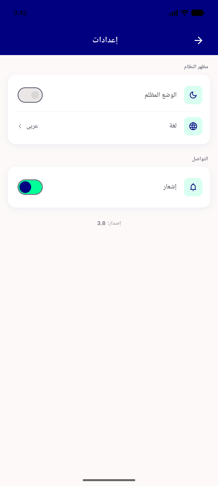</a> reg3 02 rtl swipe back returns to settings</td>
</tr>
<tr>
<td align="center" width="33%"><a href="reg4-01-wallet-populated-transactions.png">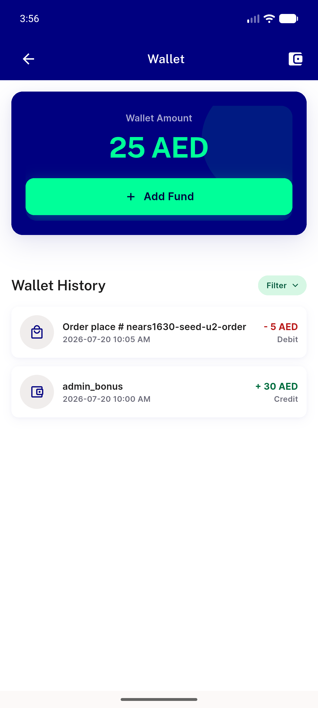</a> reg4 01 wallet populated transactions</td>
</tr>
</table>

### Other artifacts
- [`progress.md`](progress.md)

---
*From `nears/docs/qa-evidence/NEARS-1526/` · public-repo scrub policy (no live secrets; verified clean).*
