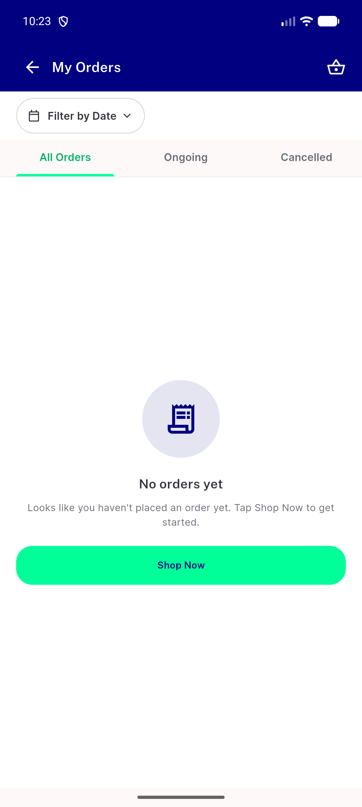
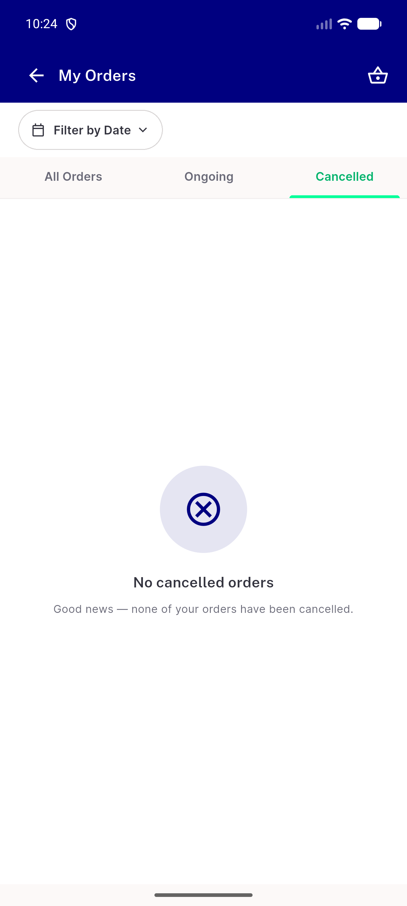
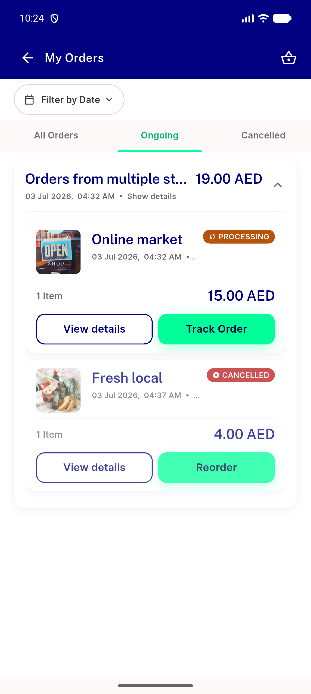

# QA Evidence — NEARS-1527

**PASS - NEARS-1527 grouped-history empty state, emulator-5600, b6e8df29e**

**3 screenshot(s).** Click any thumbnail for full resolution.

<table>
<tr>
<td align="center" width="33%"> ac2 zero order all tab</td>
<td align="center" width="33%"> cell1 staged cancelled empty</td>
<td align="center" width="33%"> cell4 ongoing group expanded 168 error badge</td>
</tr>
</table>

### Other artifacts
- [`ac2-cancelled-tab-a11y.xml`](ac2-cancelled-tab-a11y.xml)
- [`cell1-staged-cancelled-tab-a11y.xml`](cell1-staged-cancelled-tab-a11y.xml)
- [`cell2-staged-all-tab-a11y.xml`](cell2-staged-all-tab-a11y.xml)
- [`cell3-all-filtered-a11y.xml`](cell3-all-filtered-a11y.xml)
- [`cell3-cancelled-filtered-a11y.xml`](cell3-cancelled-filtered-a11y.xml)
- [`cell3-emily-cancelled-module-grocery-a11y.xml`](cell3-emily-cancelled-module-grocery-a11y.xml)
- [`cell4-ongoing-group-expanded-a11y.xml`](cell4-ongoing-group-expanded-a11y.xml)
- [`cell4-order-168-details-a11y.xml`](cell4-order-168-details-a11y.xml)
- [`cell5-all-tab-after-page3-a11y.xml`](cell5-all-tab-after-page3-a11y.xml)
- [`cell8-james-cancelled-a11y.xml`](cell8-james-cancelled-a11y.xml)
- [`progress.md`](progress.md)

---
*From `nears/docs/qa-evidence/NEARS-1527/` · public-repo scrub policy (no live secrets; verified clean).*
