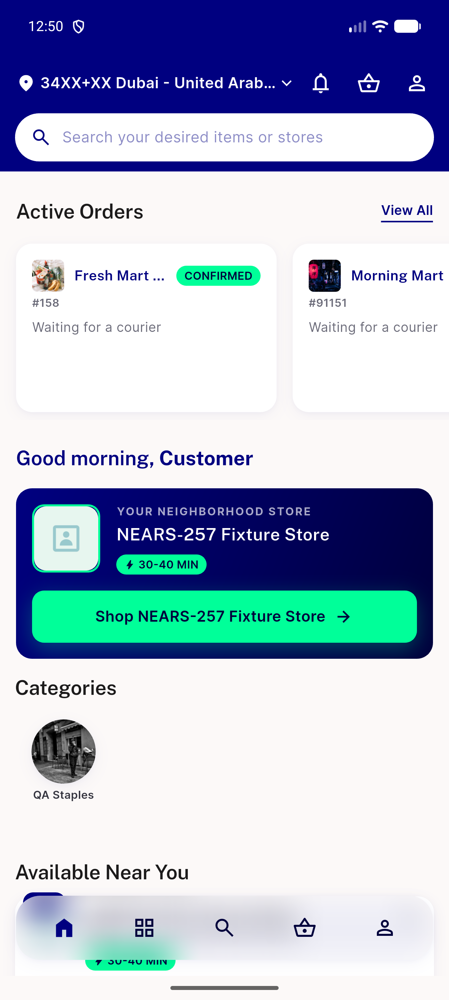
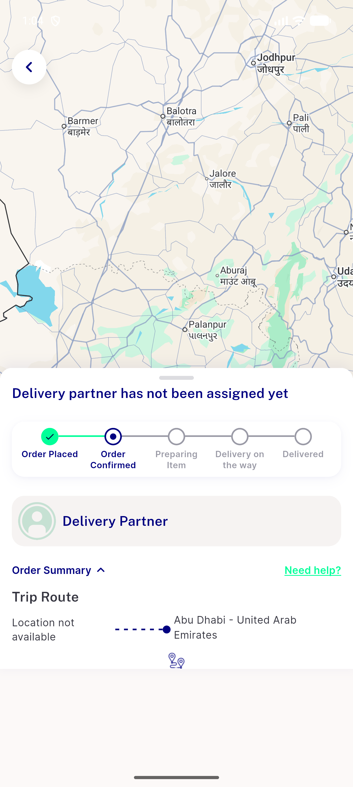
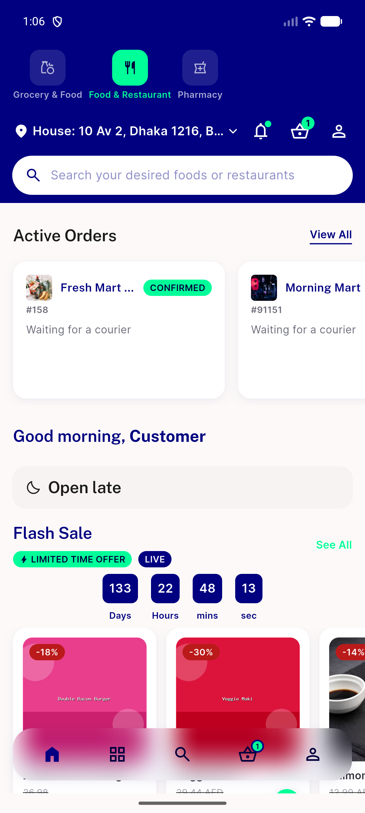

# QA Evidence — NEARS-1528

**PASS — pure dead-code removal, no retained-flow regression; 98/98 unit tests + flutter analyze clean; module homes (Grocery/Food/Pharmacy) + coupon-apply + order-tracking trip_route verified live**

**3 screenshot(s).** Click any thumbnail for full resolution.

<table>
<tr>
<td align="center" width="33%"> ac1 home banner</td>
<td align="center" width="33%"> ac2 trip route</td>
<td align="center" width="33%"> regression food home</td>
</tr>
</table>

---
*From `nears/docs/qa-evidence/NEARS-1528/` · public-repo scrub policy (no live secrets; verified clean).*
