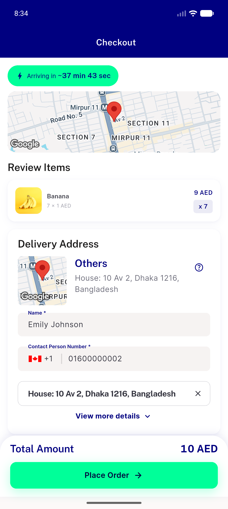

# QA Evidence — NEARS-1529

**PASS — AC1 demonstrated via mutation-proven bundle/loader suite (6 blocks, 8 assertions); regression 448 suites / 3973 tests, 0 failed; checkout clean on emulator-5556**

**1 screenshot(s).** Click any thumbnail for full resolution.

<table>
<tr>
<td align="center" width="33%"> regression checkout no extra discount</td>
</tr>
</table>

### Other artifacts
- [`mutation-gate.log`](mutation-gate.log)

---
*From `nears/docs/qa-evidence/NEARS-1529/` · public-repo scrub policy (no live secrets; verified clean).*
