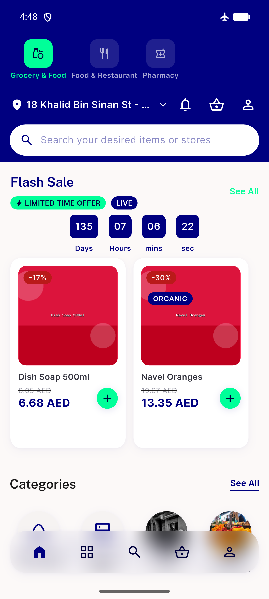
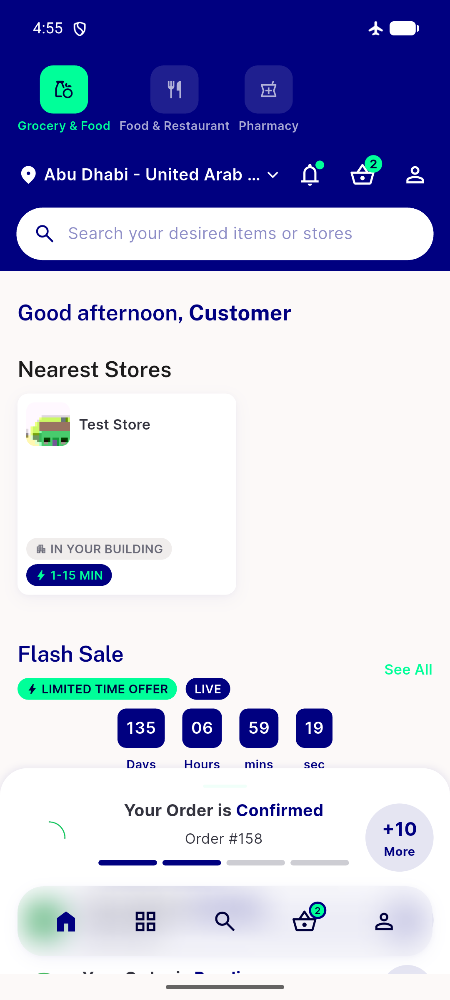

# QA Evidence — NEARS-1538

**PASS — NBadge semanticLabel a11y fix verified live on emulator-5564 (54/54 call sites, TalkBack content-desc confirmed natural-case across Home/Item/Cart/Checkout/Arabic samples)**

**2 screenshot(s).** Click any thumbnail for full resolution.

<table>
<tr>
<td align="center" width="33%"> home badges</td>
<td align="center" width="33%"> tower view badges</td>
</tr>
</table>

### Other artifacts
- [`ac2-a11y-content-desc-samples.log`](ac2-a11y-content-desc-samples.log)
- [`bug-delivery-eta-pill-unreachable.log`](bug-delivery-eta-pill-unreachable.log)
- [`bug-map-screen-latlngbounds-assertion.log`](bug-map-screen-latlngbounds-assertion.log)
- [`bug-nstorecard-internal-nbadge-no-semanticlabel.log`](bug-nstorecard-internal-nbadge-no-semanticlabel.log)

---
*From `nears/docs/qa-evidence/NEARS-1538/` · public-repo scrub policy (no live secrets; verified clean).*
