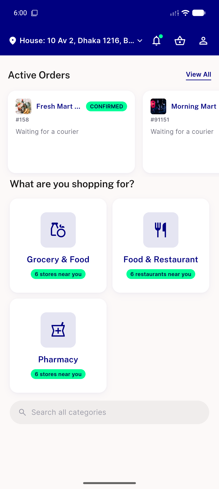
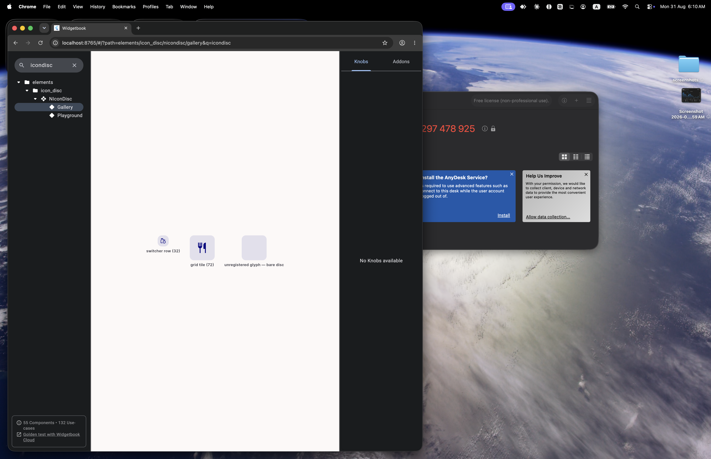
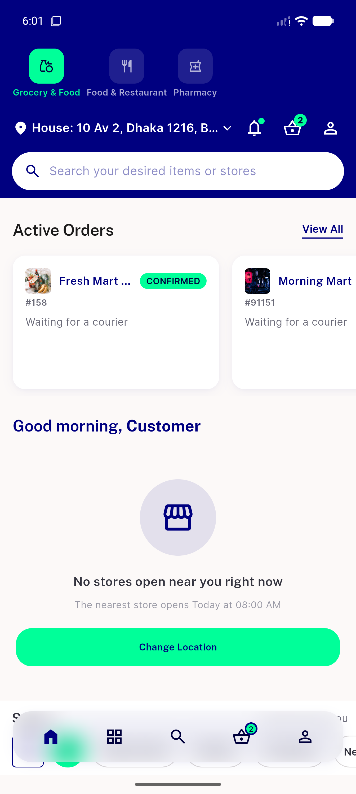

# QA Evidence — NEARS-1540

**PASS - NIconDisc promotion verified live (widgetbook + UserApp), 103 unit tests green**

**3 screenshot(s).** Click any thumbnail for full resolution.

<table>
<tr>
<td align="center" width="33%"> module grid home</td>
<td align="center" width="33%"> nicondisc widgetbook gallery</td>
<td align="center" width="33%"> nmodulerow live chiprow not nmoduleswitcher</td>
</tr>
</table>

---
*From `nears/docs/qa-evidence/NEARS-1540/` · public-repo scrub policy (no live secrets; verified clean).*
