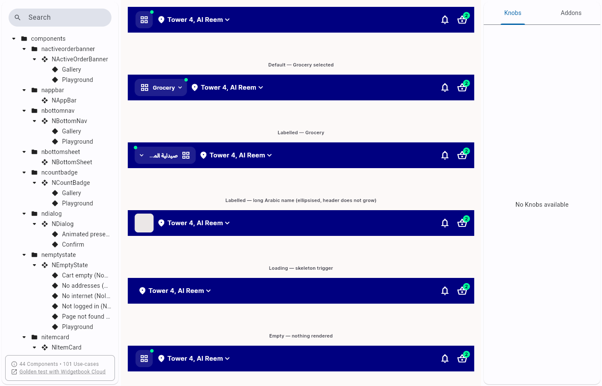
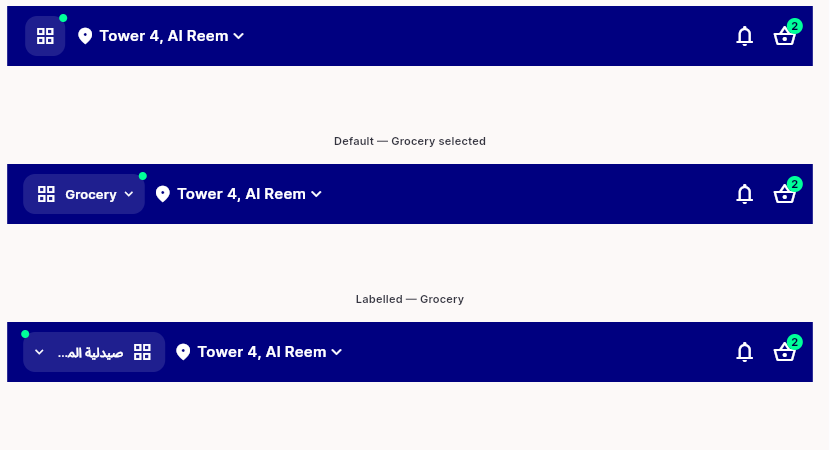

# QA Evidence — NEARS-1543

**PASS 6/6 ACs - NModuleSwitcher label pill, built from 8978eac6**

**4 screenshot(s).** Click any thumbnail for full resolution.

<table>
<tr>
<td align="center" width="33%"> widgetbook gallery full</td>
<td align="center" width="33%"> icon vs pill height compare</td>
<td align="center" width="33%"> pill ltr zoom</td>
</tr>
<tr>
<td align="center" width="33%"> pill rtl arabic zoom</td>
</tr>
</table>

### Other artifacts
- [`run-8978eac6`](run-8978eac6)

---
*From `nears/docs/qa-evidence/NEARS-1543/` · public-repo scrub policy (no live secrets; verified clean).*
