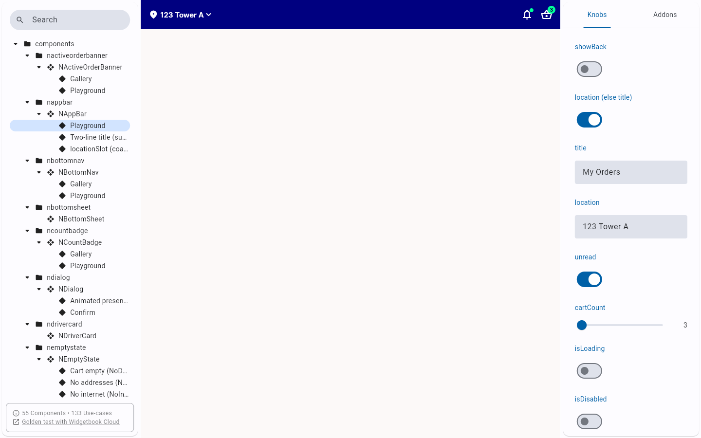
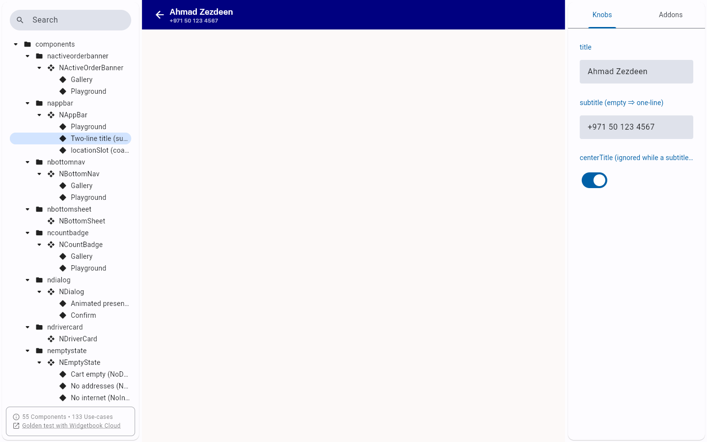
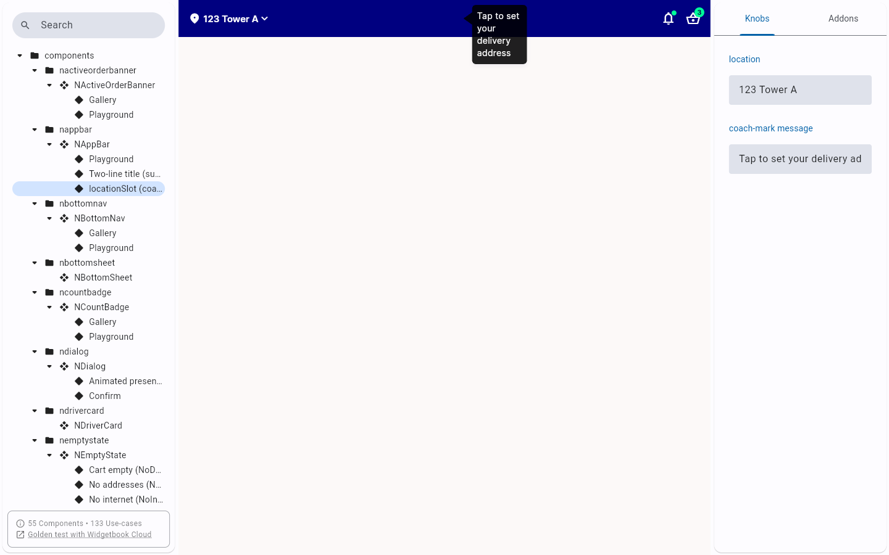
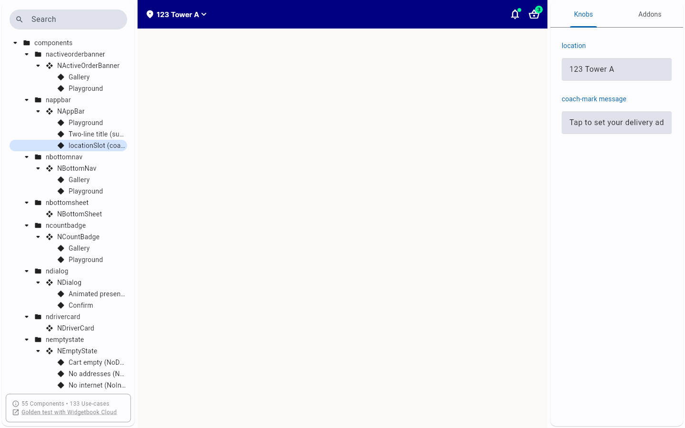

# QA Evidence — NEARS-1549

**PASS - NAppBar locationSlot additive prop, widgetbook AC1/AC2 live, 45/45 tests green**

**4 screenshot(s).** Click any thumbnail for full resolution.

<table>
<tr>
<td align="center" width="33%"> ac1 playground</td>
<td align="center" width="33%"> ac1 two line title</td>
<td align="center" width="33%"> ac2 after tap</td>
</tr>
<tr>
<td align="center" width="33%"> ac2 before tap</td>
</tr>
</table>

### Other artifacts
- [`n_appbar_test.log`](n_appbar_test.log)

---
*From `nears/docs/qa-evidence/NEARS-1549/` · public-repo scrub policy (no live secrets; verified clean).*
