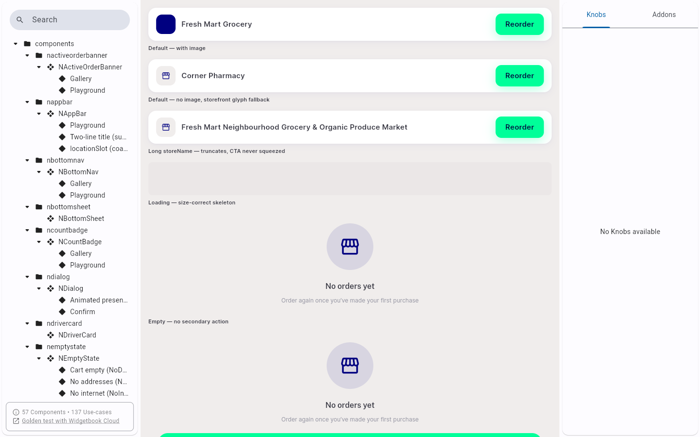
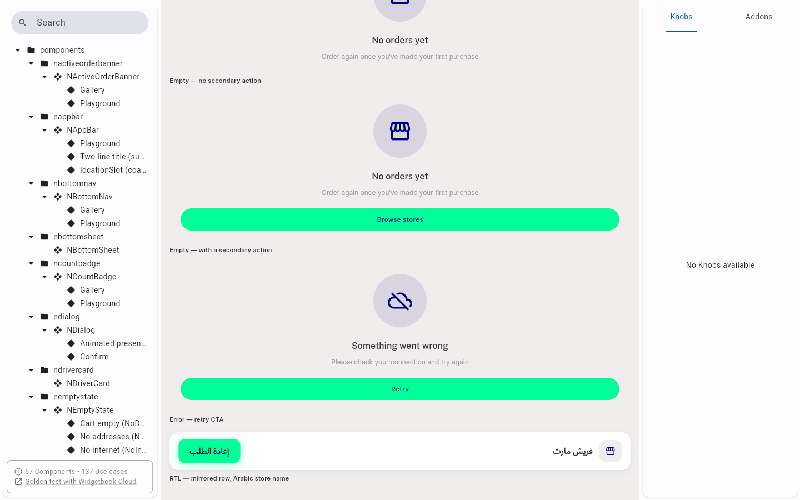
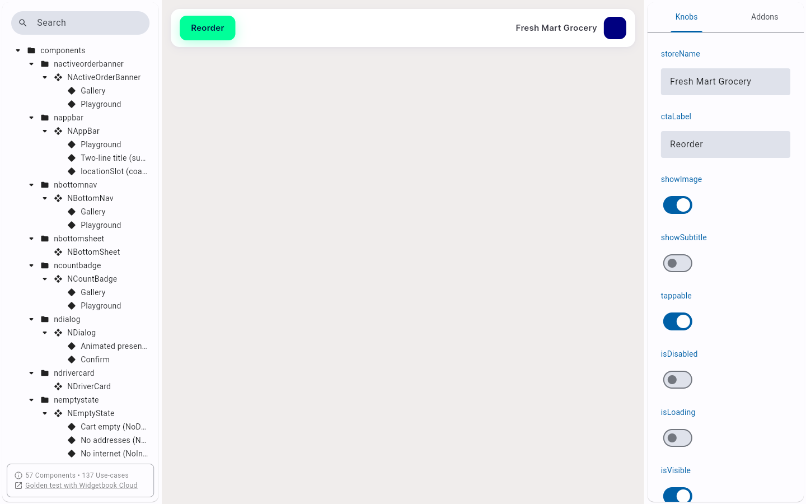

# QA Evidence — NEARS-1550

**PASS -- NReorderShortcutCard widgetbook verification, fix-cycle 1 (+ 2 flutter-test findings logged)**

**3 screenshot(s).** Click any thumbnail for full resolution.

<table>
<tr>
<td align="center" width="33%"> ac1 ac2 gallery default loading empty</td>
<td align="center" width="33%"> ac2 gallery empty2 error rtl cell</td>
<td align="center" width="33%"> ac3 playground localizationaddon arSA mirrored</td>
</tr>
</table>

### Other artifacts
- [`bug-catalog-count-not-bumped-to-57.log`](bug-catalog-count-not-bumped-to-57.log)
- [`bug-nitemcard-axes-preexisting-stale.log`](bug-nitemcard-axes-preexisting-stale.log)

---
*From `nears/docs/qa-evidence/NEARS-1550/` · public-repo scrub policy (no live secrets; verified clean).*
