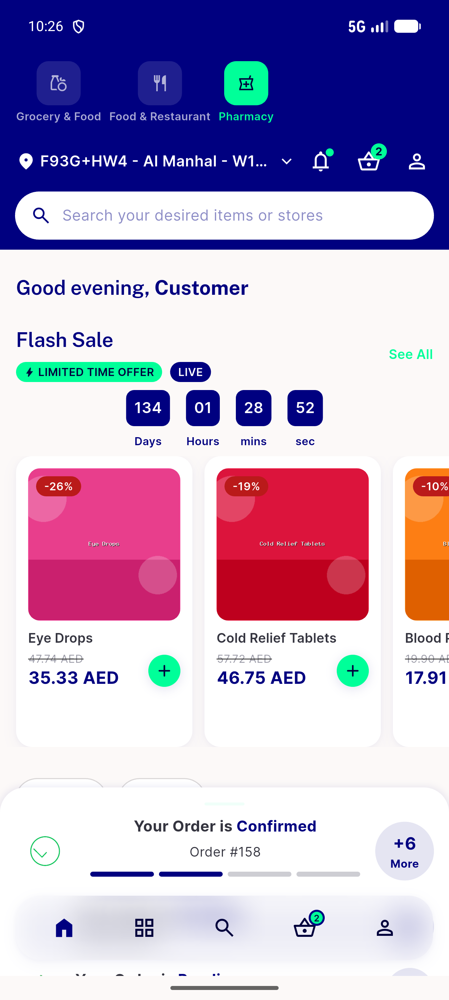
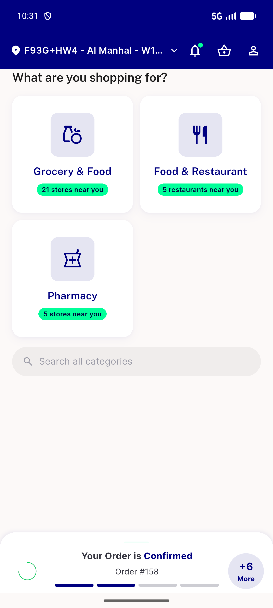
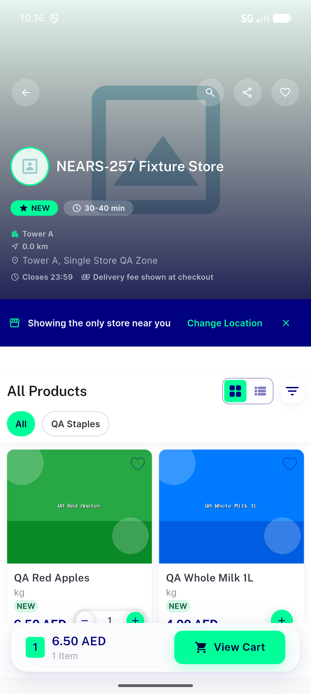

# QA Evidence — NEARS-1551

**PASS - AC1/AC2/AC4 demonstrated live on emulator-5556**

**3 screenshot(s).** Click any thumbnail for full resolution.

<table>
<tr>
<td align="center" width="33%"> ac1 restored pharmacy home</td>
<td align="center" width="33%"> ac2 stale module falls back to chooser</td>
<td align="center" width="33%"> ac4 single store zone directstore unaffected</td>
</tr>
</table>

---
*From `nears/docs/qa-evidence/NEARS-1551/` · public-repo scrub policy (no live secrets; verified clean).*
