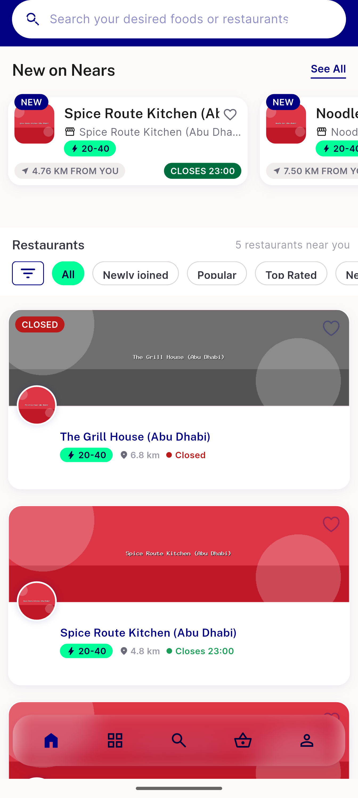

# QA Evidence — NEARS-1554

**PASS — AC1+AC2 verified live; pre-fix repro observed at campaign_repository.dart:25:100, post-fix clean with execution proof**

**2 screenshot(s).** Click any thumbnail for full resolution.

<table>
<tr>
<td align="center" width="33%"> ac2 food home POSTFIX 5562</td>
<td align="center" width="33%"> ac2 food home PREFIX 5556</td>
</tr>
</table>

### Other artifacts
- [`ac1-postfix-clean-with-execution-proof.log`](ac1-postfix-clean-with-execution-proof.log)
- [`ac2-render-and-cache-continuity.log`](ac2-render-and-cache-continuity.log)
- [`automated-backstop-with-falsifiability-control.log`](automated-backstop-with-falsifiability-control.log)
- [`bug-prefix-repro-uncaught-async-error.log`](bug-prefix-repro-uncaught-async-error.log)
- [`progress.md`](progress.md)
- [`regression-sweep-postfix.log`](regression-sweep-postfix.log)

---
*From `nears/docs/qa-evidence/NEARS-1554/` · public-repo scrub policy (no live secrets; verified clean).*
