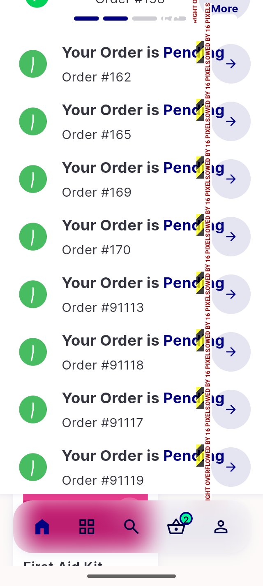

# QA Evidence — NEARS-1555

**PASS - FlashSaleShimmerView header: zero RenderFlex overflow at 320dp/1.3x in LTR and RTL; base control fires 115px (en) / 84px (ar) attributed to flash_sale_view_widget.dart:178**

**1 screenshot(s).** Click any thumbnail for full resolution.

<table>
<tr>
<td align="center" width="33%"> bug running order overflow 320dp 1.3x</td>
</tr>
</table>

### Other artifacts
- [`ac1-en-320dp-1.3x.log`](ac1-en-320dp-1.3x.log)
- [`ac2-ar-320dp-1.3x.log`](ac2-ar-320dp-1.3x.log)
- [`bug-item-widget-bottom-overflow.log`](bug-item-widget-bottom-overflow.log)
- [`control-base-attributed-overflow.log`](control-base-attributed-overflow.log)
- [`regression-1.0x-geometries.log`](regression-1.0x-geometries.log)

---
*From `nears/docs/qa-evidence/NEARS-1555/` · public-repo scrub policy (no live secrets; verified clean).*
