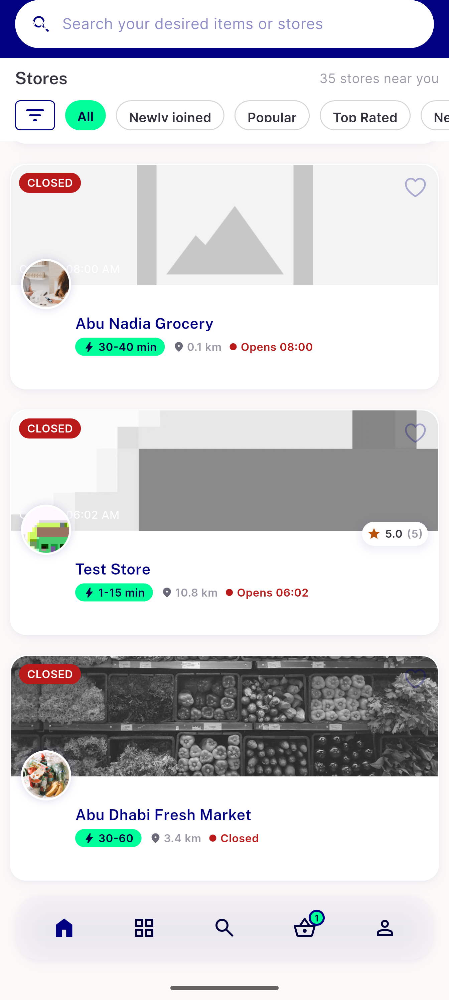

# QA Evidence — NEARS-1556

**QA re-verify: warm pageSize fix confirmed live (3 net calls = ceil(35/12), no extra empty page); cold-start freeze not reproduced in this attempt (n=3, prior 2x reproduced + root-caused stands); other PaginatedListView consumers spot-checked clean; owner-accepted partial per NEARS-2337**

**3 screenshot(s).** Click any thumbnail for full resolution.

<table>
<tr>
<td align="center" width="33%"> coldrepro attempt qa8 not reproduced</td>
<td align="center" width="33%"> repro stall emulator 5558</td>
<td align="center" width="33%"> warm pagesize fix bottom of list</td>
</tr>
</table>

### Other artifacts
- [`coldrepro-attempt-qa8-net.log`](coldrepro-attempt-qa8-net.log)
- [`repro-stall-cold-start-dump.xml`](repro-stall-cold-start-dump.xml)
- [`repro-stall-dump.xml`](repro-stall-dump.xml)
- [`warm-net-requests.log`](warm-net-requests.log)

---
*From `nears/docs/qa-evidence/NEARS-1556/` · public-repo scrub policy (no live secrets; verified clean).*
