# QA Evidence — NEARS-1559

**PARTIAL — 9/10 AC demonstrated live on emulator-5554; page-stability + offline arms proven numerically**

**13 screenshot(s).** Click any thumbnail for full resolution.

<table>
<tr>
<td align="center" width="33%"><a href="ac1-ac4-row-above-location-module-home.png">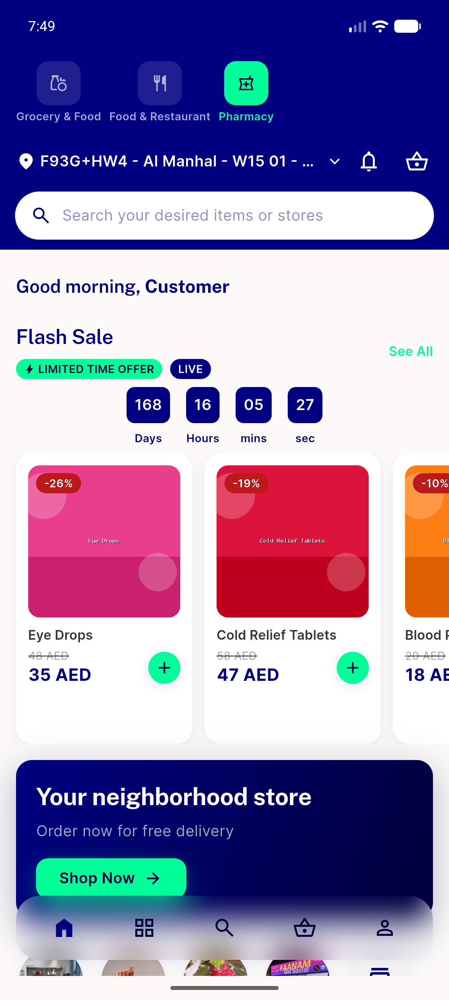</a> ac1 ac4 row above location module home</td>
<td align="center" width="33%"><a href="ac1-row-above-location-bar.png">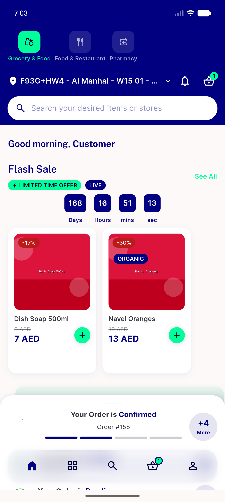</a> ac1 row above location bar</td>
<td align="center" width="33%"><a href="ac2-header-floated-away-search-pinned.png">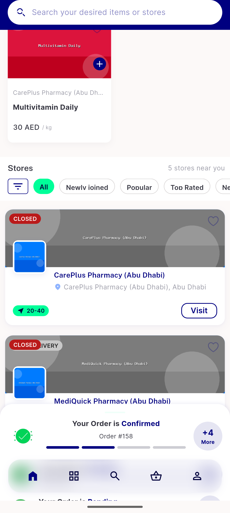</a> ac2 header floated away search pinned</td>
</tr>
<tr>
<td align="center" width="33%"><a href="ac2-header-reentry-page-held.png">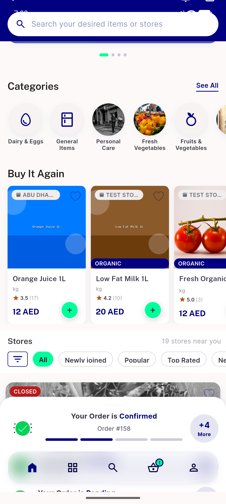</a> ac2 header reentry page held</td>
<td align="center" width="33%"><a href="ac5-offline-switch-worked.png">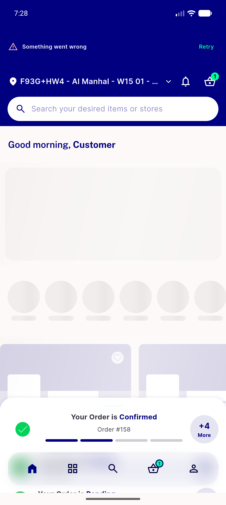</a> ac5 offline switch worked</td>
<td align="center" width="33%"><a href="ac5-offline-warmcache-switch-works.png">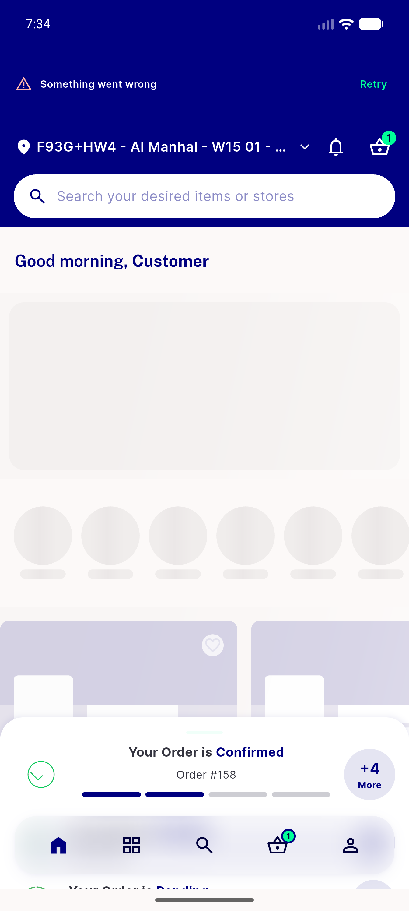</a> ac5 offline warmcache switch works</td>
</tr>
<tr>
<td align="center" width="33%"><a href="ac5-offline-warmcache-tiles-kept.png">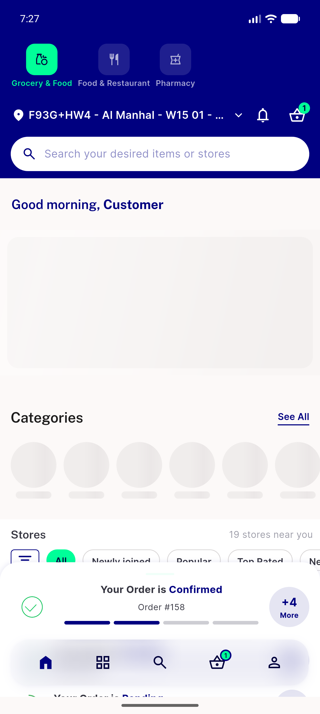</a> ac5 offline warmcache tiles kept</td>
<td align="center" width="33%"><a href="ac5b-offline-nocache-inband-error-retry.png">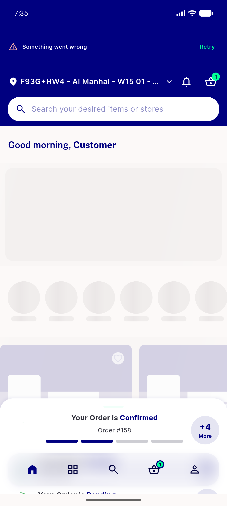</a> ac5b offline nocache inband error retry</td>
<td align="center" width="33%"> ac7 no history fullscreen grid</td>
</tr>
<tr>
<td align="center" width="33%"><a href="ac8-rtl-arabic-scale10.png">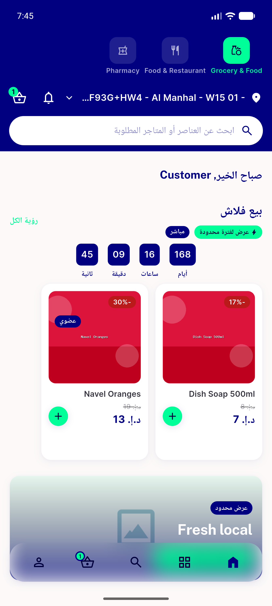</a> ac8 rtl arabic scale10</td>
<td align="center" width="33%"> ac8 rtl arabic scale13</td>
<td align="center" width="33%"><a href="ac8-textscale13-ltr-band-grows.png">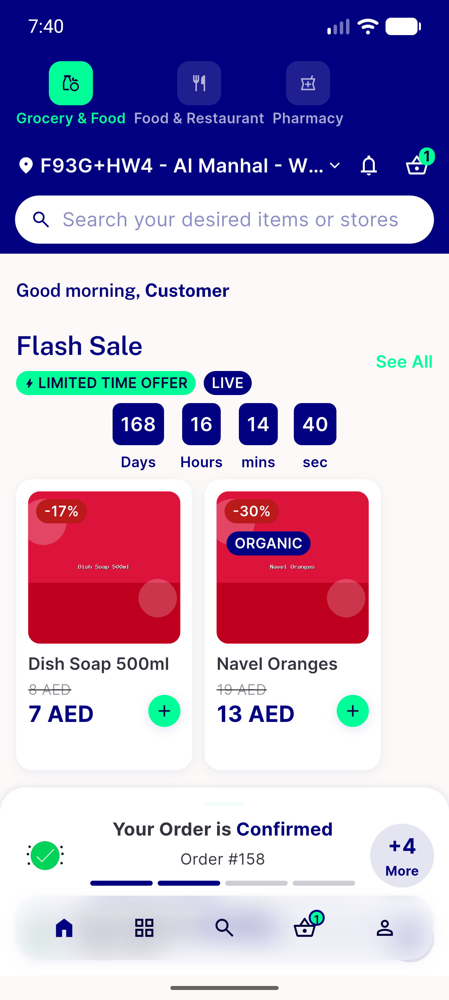</a> ac8 textscale13 ltr band grows</td>
</tr>
<tr>
<td align="center" width="33%"><a href="note-airplane-mode-shows-global-no-internet-screen.png">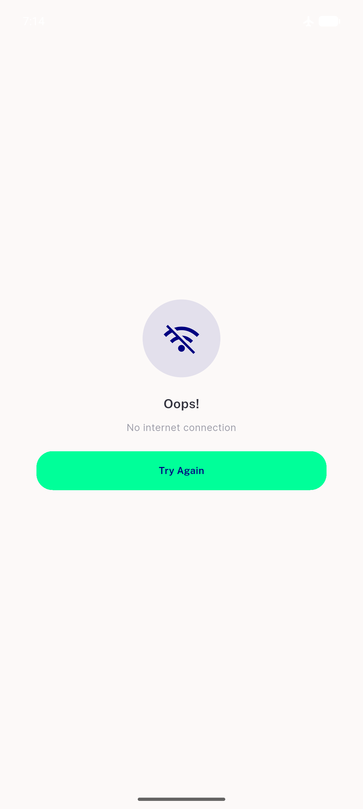</a> note airplane mode shows global no internet screen</td>
</tr>
</table>

### Other artifacts
- [`ac2-selection-page-offset.log`](ac2-selection-page-offset.log)
- [`ac2-sliver-geometry.log`](ac2-sliver-geometry.log)
- [`ac5-reveal-moves-row-not-page.log`](ac5-reveal-moves-row-not-page.log)
- [`ac6-single-module-no-row-no-void.log`](ac6-single-module-no-row-no-void.log)
- [`automated-backstop-flutter-test.log`](automated-backstop-flutter-test.log)
- [`followup-empty-module-list-after-offline-retry.log`](followup-empty-module-list-after-offline-retry.log)
- [`note-airplane-mode-preempts-home.log`](note-airplane-mode-preempts-home.log)
- [`status-bar-clearance-real-device.log`](status-bar-clearance-real-device.log)

---
*From `nears/docs/qa-evidence/NEARS-1559/` · public-repo scrub policy (no live secrets; verified clean).*
