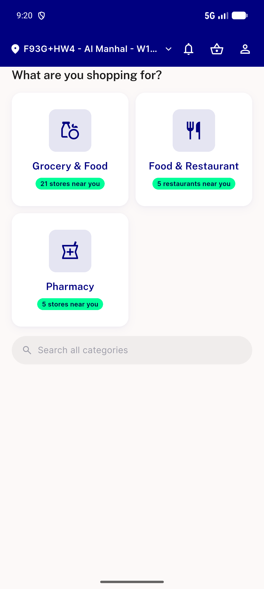
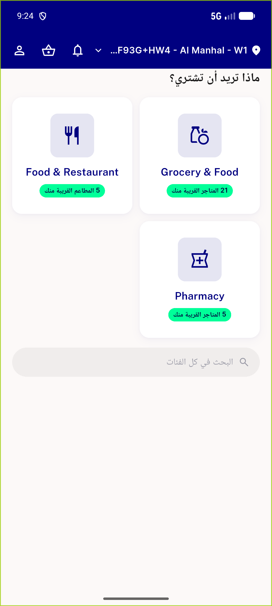

# QA Evidence — NEARS-1560

**PASS — module grid reorder before search bar (emulator-5556, UserApp, light mode)**

**2 screenshot(s).** Click any thumbnail for full resolution.

<table>
<tr>
<td align="center" width="33%"> ac1 module grid before search</td>
<td align="center" width="33%"> regression rtl module selection</td>
</tr>
</table>

---
*From `nears/docs/qa-evidence/NEARS-1560/` · public-repo scrub policy (no live secrets; verified clean).*
