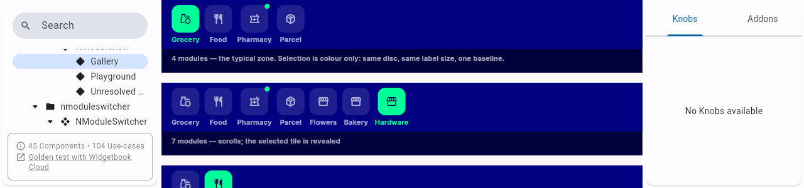
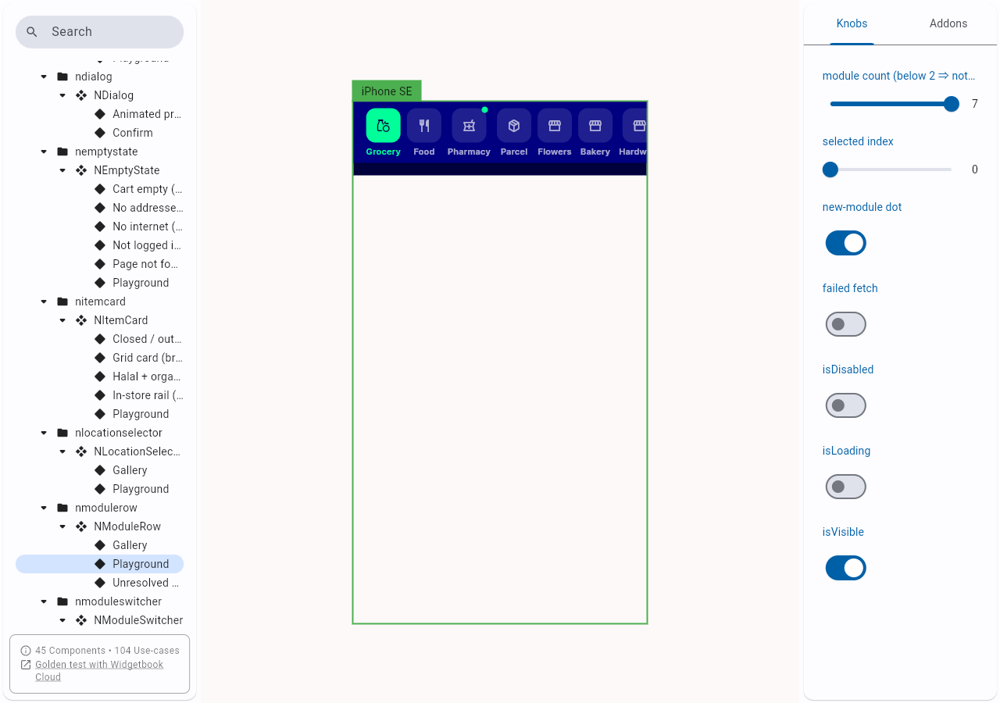
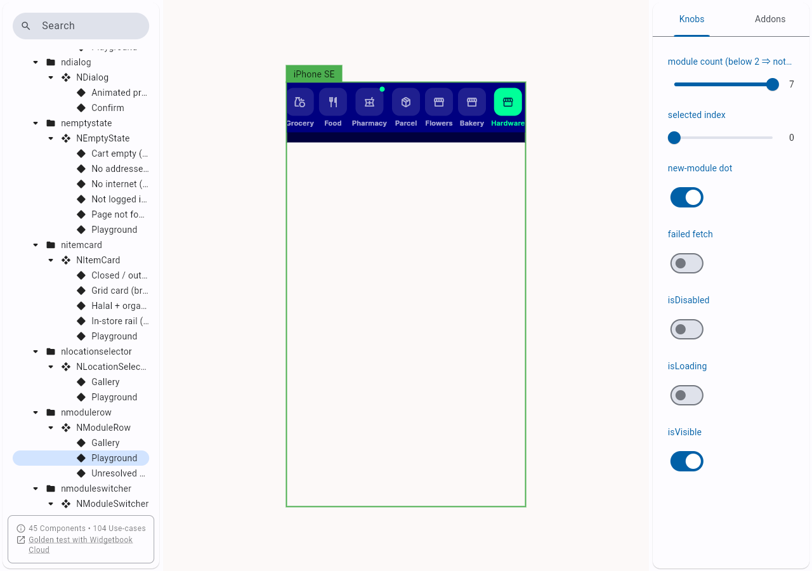
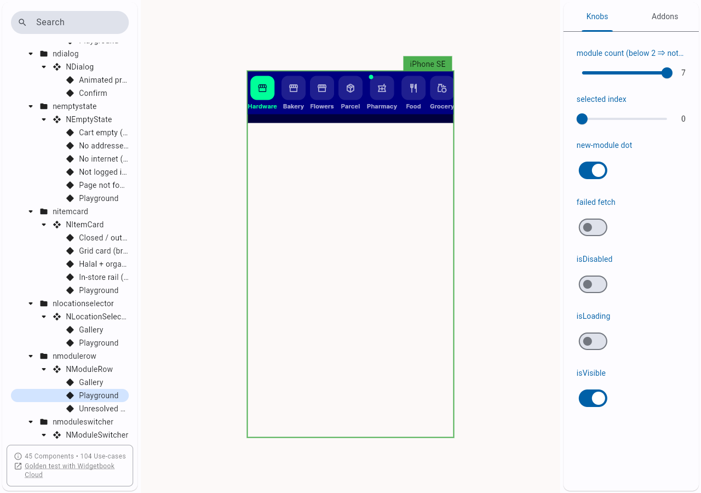
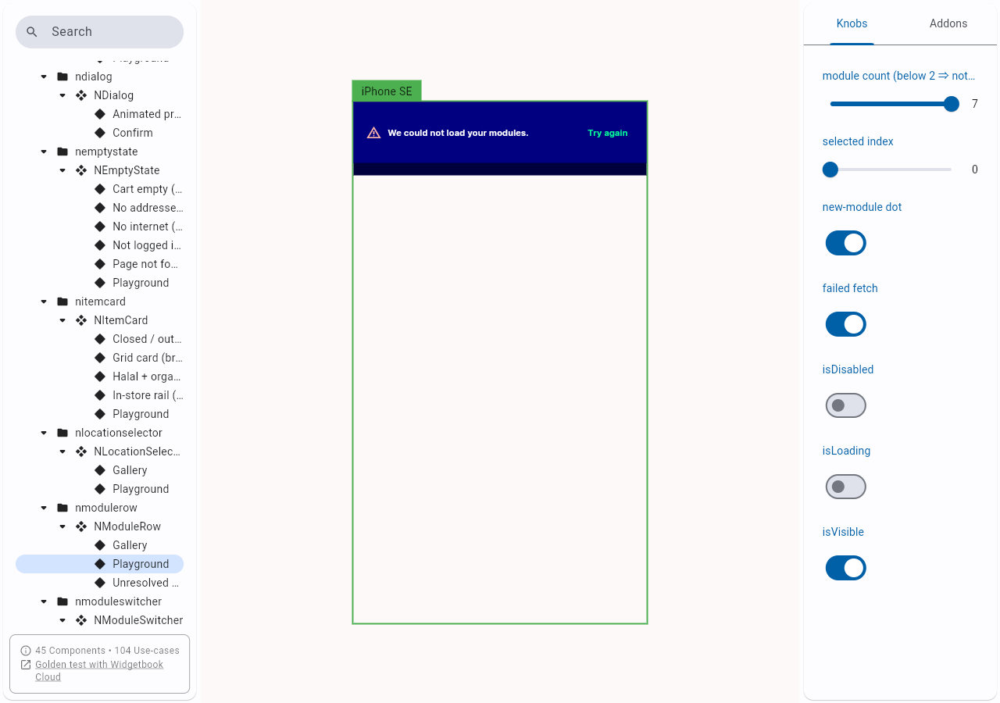
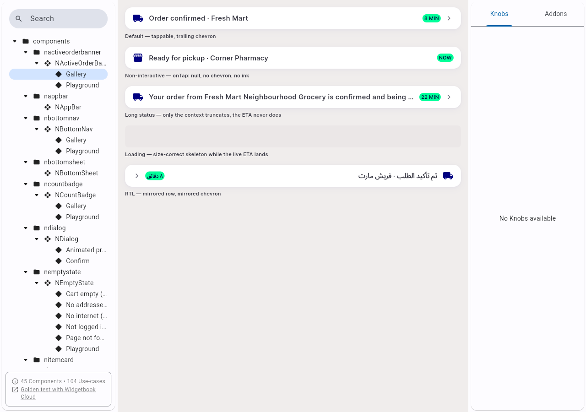

# QA Evidence — NEARS-1563

**PASS — _reveal scoped to the row's own ScrollPosition; ancestor never moves**

**6 screenshot(s).** Click any thumbnail for full resolution.

<table>
<tr>
<td align="center" width="33%"> ac1 gallery firstpaint 1280x300</td>
<td align="center" width="33%"> ac3 ltr at rest</td>
<td align="center" width="33%"> ac3 ltr trailing revealed</td>
</tr>
<tr>
<td align="center" width="33%"> ac5 rtl reveal</td>
<td align="center" width="33%"> ac6 error branch</td>
<td align="center" width="33%"> control nactiveorderbanner gallery</td>
</tr>
</table>

### Other artifacts
- [`progress.md`](progress.md)

---
*From `nears/docs/qa-evidence/NEARS-1563/` · public-repo scrub policy (no live secrets; verified clean).*
