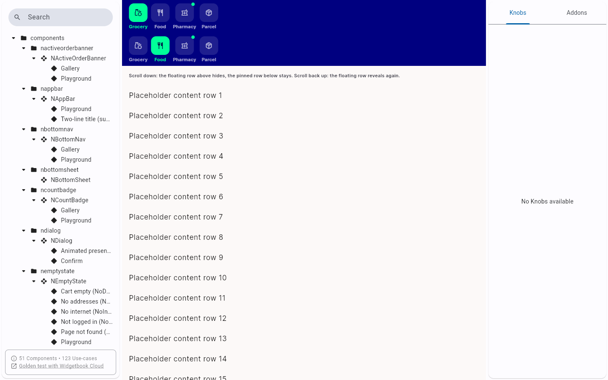
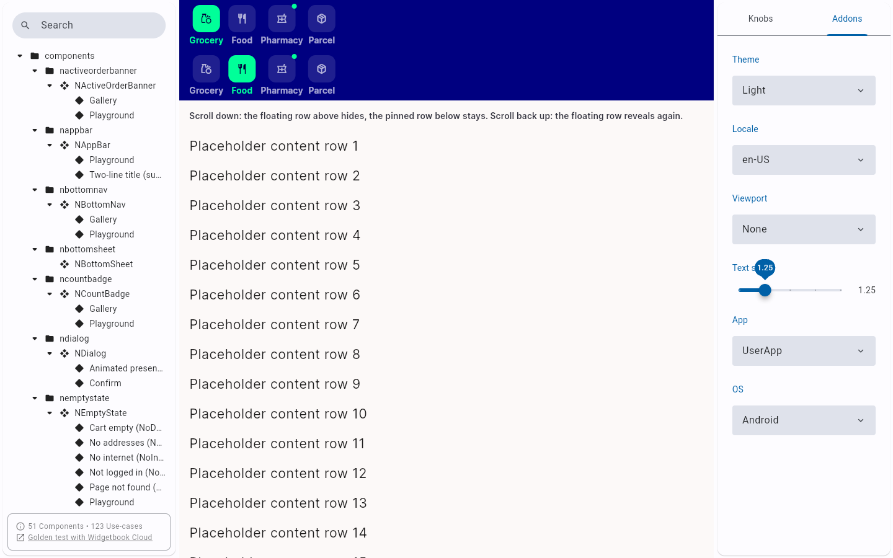
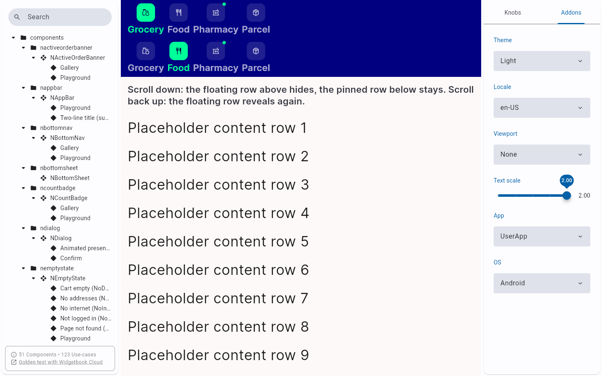
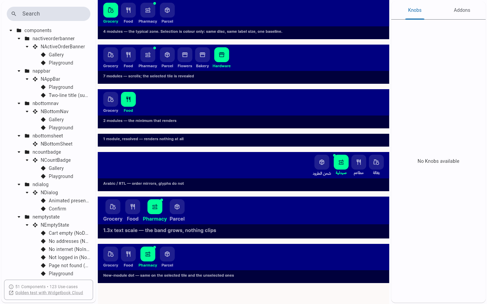
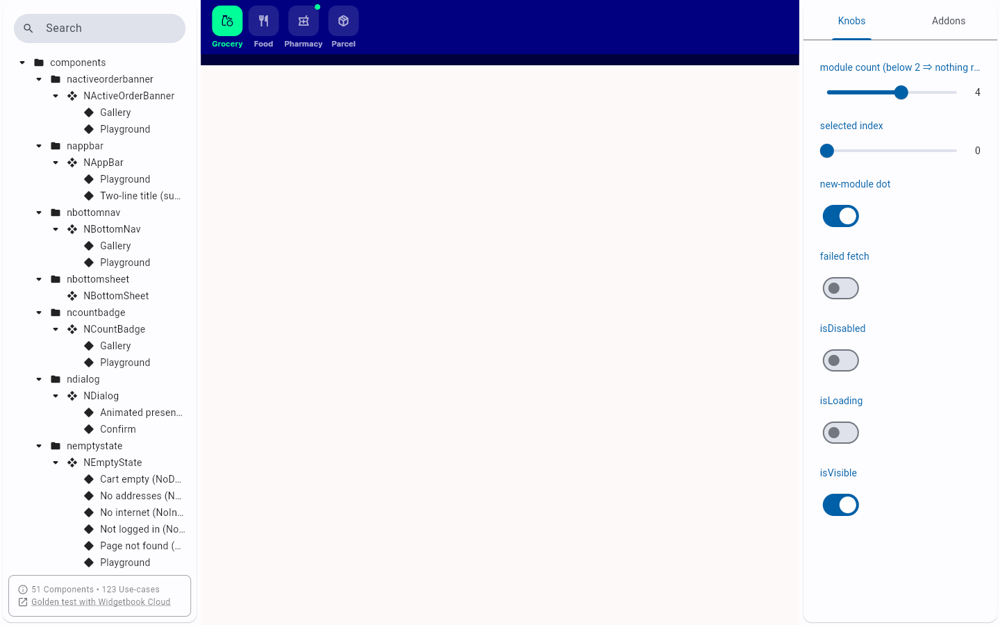
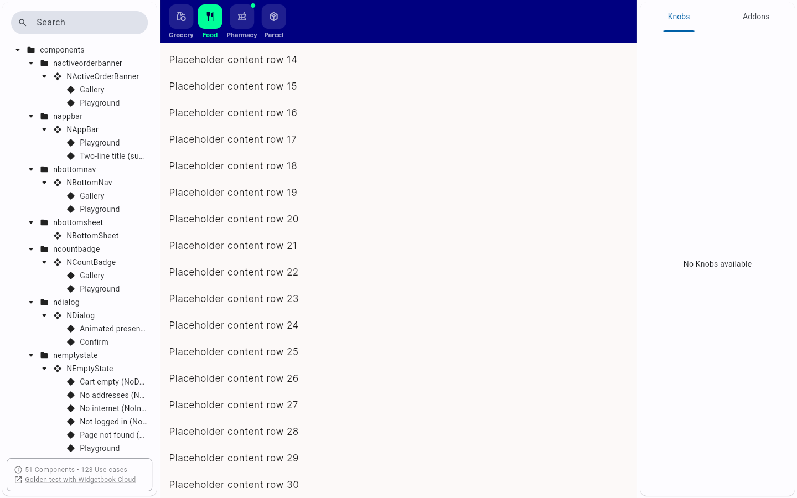
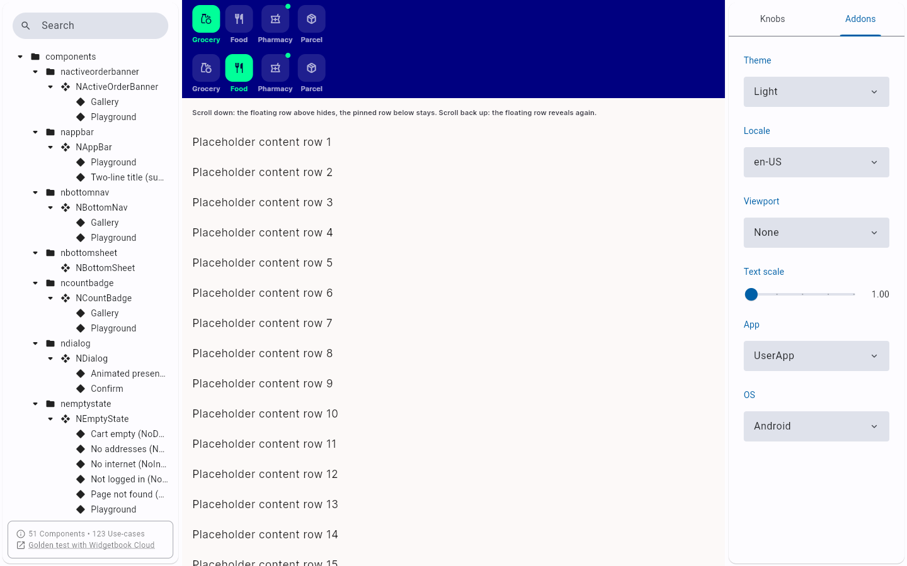

# QA Evidence — NEARS-1565

**PASS — NModuleRow sliver-host use case (Widgetbook), floating+pinned demonstrated live, no hardcoded height**

**8 screenshot(s).** Click any thumbnail for full resolution.

<table>
<tr>
<td align="center" width="33%"> sliver host initial</td>
<td align="center" width="33%"> textscale 125</td>
<td align="center" width="33%"> textscale max</td>
</tr>
<tr>
<td align="center" width="33%"> regression gallery</td>
<td align="center" width="33%"> regression playground</td>
<td align="center" width="33%"> scroll down floating hidden</td>
</tr>
<tr>
<td align="center" width="33%"> scroll up floating revealed</td>
<td align="center" width="33%"> addons panel textscale slider</td>
</tr>
</table>

### Other artifacts
- [`bug-catalog-sidecar-missing-sliver-host-usecase.log`](bug-catalog-sidecar-missing-sliver-host-usecase.log)
- [`bug-regression-catalog-generator-drift.log`](bug-regression-catalog-generator-drift.log)

---
*From `nears/docs/qa-evidence/NEARS-1565/` · public-repo scrub policy (no live secrets; verified clean).*
