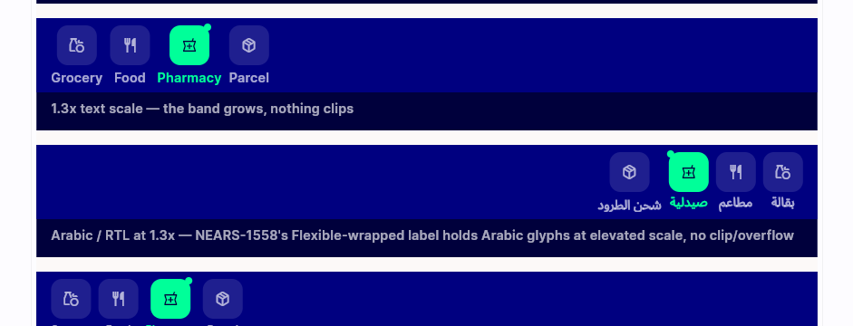
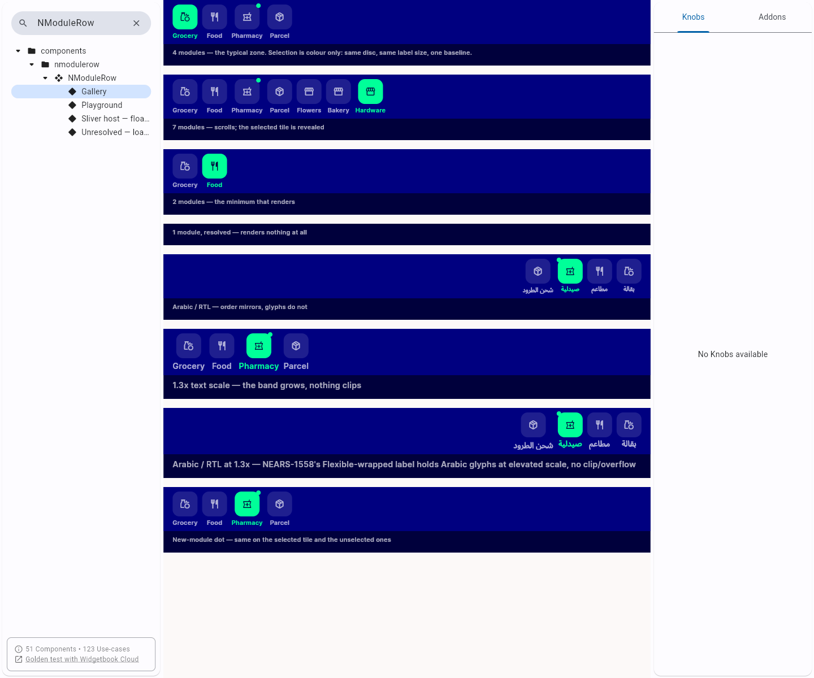
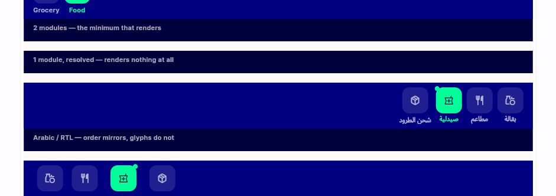
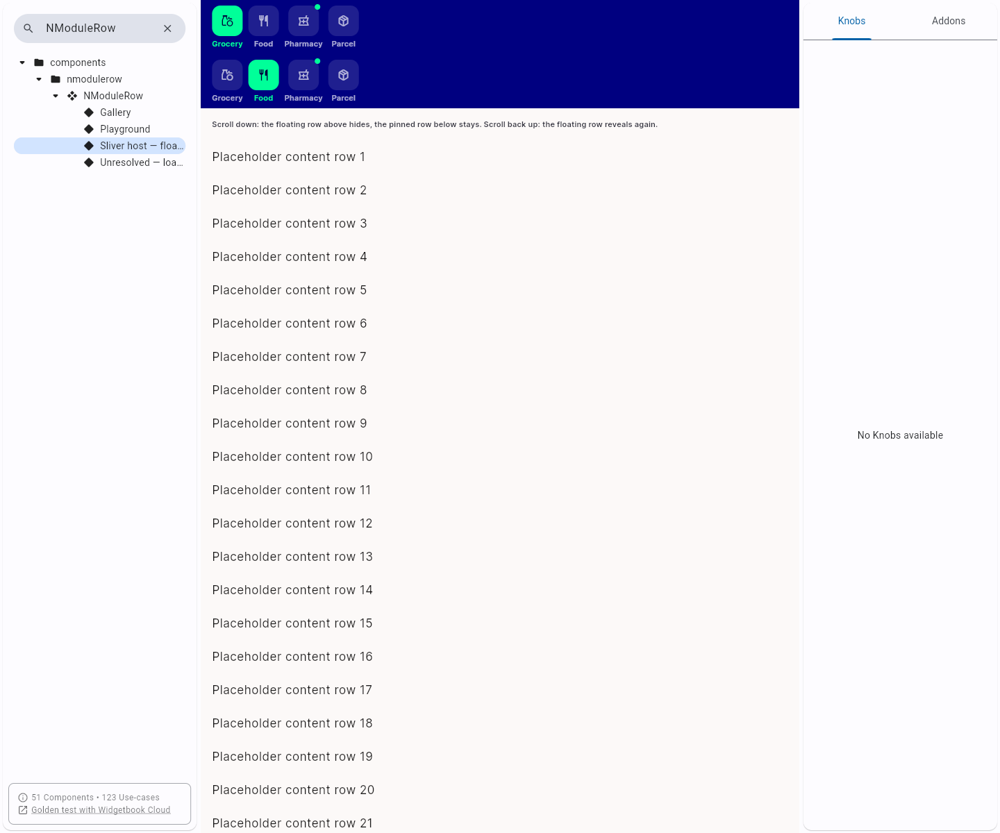

# QA Evidence — NEARS-1566

**PASS — widgetbook Gallery case for _arabic tiles at 1.3x renders correctly, no clip/overflow**

**4 screenshot(s).** Click any thumbnail for full resolution.

<table>
<tr>
<td align="center" width="33%"> nmodulerow arabic 13x case</td>
<td align="center" width="33%"> nmodulerow arabic 13x full</td>
<td align="center" width="33%"> rtl 10x unchanged</td>
</tr>
<tr>
<td align="center" width="33%"> sliver host unchanged</td>
</tr>
</table>

---
*From `nears/docs/qa-evidence/NEARS-1566/` · public-repo scrub policy (no live secrets; verified clean).*
