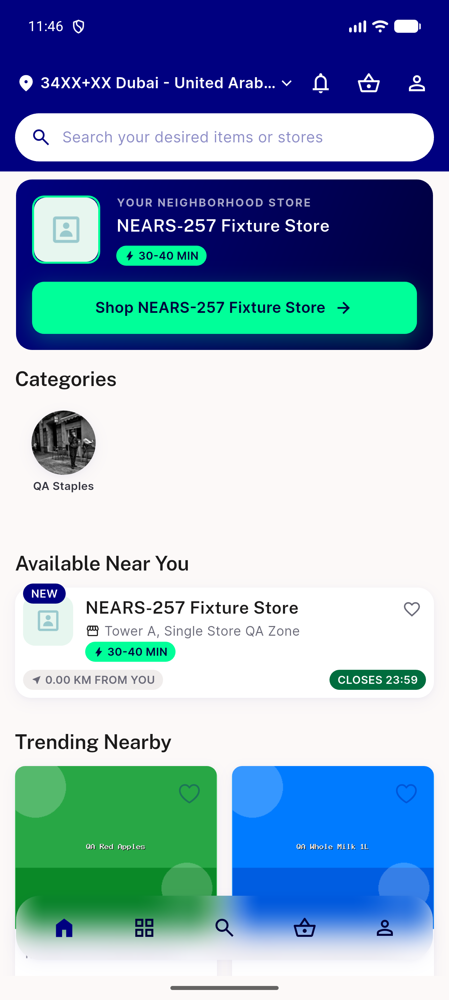

# QA Evidence — NEARS-1569

**PASS - live-QA'd on emulator-5556, patched uinav.sh/uifind.py driver; 10/10 repro clean, loud-fail + NEARS-2082 structural failure class both confirmed live**

**1 screenshot(s).** Click any thumbnail for full resolution.

<table>
<tr>
<td align="center" width="33%"> userapp home screen</td>
</tr>
</table>

### Other artifacts
- [`ac1-10-sample-repro.log`](ac1-10-sample-repro.log)
- [`genuine-absence-loud-fail.log`](genuine-absence-loud-fail.log)
- [`nears-2082-live-structural-failure.log`](nears-2082-live-structural-failure.log)

---
*From `nears/docs/qa-evidence/NEARS-1569/` · public-repo scrub policy (no live secrets; verified clean).*
