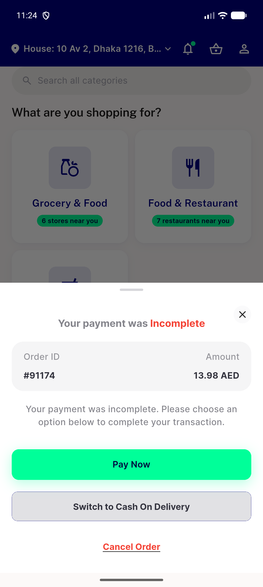
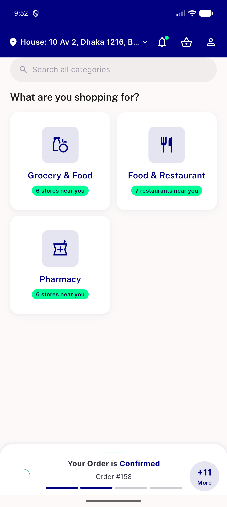

# QA Evidence — NEARS-1570

**PASS (re-QA cycle 2) — delivery_address backfilled, order 91174 returns 200 + sheet shows #91174 / 13.98 AED**

**2 screenshot(s).** Click any thumbnail for full resolution.

<table>
<tr>
<td align="center" width="33%"> ac2 payment incomplete sheet order 91174</td>
<td align="center" width="33%"> bug payment failed 500 no sheet</td>
</tr>
</table>

### Other artifacts
- [`bug-payment-failed-500-null-delivery-address.log`](bug-payment-failed-500-null-delivery-address.log)

---
*From `nears/docs/qa-evidence/NEARS-1570/` · public-repo scrub policy (no live secrets; verified clean).*
