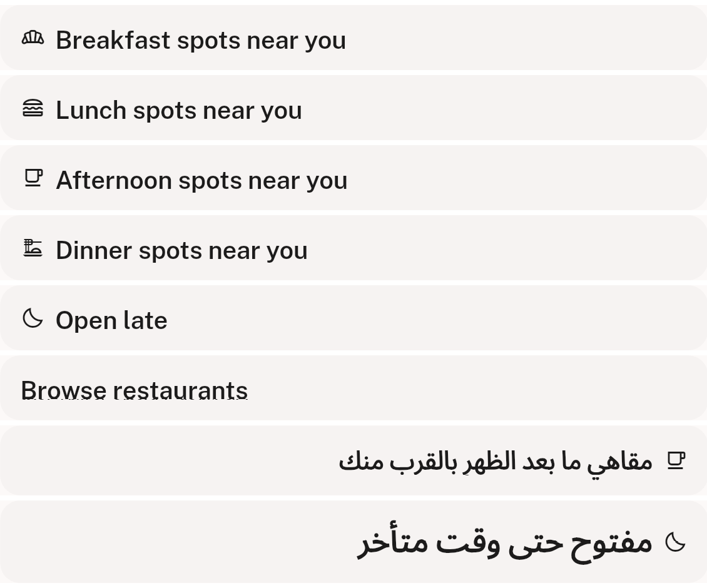
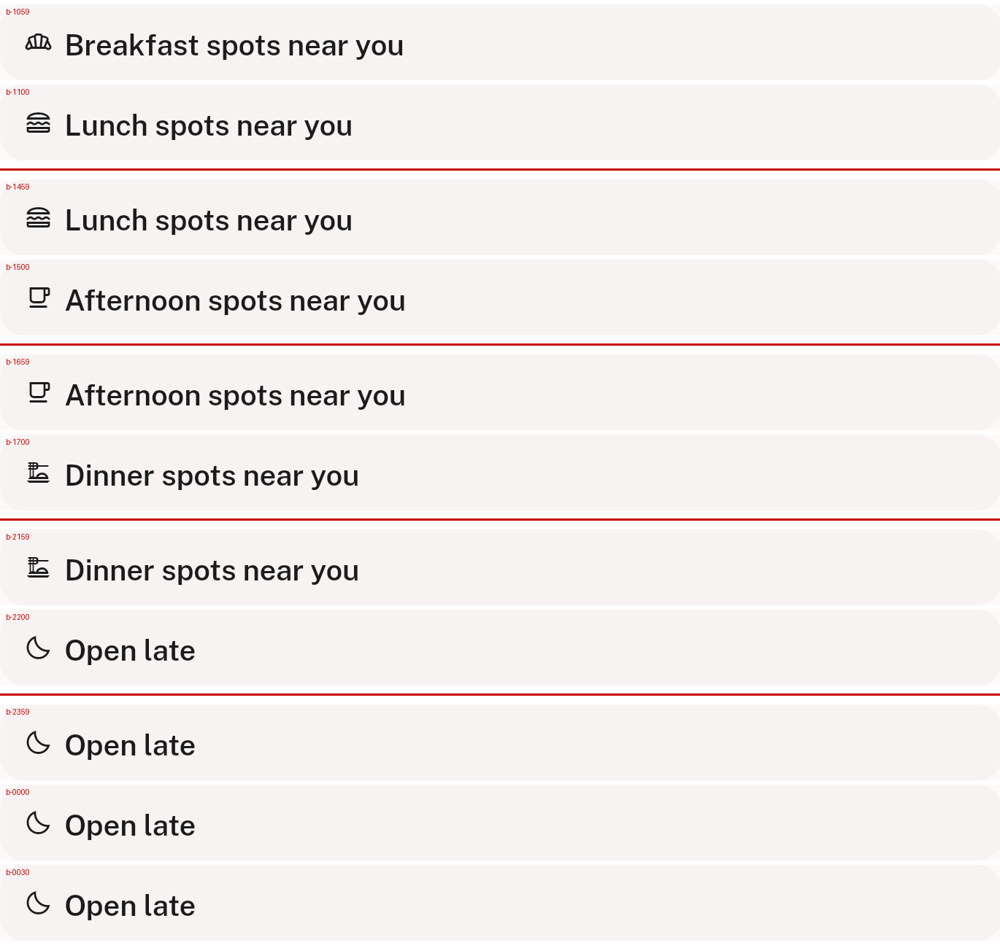

# QA Evidence — NEARS-1572

**PASS — NTimeContextBar verified live on the widgetbook storybook @ eceea37d; 1033/1033 tests**

**4 screenshot(s).** Click any thumbnail for full resolution.

<table>
<tr>
<td align="center" width="33%"> ac1 five windows glyphs ink rtl</td>
<td align="center" width="33%"> ac2 boundary pairs and midnight wrap</td>
<td align="center" width="33%"> ac4 skeleton textscale ellipsis</td>
</tr>
<tr>
<td align="center" width="33%"> ac6 fallback band glyphless</td>
</tr>
</table>

### Other artifacts
- [`bug-catalog-deeplink-fail-open.log`](bug-catalog-deeplink-fail-open.log)
- [`progress.md`](progress.md)

---
*From `nears/docs/qa-evidence/NEARS-1572/` · public-repo scrub policy (no live secrets; verified clean).*
