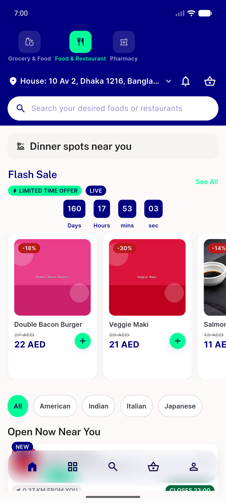
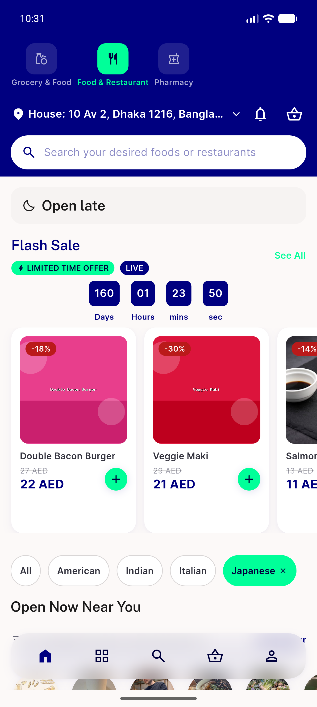
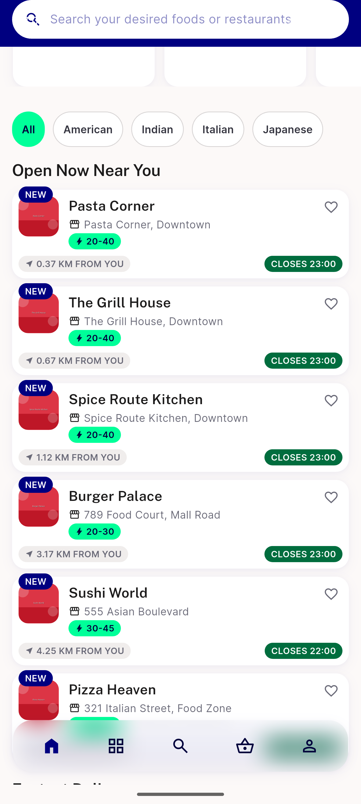
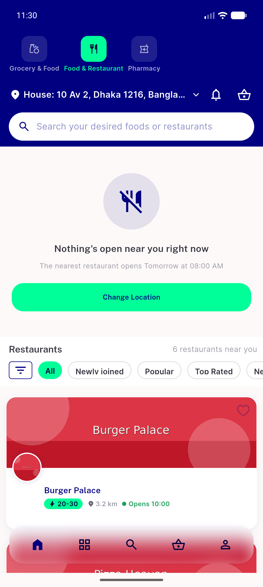
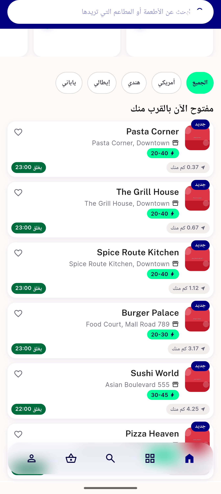
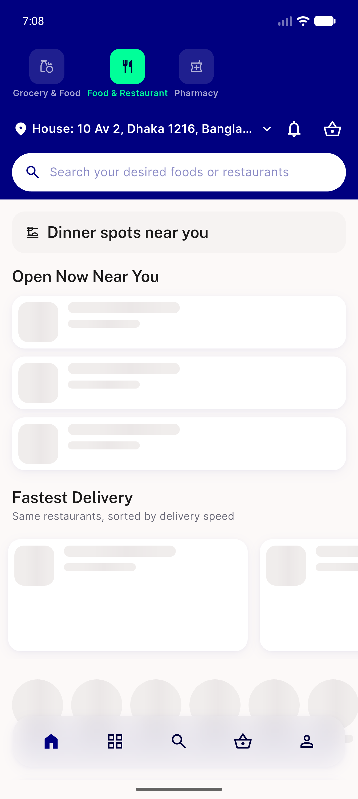
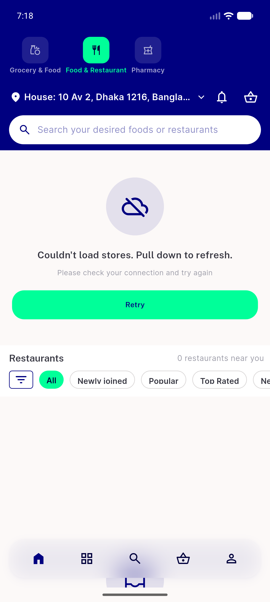
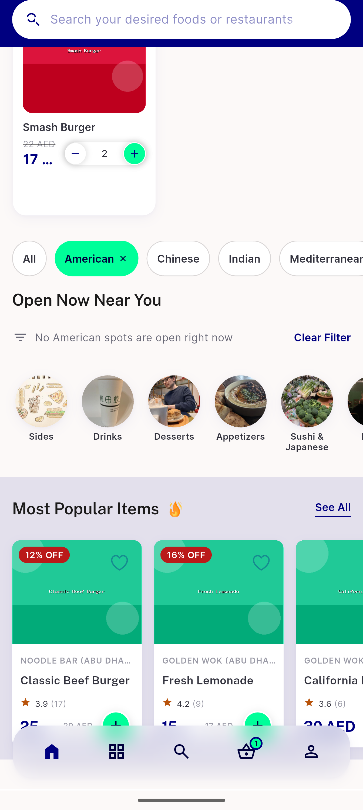

# QA Evidence — NEARS-1574

**PASS — Food Home rebuild + NEARS-1582 cuisine taxonomy (AC9 loading branch recaptured)**

**8 screenshot(s).** Click any thumbnail for full resolution.

<table>
<tr>
<td align="center" width="33%"> ac1 home order row location search</td>
<td align="center" width="33%"> ac4 section local empty japanese</td>
<td align="center" width="33%"> ac5 open now distance eta</td>
</tr>
<tr>
<td align="center" width="33%"> ac7 module empty nothing open</td>
<td align="center" width="33%"> ac9 arabic rtl food home</td>
<td align="center" width="33%"> ac9 loading skeleton branch1 verified</td>
</tr>
<tr>
<td align="center" width="33%"> ac9 store load failed branch</td>
<td align="center" width="33%"> zone2 american section local inactive store47</td>
</tr>
</table>

### Other artifacts
- [`ac9-loading-skeleton-capture-method.log`](ac9-loading-skeleton-capture-method.log)
- [`bug-campaign-screen-rtl-overflow.log`](bug-campaign-screen-rtl-overflow.log)

---
*From `nears/docs/qa-evidence/NEARS-1574/` · public-repo scrub policy (no live secrets; verified clean).*
